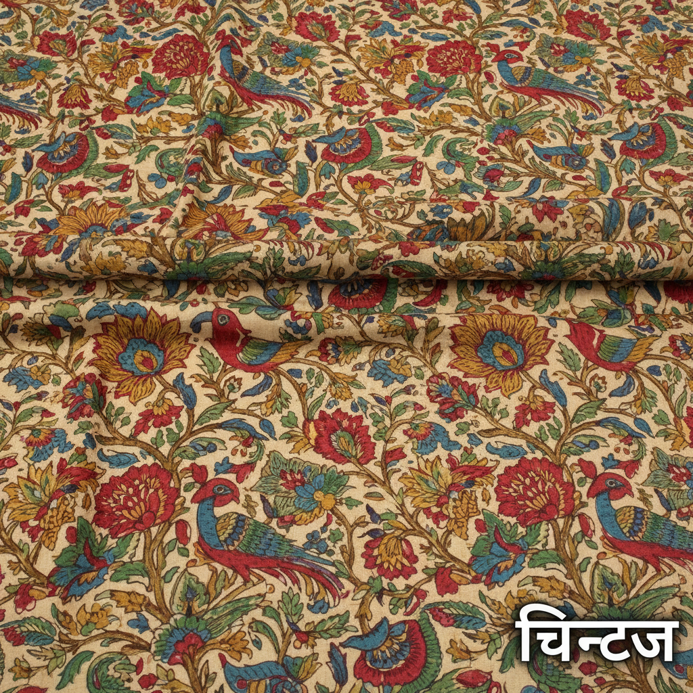

# Chintz 印花棉布 | चिन्ट्ज़

> **"印度的花园穿在欧洲的身上——一块棉布引发了贸易战争和时尚革命。"**

## 概述

印花棉布（Chintz / चिन्ट्ज़）是一种源自印度的彩色印花或手绘棉布，以其鲜艳的花卉图案和光泽表面著称。"Chintz"源自印地语"chīṁṭ"（चीँट，意为"斑点"）。17-18世纪，印度的手绘和木版印花棉布通过东印度公司大量出口欧洲，因其色彩鲜艳、耐洗不褪色（使用媒染剂固色技术）而风靡一时。欧洲本土纺织业受到严重冲击，法国（1686年）和英国（1720年）甚至立法禁止进口和穿着印度棉布——这是历史上最早的贸易保护主义案例之一。

## 历史传播

| 时期 | 事件 |
|------|------|
| 古代 | 印度发展出媒染剂固色技术 |
| 16世纪 | 葡萄牙人开始贸易 |
| 17世纪 | 东印度公司大量进口欧洲 |
| 1686年 | 法国禁止Chintz |
| 1720年 | 英国Calico Act禁令 |
| 18世纪 | 欧洲开始仿制 |
| 当代 | 室内设计经典面料 |

## 核心特征

- **花卉图案**：丰富的花卉和藤蔓
- **鲜艳色彩**：媒染剂固色，耐洗不褪
- **手绘/木版**：传统手工制作
- **棉布基底**：轻薄透气的棉布
- **光泽表面**：上蜡或上浆处理
- **异域风情**：东方花园的想象

## 主要产地

| 地区 | 特征 |
|------|------|
| 科罗曼德尔海岸 | 手绘Kalamkari |
| 古吉拉特 | 木版印花 |
| 拉贾斯坦 | Sanganeri/Bagru印花 |
| 欧洲仿制 | 法国Toile、英国印花 |

## 视觉特征

- 繁茂的花卉和藤蔓图案
- 鲜艳饱和的色彩
- 异域花鸟的生动描绘
- 密集的图案填充
- 自然主义的花卉造型
- 温暖的棉布质感

## 与其他风格的关系

| 风格 | 关系 |
|------|------|
| Toile de Jouy | 受Chintz影响的法国印花 |
| William Morris | 受印度印花启发 |
| Liberty Print | Chintz的英国现代版 |
| Chinoiserie | 共享东方异域想象 |
| 当代室内设计 | Chintz的持续流行 |

## 概念图

---

*浮光艺志 | Chronicle of Artistry*
