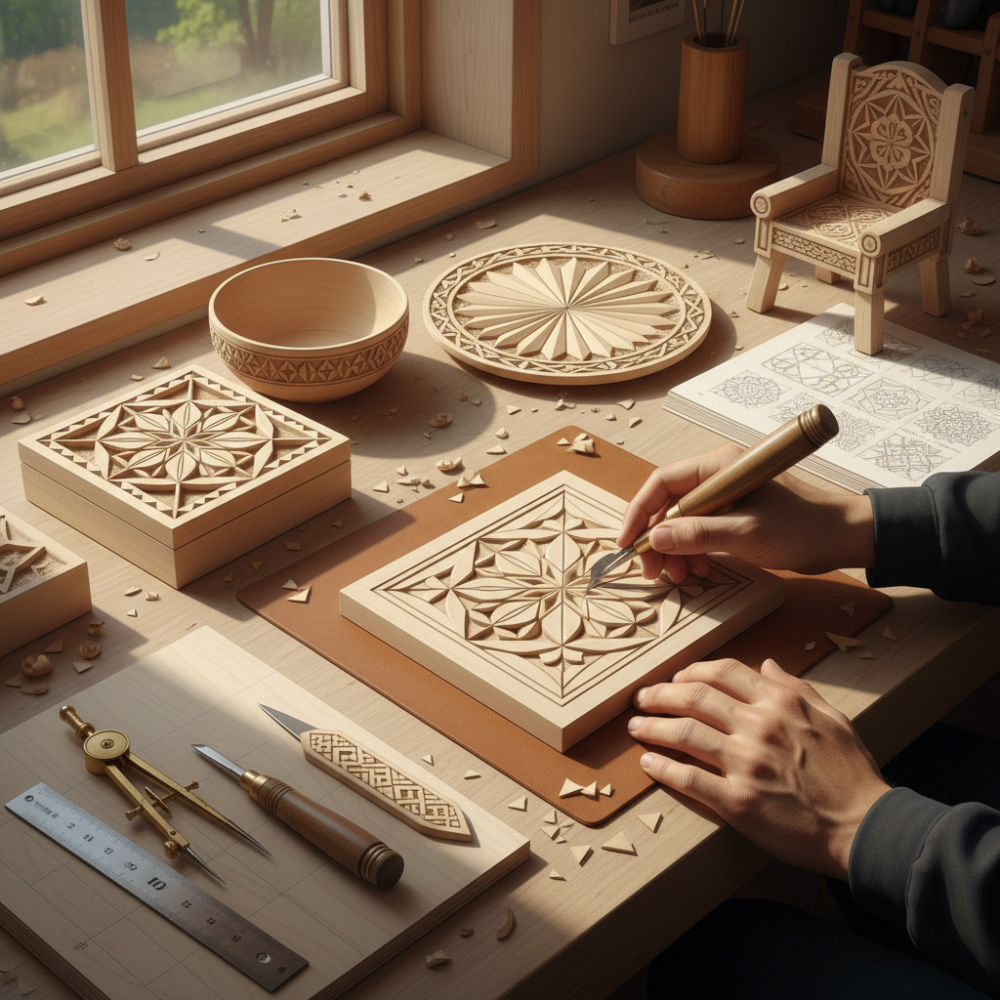

# Chip Carving Art 剔花雕刻艺术

> "Chip carving is geometry made tangible — triangles, circles, and rosettes cut into wood with a single knife, each chip removed cleanly to reveal patterns of light and shadow. The chip carver works with mathematical precision, dividing surfaces into grids and compass arcs, then cutting away small triangular chips to create designs that catch light like faceted gems. It is the most disciplined of carving arts — pure pattern, pure precision, pure repetition." — Unknown

## 概述

剔花雕刻艺术（Chip Carving Art）是使用专用刻刀从木材表面切除小三角形或几何形状的木片（chips），通过这些凹陷的组合形成装饰图案的木雕技法——以其精确的几何图案和清晰的刀痕著称，是最古老和最基础的木雕装饰技法之一。

剔花雕刻艺术的实践包括：1）三角剔花——基本的三角形切除；2）圆形剔花——圆形和弧形的组合图案；3）玫瑰花窗——放射状的花窗图案；4）边框装饰——器物边缘的剔花装饰；5）全面覆盖——整个表面的剔花图案；6）字母和文字——剔花技法的文字装饰；7）当代剔花——将传统技法与现代设计结合的创作。

## 核心特征

| 特征 | 描述 |
|------|------|
| 几何 | 精确的几何图案 |
| 精确 | 极其精确的刀工 |
| 简洁 | 工具简单（一把刀） |
| 重复 | 图案的精确重复 |
| 光影 | 切面的光影效果 |
| 传统 | 深厚的民间传统 |

## 视觉特征

- **三角**：三角形的基本单元
- **几何**：精确的几何图案
- **光影**：切面角度的光影变化
- **重复**：规律重复的图案
- **对称**：精确的对称设计
- **清晰**：清晰锐利的刀痕

## 代表作品

| 作品 | 艺术家/文化 | 年代 | 意义 |
|------|-------------|------|------|
| *Swiss chip carving* | 瑞士传统 | 中世纪至今 | 瑞士剔花传统 |
| *Scandinavian chip carving* | 北欧传统 | 维京时代至今 | 北欧剔花 |
| *Wayne Barton works* | Wayne Barton | 当代 | 当代剔花大师 |
| *German Kerbschnitt* | 德国传统 | 中世纪至今 | 德国剔花 |
| *Russian chip carving* | 俄罗斯传统 | 古代至今 | 俄罗斯剔花 |

## 历史时间线

| 时期 | 事件 |
|------|------|
| 古代 | 最早的剔花装饰 |
| 中世纪 | 欧洲剔花传统的发展 |
| 维京时代 | 北欧剔花的繁荣 |
| 18-19世纪 | 瑞士剔花的黄金时代 |
| 当代 | 剔花的现代传承和复兴 |

## 中国语境

剔花雕刻艺术在中国有对应的传统形式。中国传统木雕中的"阴刻"技法与剔花有相似之处——都是从表面去除材料形成图案。中国的传统家具装饰中有类似剔花的几何纹样雕刻——如回纹、万字纹等几何图案的浅浮雕。中国的一些少数民族（如苗族、侗族）的木建筑装饰中也有类似剔花的几何雕刻。中国当代的木工爱好者中，剔花（chip carving）作为一种入门级的木雕技法正在获得关注——因为工具简单、上手容易。中国的一些手工工作室开始教授剔花技法——将其作为木工入门课程的一部分。中国的木工社区中，一些爱好者将中国传统几何纹样（如冰裂纹、龟背纹）用剔花技法来表现——创造具有中国特色的剔花作品。

## AI生成概念图

## 与其他风格的关系

- **Relief Carving** → 浮雕
- **Wood Carving** → 木雕艺术
- **Geometric Art** → 几何艺术
- **Folk Art** → 民间艺术
- **Whittling** → 削木艺术
- **Decorative Art** → 装饰艺术

---

*浮光艺志 | Chronicle of Artistry*
