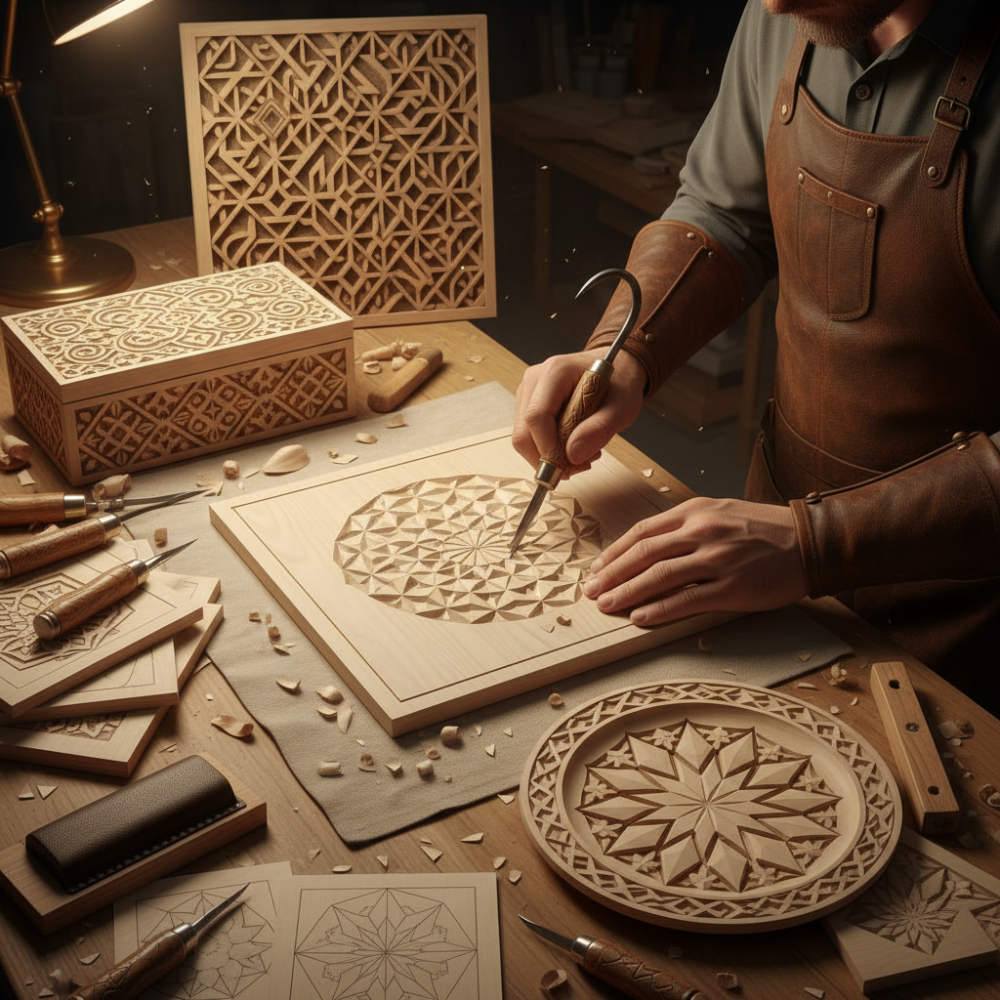

# Chip Carving 刻花木雕

> "Chip carving is geometry made tangible — triangles and curves cut cleanly from wood, each chip removed with a single precise stroke, revealing pattern through absence." — Unknown

## 概述

刻花木雕（Chip Carving）是一种通过从平坦的木材表面切除小块（chips）来创造装饰图案的木雕技法。与浮雕或圆雕不同，刻花木雕不追求立体形象，而是在平面上通过几何图案的凹陷来创造光影效果。基本的切割动作是用专用的刻花刀以特定角度切入木材，然后从另一个角度切入，使一小块木材干净地脱落。

刻花木雕的图案以几何形为主——三角形、菱形、圆弧、花瓣等基本元素通过重复和组合形成复杂的装饰图案。这种技法在北欧（特别是瑞士和斯堪的纳维亚）有着深厚的传统，常用于装饰家具、盒子、餐具和建筑构件。

## 核心特征

| 特征 | 描述 |
|------|------|
| 切除 | 切除小块木材 |
| 几何 | 几何图案为主 |
| 平面 | 在平面上操作 |
| 精确 | 需要精确的刀法 |
| 光影 | 通过凹陷创造光影 |
| 重复 | 重复的图案单元 |

## 视觉特征

- **几何**：精确的几何图案
- **对称**：对称的构图
- **光影**：切面的光影变化
- **干净**：干净利落的切口
- **重复**：重复的图案节奏
- **平面**：平面装饰效果

## 代表作品

| 作品 | 艺术家 | 年代 | 意义 |
|------|--------|------|------|
| *Swiss chip-carved boxes* | 匿名 | 传统 | 瑞士传统刻花 |
| *Scandinavian furniture* | 匿名 | 传统 | 北欧刻花家具 |
| *Kolrosing (Norwegian)* | 匿名 | 传统 | 挪威刻花 |
| *Contemporary chip carving* | Various | 当代 | 当代刻花艺术 |
| *Geometric chip plates* | Various | 当代 | 刻花装饰盘 |

## 历史时间线

| 时期 | 事件 |
|------|------|
| 古代 | 早期的木材刻花装饰 |
| 中世纪 | 欧洲教堂和家具的刻花 |
| 17-18世纪 | 瑞士刻花传统的鼎盛 |
| 19世纪 | 北欧民间刻花的繁荣 |
| 20世纪 | 刻花木雕的教育普及 |
| 当代 | 当代刻花的复兴 |

## 中国语境

刻花木雕在中国有着对应的传统——中国传统木雕中的"阴刻"技法与Chip Carving有相似之处。中国的传统建筑装饰（如窗花、门楣）中大量使用几何图案的木雕。中国的传统家具（特别是明式家具）上的装饰雕刻也包含类似的几何刻花元素。当代中国的木工爱好者群体中，Chip Carving作为一种入门级的木雕技法越来越受欢迎。一些中国的手工工作坊提供刻花木雕课程。

## AI生成概念图

## 与其他风格的关系

- **Wood Carving** → 木雕
- **Relief Carving** → 浮雕
- **Kolrosing** → 挪威刻花
- **Geometric Art** → 几何艺术
- **Woodworking** → 木工
- **Folk Art** → 民间艺术

---

*浮光艺志 | Chronicle of Artistry*
