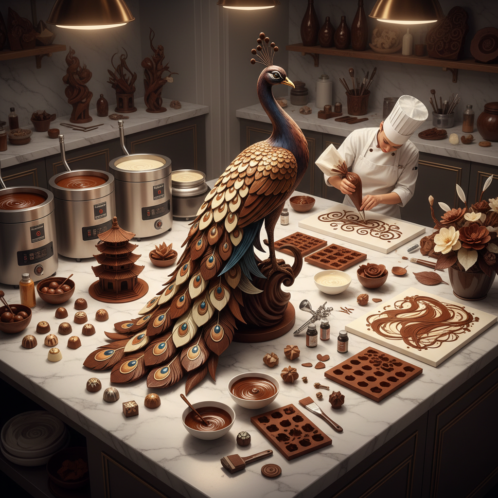

# Chocolate Art 巧克力艺术

> "Chocolate is the most sensual of art materials — it engages every sense. It has color that ranges from ivory white through warm brown to deepest black, a surface that can be polished to a mirror shine, a texture that melts at body temperature, an aroma that triggers memory and desire, and a taste that rewards the viewer who dares to consume the artwork. Chocolate art exists in the tension between permanence and consumption." — Unknown

## 概述

巧克力艺术（Chocolate Art）是以巧克力为主要材料进行艺术创作的实践——利用巧克力的可塑性、色彩范围、光泽和可食用性创造视觉与味觉兼具的艺术品。巧克力艺术是烹饪艺术与视觉艺术的交汇点。

巧克力艺术的实践包括：1）巧克力雕塑——用巧克力雕刻或塑造大型雕塑；2）巧克力绘画——用融化的巧克力在表面绘画；3）巧克力建筑——用巧克力构建建筑模型；4）巧克力装饰——精美的巧克力糖果装饰（bonbon art）；5）巧克力展示品（showpiece）——比赛级别的巧克力艺术展示；6）巧克力模具艺术——用精密模具制作的巧克力造型；7）巧克力调温艺术——利用不同结晶状态创造纹理效果。

## 核心特征

| 特征 | 描述 |
|------|------|
| 可食 | 可食用的艺术 |
| 温敏 | 对温度极其敏感 |
| 光泽 | 调温后的镜面光泽 |
| 可塑 | 融化后可塑形 |
| 芳香 | 浓郁的香气 |
| 短暂 | 需要特定保存条件 |

## 视觉特征

- **棕色**：从象牙白到深黑的色彩范围
- **光泽**：调温巧克力的镜面光泽
- **流动**：融化巧克力的流动感
- **精细**：极精细的装饰细节
- **层次**：多层巧克力的深度
- **纹理**：不同结晶状态的纹理

## 代表作品

| 作品 | 艺术家 | 年代 | 意义 |
|------|--------|------|------|
| *World Chocolate Masters* | Various | 2005至今 | 世界巧克力大师赛 |
| *Chocolate sculptures* | Patrick Roger | 当代 | 大型巧克力雕塑 |
| *Bonbon art* | Various | 当代 | 精美巧克力糖果 |
| *Chocolate showpieces* | Various | 当代 | 比赛展示品 |
| *Chocolate architecture* | Various | 当代 | 巧克力建筑 |

## 历史时间线

| 时期 | 事件 |
|------|------|
| 公元前1900年 | 中美洲可可的使用 |
| 19世纪 | 固体巧克力的发明 |
| 20世纪初 | 巧克力雕塑的出现 |
| 2005 | 世界巧克力大师赛创立 |
| 当代 | 巧克力艺术的专业化 |

## 中国语境

巧克力艺术在中国近年来发展迅速。随着中国巧克力消费市场的增长，越来越多的中国巧克力师（chocolatier）开始探索巧克力艺术。中国的巧克力艺术家将中国传统美学元素融入巧克力创作——用巧克力重现中国传统建筑、将中国传统纹样（如祥云、龙凤）应用于巧克力装饰、用中国茶叶和香料（如龙井、花椒）创造独特风味的艺术巧克力。中国的一些巧克力品牌和工作室在国际巧克力比赛中获得认可。中国传统的"糖画"——用融化的糖浆绘画——与巧克力绘画有异曲同工之妙。

## AI生成概念图

## 与其他风格的关系

- **Sugar Art** → 糖艺术
- **Culinary Art** → 烹饪艺术
- **Sculpture** → 雕塑
- **Ephemeral Art** → 短暂艺术
- **Food Art** → 食物艺术
- **Craft Art** → 工艺美术

---

*浮光艺志 | Chronicle of Artistry*
