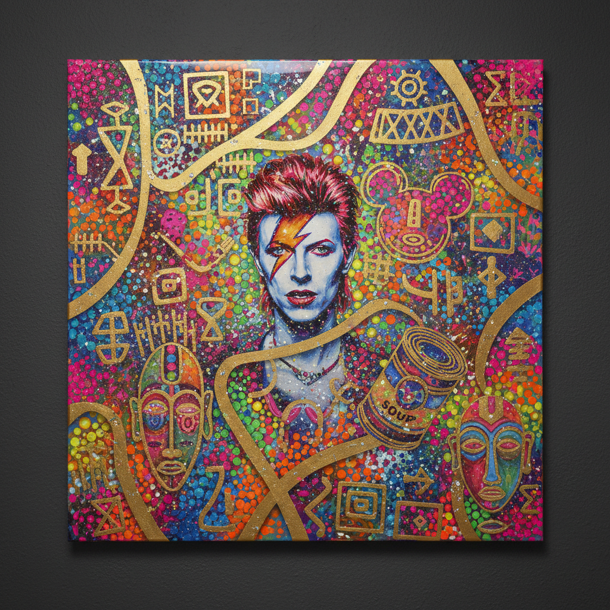

# Chris Ofili 克里斯·奥菲利

> **时期：** 1968–至今  
> **关键词：** 象粪绘画、迷幻装饰、黑人身份、多层拼贴

## 概述

Chris Ofili 是英国尼日利亚裔当代艺术家，以将大象粪便、闪光粉、杂志剪贴和树脂层叠于画布上的独特技法闻名。他的作品融合了非洲装饰传统、嘻哈文化、天主教图像学和迷幻视觉，创造出华丽而具有挑衅性的多层画面。

## 风格特征

- **象粪底座**：画作以漆过的大象粪球作为支撑点，既是材料也是概念声明
- **多层叠加**：树脂、闪光粉、地图钉、杂志剪贴层层堆叠，画面具有浮雕般的物质感
- **迷幻色彩**：大量使用荧光色、金属色和彩虹渐变，视觉密度极高
- **圆点图案**：标志性的彩色圆点散布画面，如同迷幻蘑菇的视觉效果
- **黑人形象**：人物以深色皮肤和夸张特征呈现，既是庆祝也是对刻板印象的回应

## 代表作品

- *The Holy Virgin Mary*（1996）
- *No Woman, No Cry*（1998）
- *Afrodizzia*（1996）
- *The Upper Room*（1999–2002）

## 历史意义

Ofili 是YBA（Young British Artists）运动的核心成员，1998年获得特纳奖。他的作品挑战了"高雅"与"低俗"材料的界限，将非洲散居文化的视觉遗产带入西方当代艺术的核心讨论。

## 概念图

