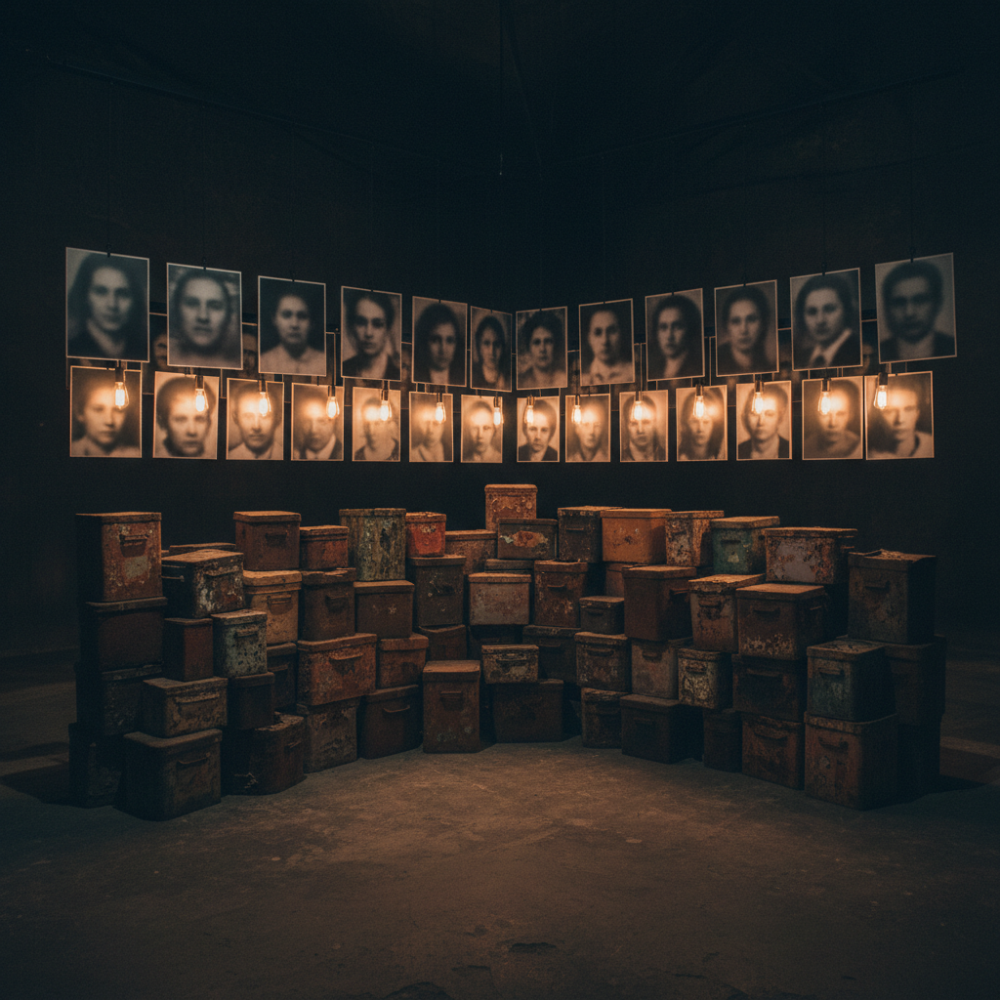

# Christian Boltanski 克里斯蒂安·波尔坦斯基

> **时期：** 1944–2021  
> **关键词：** 记忆装置、旧照片、灯泡与铁盒、大屠杀记忆

## 概述

Christian Boltanski 是法国艺术家，以用旧照片、旧衣服、灯泡和铁盒创造的记忆装置闻名。他的作品探索集体记忆、个体消失和大屠杀的阴影，将匿名的旧照片和日常物品转化为具有纪念碑性的哀悼仪式。

## 风格特征

- **旧照片**：模糊的、匿名的面孔照片暗示已消失的生命
- **灯泡照明**：裸露的灯泡创造出祭坛般的氛围
- **铁盒档案**：生锈的铁盒如同骨灰盒或档案柜
- **旧衣服**：堆积的衣物暗示缺席的身体
- **大规模重复**：数千张照片或数吨衣物创造出压倒性的数量感

## 代表作品

- *Monuments*系列（1985）
- *No Man's Land*（2010）
- *Personnes*（2010）
- *Les Archives du Cœur*（2005–至今）

## 概念图

