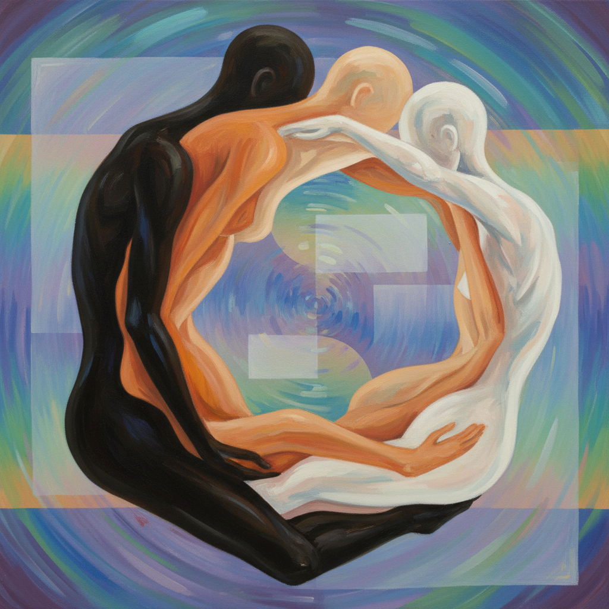

# Christina Quarles 克里斯蒂娜·夸尔斯

> **时期：** 1985–至今  
> **关键词：** 身体纠缠、酷儿身份、数字图案、混合种族经验

## 概述

Christina Quarles 是美国当代画家，以描绘纠缠扭曲的身体形象闻名。她的作品探索混合种族和酷儿身份的身体经验——多个身体在画面中融合、分离、穿透彼此，皮肤色调在同一形体上不断变化，挑战了身份的固定性和身体的边界。

## 风格特征

- **身体纠缠**：多个人体形象相互缠绕、融合，无法分辨个体边界
- **皮肤渐变**：同一身体上的肤色从深到浅不断变化，拒绝种族的视觉固定
- **数字图案**：背景和身体表面覆盖着Photoshop式的渐变、网格和数字纹理
- **空间断裂**：画面空间不连贯，如同多个窗口叠加
- **线条与色块**：精确的轮廓线与松散的色彩填充并存

## 代表作品

- *Night Fell Upon Us Up On Us*（2019）
- *Tha Lil Bit Left*（2019）
- *But I Woke Jus' Tha Same*（2018）
- *For a Flaw / For a Fall / For the End*（2018）

## 历史意义

Quarles 将身份政治的复杂性转化为纯粹的视觉体验——不是图解理论，而是让观者在身体层面感受到"不属于任何单一类别"的经验。她的作品是21世纪交叉性（intersectionality）思想的最佳视觉对应物。

## 概念图

