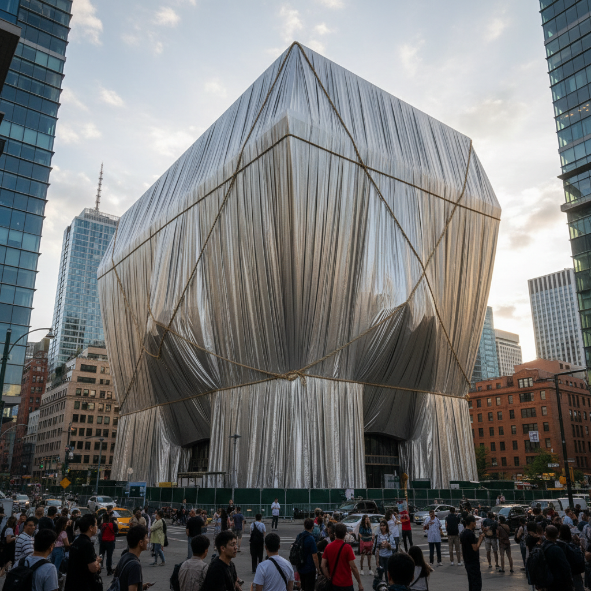

# Christo & Jeanne-Claude 克里斯托与珍妮-克劳德

> **流派**: 大地艺术 · 环境艺术 · 包裹艺术  
> **时期**: 1935–2020 保加利亚/法国/美国  
> **关键词**: 包裹建筑、临时性、大地尺度、公共参与

## 概述

克里斯托与珍妮-克劳德以包裹整座建筑、桥梁甚至海岸线的巨型临时艺术项目闻名于世。他们的作品存在时间极短（通常仅两周），却需要数十年的筹备。这种"短暂的永恒"赋予了日常景观全新的视觉体验。

## 视觉特征

- **织物包裹**: 用银色或金色织物覆盖巨大的建筑或地形
- **临时性**: 作品仅存在数天到数周
- **大地尺度**: 从单个物体到整片海岸线
- **褶皱美学**: 织物在风中形成动态的褶皱和光影
- **框架效果**: 包裹让人重新"看见"熟悉的事物

## 代表作品

- 《包裹国会大厦》(1995) 柏林
- 《被包围的岛屿》(1983) 迈阿密
- 《门》(2005) 纽约中央公园
- 《漂浮码头》(2016) 意大利伊塞奥湖

## 历史影响

克里斯托证明了艺术可以是一个过程而非物体，可以是公共的而非私有的，可以是临时的而非永恒的。他们开创了大规模公共艺术项目的先河。

## 相关风格

- [Richard Serra 理查德·塞拉](richard-serra.md)
- [Land Art 大地艺术](land-art.md)
- [Anish Kapoor 安尼施·卡普尔](anish-kapoor.md)
