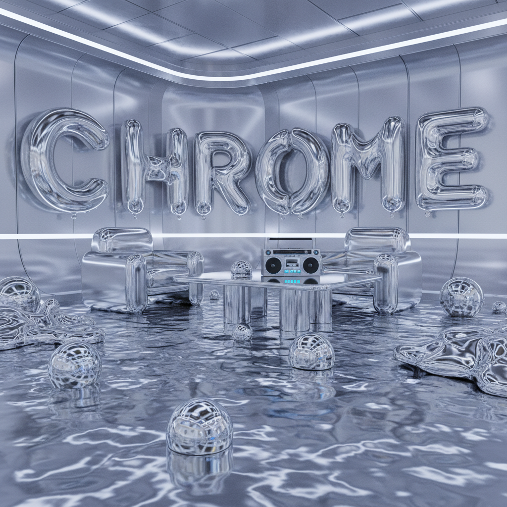
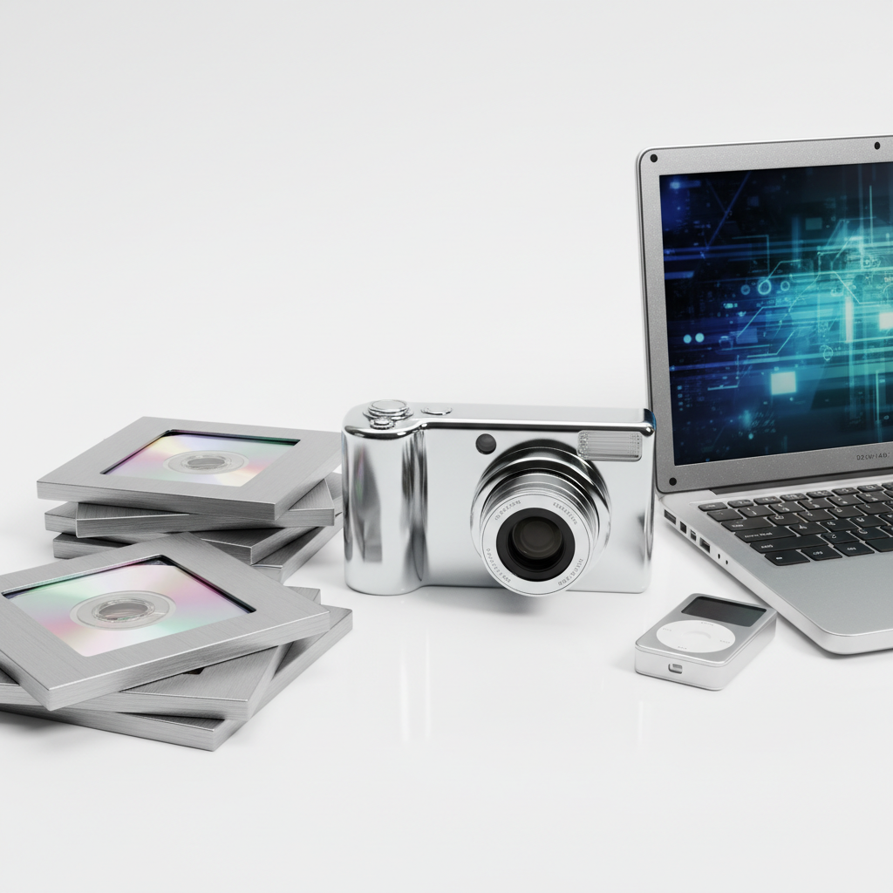

# Chromecore | 铬核美学

> 当整个世界都闪着银光——CD、手机、数码相机，万物皆铬。

## 概述

- **时间跨度**：1998 – 2007（作为Y2K Futurism的分支）
- **发源地**：全球消费电子与产品设计
- **核心理念**：以铬合金银灰色金属质感为核心的产品设计美学，反映了千禧年代对科技的乐观崇拜
- **别名**：Chrome Aesthetic、Silver Age Design

## 历史背景

### 从赛博朋克到消费品

Chromecore 在90年代末作为 Cyberpunk 和 Metalheart 的一个分支出现。但与那些偏向暗黑、地下的风格不同，Chromecore 是**彻底商业化和乐观主义**的——它相信未来是闪亮的、光滑的、银色的。

### 技术乐观主义的物质化

2000年代初，几乎所有消费电子产品都在追求同一种质感：
- **CD/DVD**：光盘本身就是铬色的完美载体
- **手机**：摩托罗拉 RAZR V3（2004）是 Chromecore 的巅峰之作
- **数码相机**：银色金属机身成为标配
- **游戏机**：PlayStation 2 的银色限定版
- **电脑**：银色笔记本取代了米色塑料

### 衰落

2006年后，Chromecore 逐渐衰落。iPhone（2007）带来的黑色玻璃+铝合金美学，以及后来的哑光、磨砂质感取代了高光铬色。镀铝、碳纤维和玻璃成为新的材质语言。

## 视觉特征

### 材质与质感
- 高光铬合金/镜面银
- 拉丝金属纹理
- 反射性表面（能映出环境）
- 光滑、无缝的曲面

### 色彩
- 银灰色为绝对主色
- 搭配冰蓝、白色LED光
- 偶尔出现的黑色对比
- 彩虹色光盘反射（CD/DVD的虹彩）

### 产品形态
- 流线型、圆润的边角
- 极简的按键和接口
- 隐藏式铰链和滑盖机构
- "未来感"的翻盖/旋转设计

### 平面设计中的Chromecore
- 3D渲染的铬色物体
- 金属质感文字效果
- 银色渐变背景
- 产品摄影中的高光反射

## 代表产品与设计

| 产品 | 年代 | 说明 |
|------|------|------|
| Motorola RAZR V3 | 2004 | Chromecore 的标志性产品 |
| Sony PlayStation 2 Silver | 2004 | 银色限定版游戏机 |
| iPod Classic (初代银色) | 2001 | 镜面不锈钢背板 |
| Nokia 8800 | 2005 | 全金属机身手机 |
| Sony Cyber-shot DSC-T7 | 2005 | 超薄银色数码相机 |
| Oakley Thump | 2004 | 铬色MP3太阳镜 |
| iMac G5 | 2004 | 白色+铝合金过渡期 |

## 与其他风格的关系

| 风格 | 关系 |
|------|------|
| Y2K Futurism | 母体风格，Chromecore是其产品设计分支 |
| Metalheart | 共享金属质感，但Metalheart更暗黑、有机 |
| Frutiger Aero | 时间重叠，但Aero偏向透明/自然，Chrome偏向金属/工业 |
| 酸性设计(当代) | 当代酸性设计大量借用铬色3D元素，是Chromecore的精神后裔 |

## 图片画廊

<!-- 图片存放于 assets/artworks/chromecore/ -->

| | |
|:---:|:---:|
|  |  |
| *铬核概念* | *银色数码设备群像* |

**推荐图片来源**：
- [贴吧：铬核Chromecore——衰落的设计风格](https://tieba.baidu.com/p/9043554191)
- [Aesthetics Wiki: Y2K - Chromecore 条目](https://aesthetics.fandom.com/wiki/Y2K)
- Pinterest: "Chromecore aesthetic 2000s"
- 素材网站搜索: "Y2K Chrome 3D shapes"

## 延伸阅读

- [Aesthetics Wiki: Y2K (Chromecore 章节)](https://aesthetics.fandom.com/wiki/Y2K)
- [贴吧：铬核Chromecore——衰落的设计风格](https://tieba.baidu.com/p/9043554191)
- [腾讯新闻：有线耳机翻红之后，Y2K Beauty 2.0也来了？](https://new.qq.com/rain/a/20260721A05HYF00)

---

[← Vectorheart](vectorheart.md) | [→ 90s Cool](90s-cool.md) | [↑ 返回目录](README.md)
