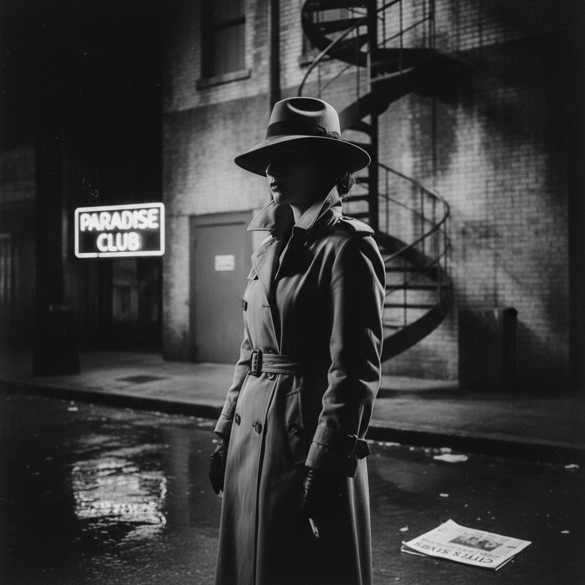

# Cindy Sherman 辛迪·舍曼

> **流派**: 后现代摄影 · 概念艺术  
> **时期**: 1954–至今 美国  
> **关键词**: 自拍肖像、身份扮演、电影剧照、女性凝视

## 概述

辛迪·舍曼是当代最重要的摄影艺术家之一。她以自己为唯一模特，通过化妆、服装和布景扮演无数不同的角色——从B级电影女主角到文艺复兴贵妇，从时尚模特到恐怖片受害者。她的作品质疑了身份、性别和媒体再现的本质。

## 视觉特征

- **自我扮演**: 艺术家本人扮演所有角色
- **电影感**: 早期作品模仿好莱坞电影剧照的构图和光线
- **身份流动**: 每张照片都是一个完全不同的"人物"
- **媒体引用**: 引用电影、广告、时尚摄影的视觉语言
- **后期夸张**: 晚期作品使用假体、假发和数字处理

## 代表作品

- 《无题电影剧照》系列 (1977–80)
- 《历史肖像》系列 (1988–90)
- 《小丑》系列 (2003–04)
- Instagram 自拍系列 (2017–)

## 历史影响

舍曼证明了摄影可以是深刻的概念艺术工具，而非仅仅记录现实。她对身份建构和媒体再现的质疑影响了整个后现代文化理论和当代自拍文化的批判性讨论。

## 相关风格

- [Pop Art 波普艺术](pop-art.md)
- [Conceptual Art 概念艺术](conceptual-art.md)
- [Kara Walker 卡拉·沃克](kara-walker.md)
