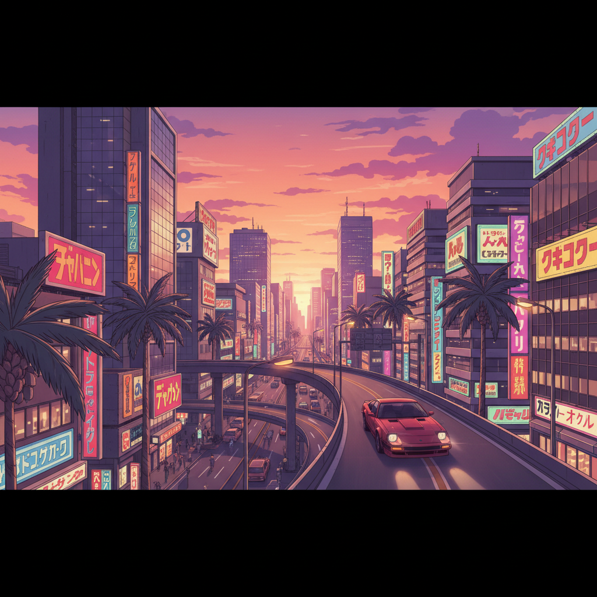

# City Pop シティ・ポップ



> **"霓虹都市、棕榈树、日落大道——1980年代东京泡沫经济的声音与画面。"**

## 概述

| 维度 | 描述 |
|------|------|
| 时期 | 1978–1988 原版 / 2017–至今 全球复兴 |
| 别名 | City Pop, シティ・ポップ, Japanese Funk |
| 核心色彩 | 日落橙粉、霓虹紫、天蓝、棕榈绿、金色 |
| 关键元素 | 霓虹城市、棕榈树、跑车、日落、泳池 |
| 代表人物 | 竹内まりや、山下達郎、大貫妙子 |
| 关联风格 | Vaporwave, Synthwave, Frutiger Aero, Future Funk |

---

## 历史脉络

### 从泡沫经济到互联网复兴

| 年份 | 事件 |
|------|------|
| 1978 | 山下達郎《Pacific》——City Pop 雏形 |
| 1980 | 竹内まりや《Plastic Love》录制 |
| 1984 | City Pop 黄金时代 |
| 1989 | 泡沫经济崩溃——City Pop 衰落 |
| 2017 | YouTube 算法推荐《Plastic Love》给全球听众 |
| 2018 | City Pop 全球复兴开始 |
| 2020s | 成为 Vaporwave/Future Funk 的核心采样源 |

### 它代表什么？

| 元素 | 含义 |
|------|------|
| 霓虹城市 | 经济繁荣、都市活力 |
| 棕榈树 | 对加州/夏威夷的向往 |
| 跑车 | 消费主义的快乐 |
| 日落 | 黄金时代的余晖 |
| 泳池 | 休闲、富裕、"我有时间" |

### 核心哲学

City Pop 的精神是**"永远停在那个最好的夏天"**：
- 泡沫经济 = 日本最自信的时代
- "明天会更好"的乐观
- 西方文化（爵士、放克）+ 日本精致
- 都市生活的浪漫化
- 一种"已经失去的未来"的怀旧

---

## 视觉语法

### 色彩系统

```
主色：
  日落橙粉 (#FF6B6B) — 黄昏、温暖
  霓虹紫 (#9B59B6) — 夜生活、都市
  天蓝 (#87CEEB) — 白天、海洋
  棕榈绿 (#2ECC71) — 热带、度假
  金色 (#F39C12) — 阳光、繁荣

辅色：
  粉色 (#FF69B4) — 浪漫
  深蓝 (#2C3E50) — 夜晚
  白色 (#FFFFFF) — 云、建筑

规则：
  - 暖色调为主
  - 日落渐变（橙→粉→紫）
  - 高饱和度
  - 柔和的光晕效果
  - 80年代喷枪画风格

质感：
  喷枪 — 柔和渐变
  霓虹 — 发光、都市
  铬合金 — 80年代质感
  水面 — 反射、泳池
  玻璃 — 高楼、现代
```

### 标志性元素

| 类别 | 元素 |
|------|------|
| 城市 | 东京天际线、霓虹招牌、高速公路 |
| 自然 | 棕榈树、日落、海滩、泳池 |
| 交通 | 红色跑车、敞篷车、首都高速 |
| 人物 | 时髦女性、墨镜、80年代发型 |
| 物品 | 鸡尾酒、黑胶唱片、卡带 |
| 字体 | 日文+英文混排、圆体、手写 |

---

## 与千禧怀旧的关系

### Vaporwave 的"前世"
- Vaporwave 大量采样 City Pop
- City Pop = "真实的80年代乐观"
- Vaporwave = "对那个乐观的讽刺/怀念"
- Future Funk = "让City Pop重新跳舞"

### 为什么2017年复兴？
- YouTube 算法偶然推荐
- 全球化让日本文化更可及
- 对"永远在线"时代的反叛——怀念"简单的快乐"
- 视觉上与 Vaporwave/Synthwave 完美契合

---

## 中国语境

- "City Pop" 在B站/网易云的巨大社区
- 中国独立音乐人的 City Pop 创作
- 与"复古日系"/"昭和风"的交叉
- 中国80年代流行乐的类似美学
- 上海/深圳的霓虹都市 = 中国版 City Pop 场景

---

## 设计应用

| 场景 | 应用方式 |
|------|----------|
| 音乐 | 日落渐变+棕榈树+霓虹字体+80年代 |
| 品牌 | 暖色渐变+复古字体+喷枪风格 |
| 空间 | 霓虹灯+热带植物+复古家具 |
| 数字 | 日落配色+圆角+柔和光效+复古 |

---

## 相关风格

← [Vaporwave 蒸汽波](vaporwave.md) | [Synthwave 合成波](synthwave.md) →

↑ [返回千禧怀旧目录](README.md) | [返回总目录](../README.md)
