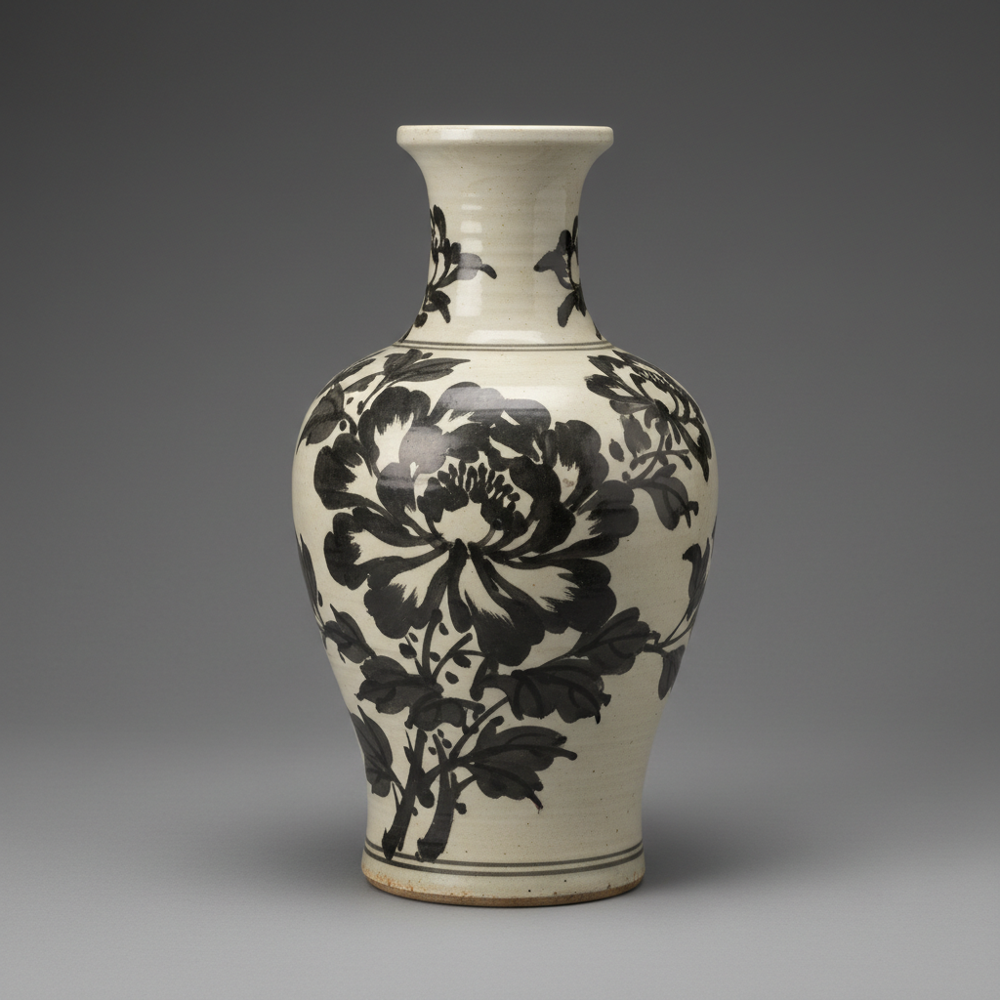

# Cizhou Ware Art 磁州窑艺术

> "Cizhou ware is the people's porcelain — bold black brushwork on white slip, free and confident as calligraphy, decoration that speaks with the directness of folk art rather than the refinement of court taste, each piece carrying the energy of a brush wielded without hesitation, the ceramic equivalent of street poetry painted on the everyday vessels of common life." — Unknown

## 概述

磁州窑艺术（Cizhou Ware Art）是中国北方最重要的民间窑系之一，以其大胆奔放的黑白装饰风格著称。磁州窑位于今河北省磁县和峰峰矿区一带，其产品以白地黑花（白色化妆土上用黑色颜料绘画）为最典型特征。磁州窑的装饰风格自由奔放、充满民间生活气息——与官窑的精致含蓄形成鲜明对比，代表了中国陶瓷艺术中最具生命力的民间传统。

磁州窑艺术的核心要素包括：1）白地黑花——白色化妆土上的黑色绘画；2）民间风格——自由奔放的民间美学；3）书画结合——书法和绘画的结合；4）题材丰富——花鸟鱼虫人物故事；5）刻划装饰——刻花划花等技法；6）日用器物——为日常生活服务；7）北方窑系——北方民窑的代表。

## 核心特征

| 特征 | 描述 |
|------|------|
| 白地黑花 | 白底上的黑色绘画 |
| 民间风格 | 自由奔放的美学 |
| 书画结合 | 书法绘画的结合 |
| 题材丰富 | 花鸟人物故事 |
| 刻划装饰 | 刻花划花技法 |
| 日用器物 | 为日常生活服务 |

## 视觉特征

- **黑白对比**：强烈的黑白对比
- **笔触奔放**：自由奔放的笔触
- **书法韵味**：如书法般的线条
- **民间题材**：花鸟鱼虫等民间题材
- **化妆土**：白色化妆土的底色
- **刻划纹样**：刻划出的装饰纹样

## 代表作品

| 作品 | 艺术家/文化 | 年代 | 意义 |
|------|-------------|------|------|
| *白地黑花梅瓶* | 磁州窑 | 宋金 | 磁州窑的经典 |
| *黑花婴戏纹枕* | 磁州窑 | 宋代 | 民间生活题材 |
| *白地黑花诗文瓶* | 磁州窑 | 金元 | 书法装饰 |
| *刻花梅瓶* | 磁州窑 | 宋代 | 刻花技法 |
| *铁锈花器* | 磁州窑 | 各时期 | 铁锈花装饰 |

## 历史时间线

| 时期 | 事件 |
|------|------|
| 北宋 | 磁州窑的兴起 |
| 金代 | 磁州窑的繁荣 |
| 元代 | 磁州窑的继续发展 |
| 明清 | 磁州窑的延续 |
| 当代 | 磁州窑传统的保护传承 |

## 中国语境

磁州窑是中国陶瓷史上最重要的民间窑系——它代表了与官窑系统完全不同的美学传统。如果说官窑追求的是精致、含蓄、完美，磁州窑追求的则是自由、奔放、生动。磁州窑的白地黑花装饰被认为是中国青花瓷的重要先驱——其在白色底色上用深色颜料绘画的技法为后来的青花瓷奠定了基础。磁州窑的装饰题材来自民间生活——婴戏、花鸟、诗文、故事等，充满了生活气息和民间智慧。磁州窑的影响范围极广——北方许多窑口都受其影响，形成了庞大的"磁州窑系"。磁州窑证明了中国陶瓷艺术不仅有精致的官窑传统，更有充满生命力的民间传统。

## AI生成概念图

## 与其他风格的关系

- **Folk Art** → 民间艺术
- **Calligraphy** → 书法
- **Sgraffito** → 刻划装饰
- **Blue and White** → 青花（先驱）
- **Northern Kilns** → 北方窑系
- **Slip Decoration** → 化妆土装饰

---

*浮光艺志 | Chronicle of Artistry*
