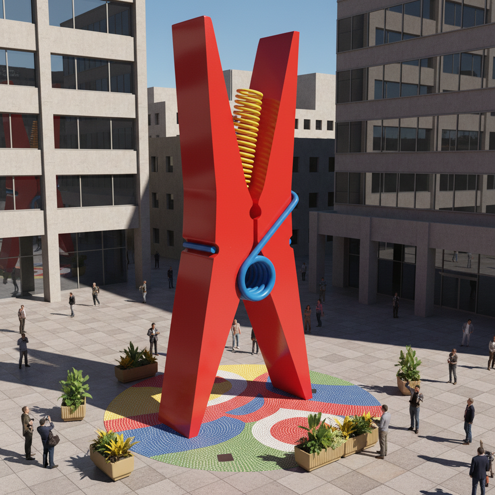

# Claes Oldenburg 克拉斯·奥尔登堡

> **流派**: 波普艺术 · 公共雕塑  
> **时期**: 1929–2022 瑞典/美国  
> **关键词**: 巨型日常物品、软雕塑、幽默感、尺度错位

## 概述

克拉斯·奥尔登堡以将日常物品放大到纪念碑尺度而闻名——巨大的衣夹、冰淇淋勺、樱桃与汤匙。他的早期"软雕塑"用帆布和乙烯基制作巨大的汉堡和打字机，挑战了雕塑必须坚硬的传统。幽默是他最锋利的工具。

## 视觉特征

- **尺度放大**: 日常小物品被放大到建筑尺度
- **软材料**: 早期用布料制作"瘫软"的巨型物品
- **鲜艳色彩**: 波普式的明亮商业色彩
- **幽默错位**: 严肃的纪念碑形式+荒谬的主题
- **公共场域**: 后期作品多为城市公共雕塑

## 代表作品

- 《衣夹》(1976) 费城
- 《汤匙桥与樱桃》(1988) 明尼阿波利斯
- 《软马桶》(1966)
- 《地板汉堡》(1962)

## 历史影响

奥尔登堡将波普艺术从画布带入三维空间和公共领域，证明了幽默和日常性可以成为纪念碑式艺术的核心。他影响了后来的公共艺术和当代雕塑。

## 相关风格

- [Pop Art 波普艺术](pop-art.md)
- [Jeff Koons 杰夫·昆斯](jeff-koons.md)
- [Andy Warhol 安迪·沃霍尔](andy-warhol.md)
