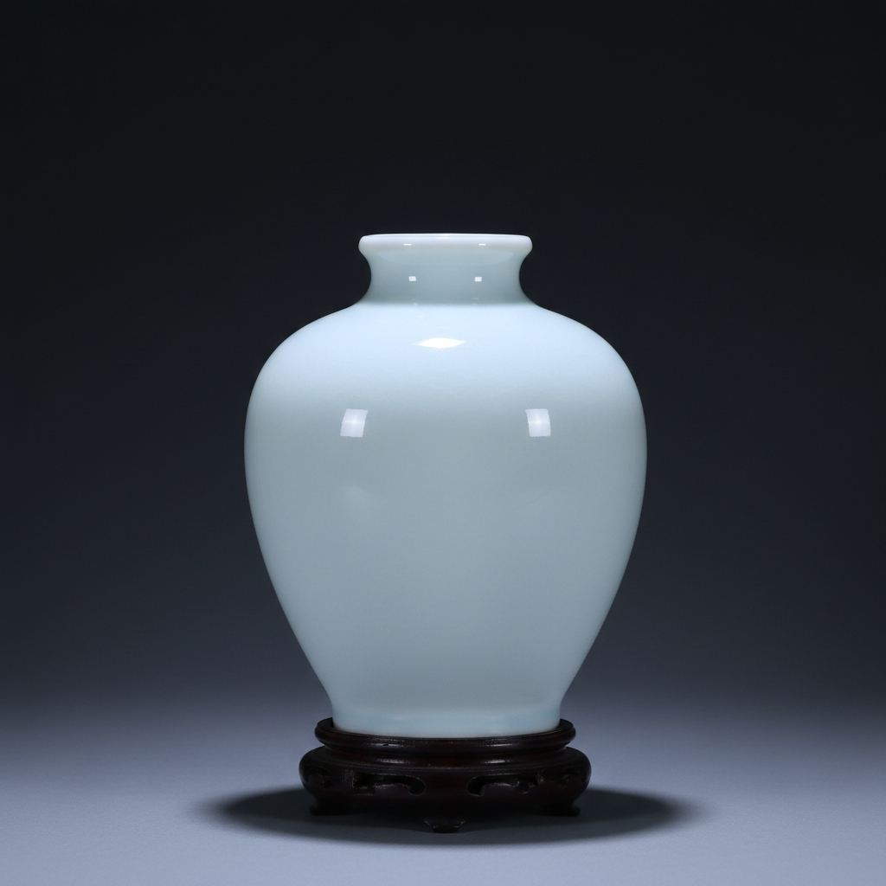

# Clair de Lune Art 月白釉艺术

> "Clair de lune is moonlight made solid — a pale blue glaze so subtle it seems to glow from within, iron reduced to its most ethereal expression in a high-fired feldspathic glaze, the color of a winter moon reflected in still water, quieter than celadon and cooler than white, a glaze that embodies the Chinese aesthetic of restraint taken to its luminous extreme." — Unknown

## 概述

月白釉艺术（Clair de Lune Art）是一种以极淡的蓝白色调为特征的高温釉色艺术。"Clair de lune"是法语"月光"之意，形容这种釉色如同月光般清冷淡雅的蓝白色泽。月白釉是中国传统釉色中最含蓄淡雅的品种之一——其色调介于白色和淡蓝之间，如同冬夜月光洒在雪地上的清冷光泽。月白釉的呈色来自微量铁元素在还原气氛中的作用。

月白釉艺术的核心要素包括：1）淡蓝白色——极淡的蓝白色调；2）月光质感——如月光般清冷淡雅；3）微量铁呈色——微量铁的还原呈色；4）高温烧成——高温长石质釉；5）含蓄极致——含蓄美学的极致；6）内敛光泽——柔和内敛的光泽；7）文人审美——极致的文人审美。

## 核心特征

| 特征 | 描述 |
|------|------|
| 淡蓝白色 | 极淡的蓝白色调 |
| 月光质感 | 如月光般清冷 |
| 微量铁呈色 | 微量铁的还原呈色 |
| 高温烧成 | 高温长石质釉 |
| 含蓄极致 | 含蓄美学的极致 |
| 内敛光泽 | 柔和内敛的光泽 |

## 视觉特征

- **淡蓝色调**：极淡的蓝色倾向
- **月光般**：如月光般的清冷光泽
- **半透明**：釉层的半透明质感
- **柔和光泽**：不刺眼的柔和光泽
- **纯净感**：极其纯净的色调
- **冷调优雅**：冷调中的优雅

## 代表作品

| 作品 | 艺术家/文化 | 年代 | 意义 |
|------|-------------|------|------|
| *宋代月白釉* | 中国宋代 | 宋代 | 月白釉的早期实践 |
| *清代月白釉* | 中国清代 | 清代 | 月白釉的精致化 |
| *月白釉梅瓶* | 中国 | 各时期 | 经典器形 |
| *月白釉文房* | 中国 | 清代 | 文房用器 |
| *当代月白釉* | 当代陶艺家 | 当代 | 当代的诠释 |

## 历史时间线

| 时期 | 事件 |
|------|------|
| 宋代 | 钧窑月白釉的出现 |
| 明代 | 月白釉的继续发展 |
| 清代 | 月白釉的精致化 |
| 19世纪 | 欧洲收藏家命名"Clair de lune" |
| 当代 | 月白釉在当代陶艺中的应用 |

## 中国语境

月白釉是中国陶瓷美学中"淡"的极致体现。中国传统美学崇尚"淡而有味"——月白釉正是这种审美理想的物质化身。宋代钧窑的月白釉是最早的代表——其淡蓝色调来自微量铁在还原气氛中的呈色。清代景德镇将月白釉发展到极致的精细——釉面如月光般柔和纯净。中国文人将月白釉与月光、清泉、冰雪等意象联系——它代表了一种超越世俗的清雅境界。"Clair de lune"这个法语名称是19世纪欧洲收藏家对中国月白釉的浪漫命名——月光的意象恰好捕捉了这种釉色的精神本质。月白釉证明了中国陶瓷在色彩上的极致追求——不是浓烈的色彩，而是最微妙的色调变化。

## AI生成概念图

## 与其他风格的关系

- **Celadon** → 青瓷
- **Jun Ware** → 钧窑
- **Monochrome Glaze** → 单色釉
- **Chinese Aesthetics** → 中国美学
- **Minimalism** → 极简主义
- **Moon White** → 月白

---

*浮光艺志 | Chronicle of Artistry*
