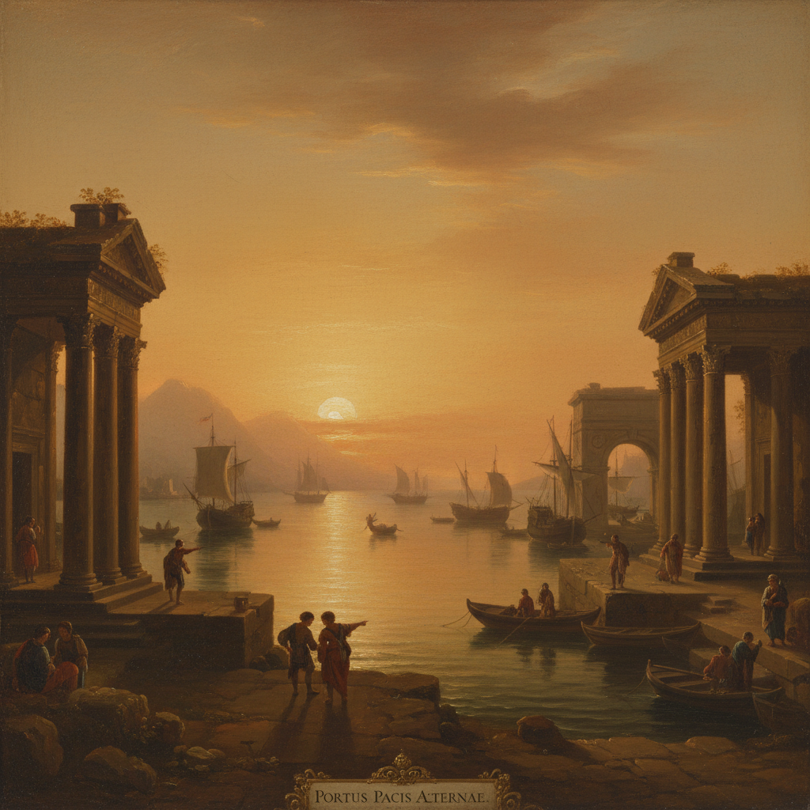

# Claude Lorrain 克洛德·洛兰

> "I have tried to paint the light." — Claude Lorrain

## 概述

克洛德·洛兰（Claude Lorrain，本名 Claude Gellée，1600–1682）是法国画家，长期居住在罗马，被誉为理想风景画的最高代表。他以描绘沐浴在金色阳光中的古典港口和田园风景闻名——将真实的意大利风光与古典建筑、神话人物融合，创造出一个永恒的黄金时代。

## 核心特征

| 特征 | 描述 |
|------|------|
| 金色光线 | 日出日落的温暖光辉 |
| 理想风景 | 古典建筑与自然的完美融合 |
| 大气透视 | 远景逐渐消融在光雾中 |
| 古典港口 | 柱廊、帆船、地中海 |
| 框架构图 | 树木和建筑框住远景 |
| 田园诗意 | 阿卡迪亚般的黄金时代 |

## 代表作品

| 作品 | 年代 | 意义 |
|------|------|------|
| *Seaport with the Embarkation of the Queen of Sheba* | 1648 | 理想港口的经典 |
| *Landscape with the Marriage of Isaac and Rebecca* | 1648 | 田园风景的巅峰 |
| *The Enchanted Castle* | 1664 | 梦幻般的诗意风景 |
| *Liber Veritatis* | 1635–82 | 作品记录的素描集 |

## AI生成概念图

## 与其他风格的关系

- **Poussin** → 同代法国古典主义画家
- **Turner** → 透纳深受其光线影响
- **Hudson River School** → 影响了美国风景画传统
- **Picturesque** → 如画美学的源头
