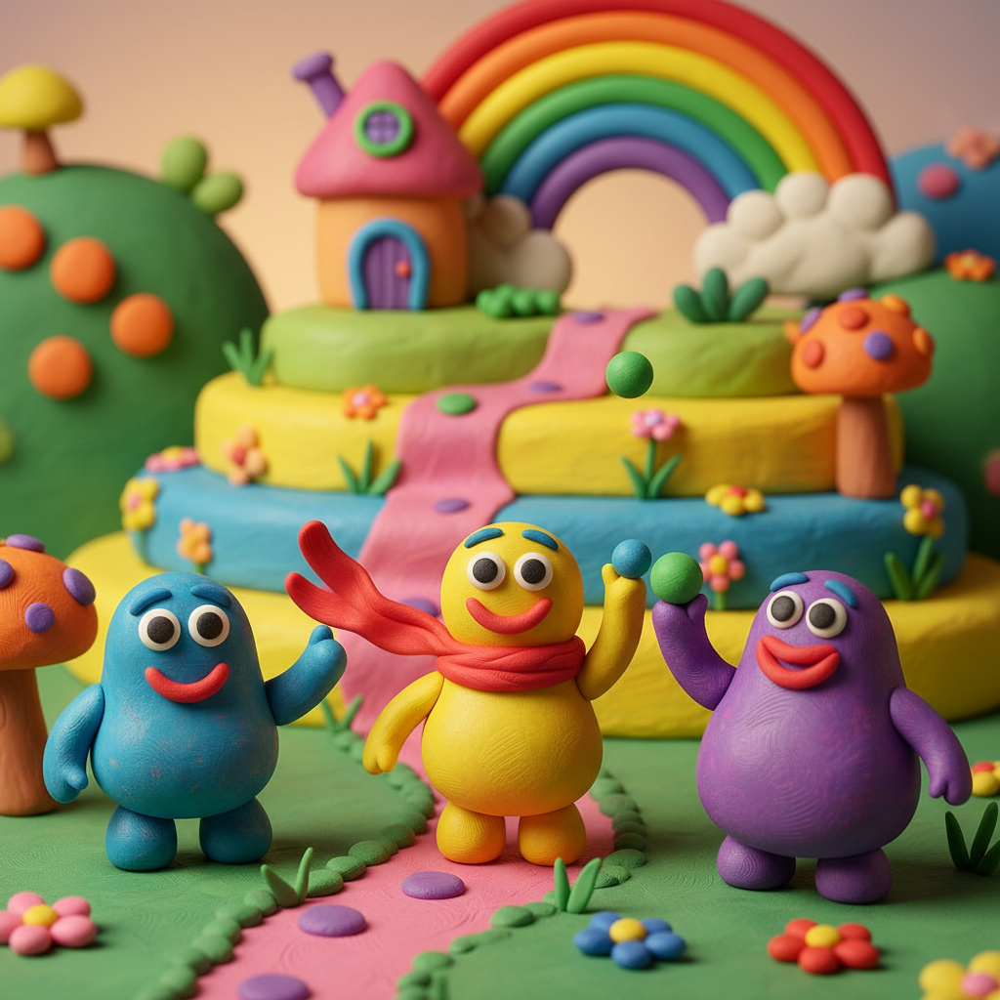

# Claymation 黏土动画

> **时期：** 1950年代–至今  
> **关键词：** 黏土造型、可塑变形、手工温度、逐帧雕塑、童趣质感

## 概述

Claymation（黏土动画）是定格动画的一个重要分支，使用可塑黏土（通常是Plasticine油泥）制作角色和场景。黏土的可塑性允许角色在帧与帧之间进行流畅的形态变化，创造出独特的"软体"运动感。从阿德曼动画的《超级无敌掌门狗》到威尔·文顿的开创性作品，黏土动画以其温暖的手工质感和幽默感深受喜爱。

## 风格特征

- **可塑变形**：黏土材质允许的流畅形态变化
- **指纹痕迹**：制作者手指留下的微妙纹理
- **圆润造型**：黏土天然的柔软圆润感
- **色彩鲜明**：彩色黏土的饱和色彩
- **表情丰富**：通过揉捏改变面部表情

## 代表人物与作品

- 威尔·文顿《加州葡萄干》广告
- 尼克·帕克《超级无敌掌门狗》《小鸡快跑》
- 阿特·克洛基《乖乖泥》(Gumby)
- 彼得·洛德《变种DNA》

## 概念图

