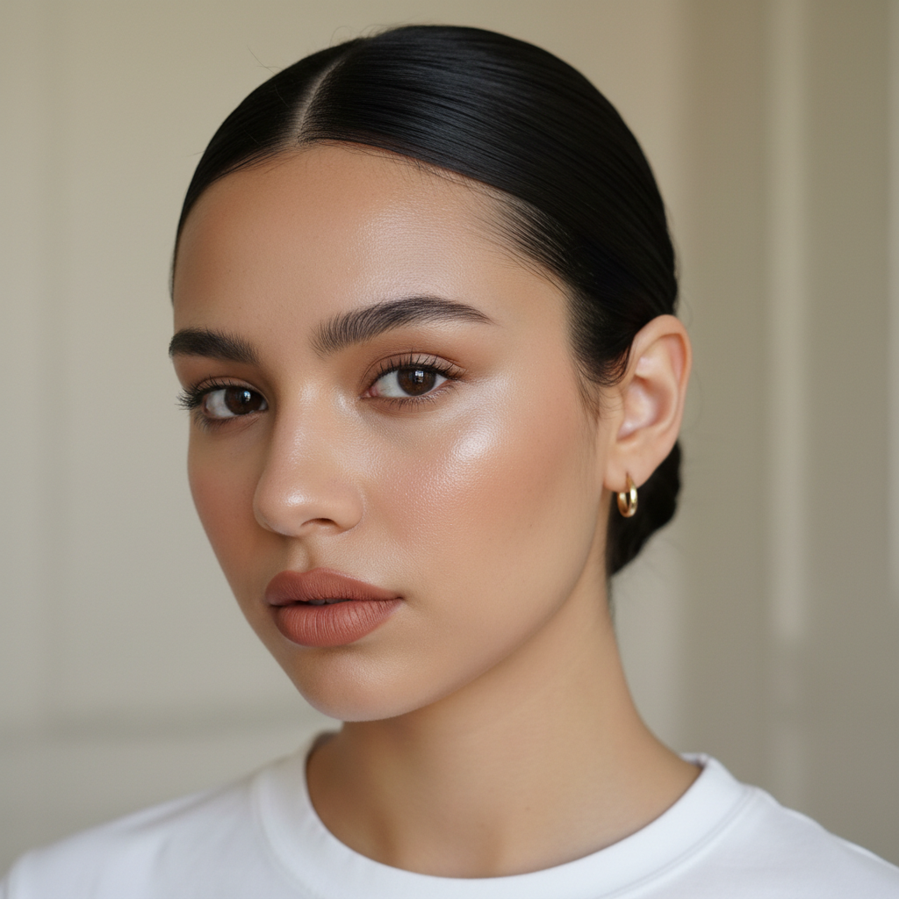

# Clean Girl 干净女孩



> **"'我只用了防晒和唇膏'——虽然实际上用了12个产品，但看起来什么都没用。"**

## 概述

| 维度 | 描述 |
|------|------|
| 时期 | 2021–至今 |
| 别名 | Clean Girl, That Girl, Vanilla Girl, Model Off Duty |
| 核心色彩 | 米色、白色、棕色、裸色、金色 |
| 关键元素 | 光泽肌、slicked-back发型、金色耳环、极简穿搭 |
| 代表人物 | Hailey Bieber、Bella Hadid、Rosie Huntington-Whiteley |
| 关联风格 | Normcore, Old Money, Soft Girl (对立面), Coastal Grandmother |

---

## 历史脉络

### 2021：TikTok 的"That Girl"

Clean Girl 美学在 2021 年从 TikTok 的 "That Girl" 趋势中分化出来：

**"That Girl" 原型**：
- 早起5点
- 晨跑/瑜伽
- 绿色果汁
- 极简穿搭
- 高效工作
- 一切都"在掌控中"

Clean Girl 是 "That Girl" 的**视觉表达**——看起来毫不费力地完美。

### 文化基因

| 来源 | 贡献 |
|------|------|
| 90s 超模 off-duty | "模特下班后"的随意感 |
| Glossier 品牌 (2014–) | "skin first, makeup second" 哲学 |
| Korean Beauty | 玻璃肌、护肤优先 |
| Scandinavian Minimalism | 极简穿搭、中性色 |
| Wellness Culture | 健康=美丽的等式 |

### 2022–2023：争议

Clean Girl 面临的批评：
- **种族问题**：被指控是对黑人和拉丁裔女性长期使用的造型（slicked-back bun、金色耳环、唇线笔）的"白人化重新包装"
- **阶级问题**：看起来"什么都没用"实际上需要昂贵的护肤品和基因彩票
- **健康主义**：将"干净"与"美丽"等同，暗示不符合标准的人是"不干净的"

---

## 视觉语法

### 色彩系统

```
主色（全部为"肤色延伸"）：
  米色 (#F5F5DC) — 衣服、背景
  裸色 (#E8C4A2) — 唇色、指甲
  白色 (#FFFFFF) — T恤、运动鞋
  棕色 (#8B4513) — 皮带、包
  金色 (#FFD700) — 耳环、项链

妆容色：
  玻璃肌（透明光泽）
  裸色唇（比嘴唇深一号）
  棕色眉（自然但整齐）
  无眼影或极淡棕色

规则：
  - 看起来像"没化妆"
  - 颜色不超过3种
  - 没有图案
  - 一切都"刚刚好"
```

### 标志性元素

| 类别 | 元素 |
|------|------|
| 发型 | Slicked-back bun（光滑低马尾/丸子头）、中分 |
| 妆容 | 玻璃肌+裸唇+自然眉+无眼影 |
| 上衣 | 白色T恤、米色针织、运动内衣 |
| 下装 | 高腰阔腿裤、瑜伽裤、直筒牛仔裤 |
| 鞋 | 白色运动鞋、凉拖、乐福鞋 |
| 配饰 | 金色小耳环（hoop）、细项链、极简手表 |
| 包 | 极简皮质手提包（无logo） |
| 生活 | 瑜伽垫、绿色果汁、极简公寓 |

---

## 与千禧怀旧的关系

Clean Girl 与千禧怀旧的关系是**对立互补**的：

### 对 2000s 极繁的反动
- 2000s：浓妆、假睫毛、古铜色、亮片 → Clean Girl：裸妆、自然、无装饰
- 2000s：logo满身 → Clean Girl：无logo
- 2000s：低腰裤+露脐装 → Clean Girl：高腰+遮盖

### 但也有继承
- 90s 超模的"effortless"美学 → Clean Girl 的直接前身
- 2010s Glossier 的"skin first" → Clean Girl 的妆容哲学

---

## 中国语境

Clean Girl 在中国的对应：
- **"纯欲风"的进化**：从"纯欲"到"干净感"
- **"氛围感妆容"**：小红书上的极简妆教程
- **"高级感穿搭"**：中性色+极简+质感
- **与"老钱风"的交叉**：两者共享"低调有品味"的核心

---

## 设计应用

| 场景 | 应用方式 |
|------|----------|
| 品牌设计 | 无衬线字体+中性色+大量留白+极简 |
| 包装 | 白色/米色+极简标签+无多余装饰 |
| 摄影 | 自然光+中性背景+极简道具 |
| UI | 大量留白+细线条+中性色板 |

---

## 延伸阅读

- Aesthetics Wiki: [Clean Girl](https://aesthetics.fandom.com/wiki/Clean_Girl)
- "The Problem with Clean Girl Aesthetic" 文化批评
- Glossier 品牌美学分析

---

## 相关风格

← [Old Money 老钱风](old-money.md) | [Normcore 正常核](normcore.md) →

↑ [返回千禧怀旧目录](README.md) | [返回总目录](../README.md)
