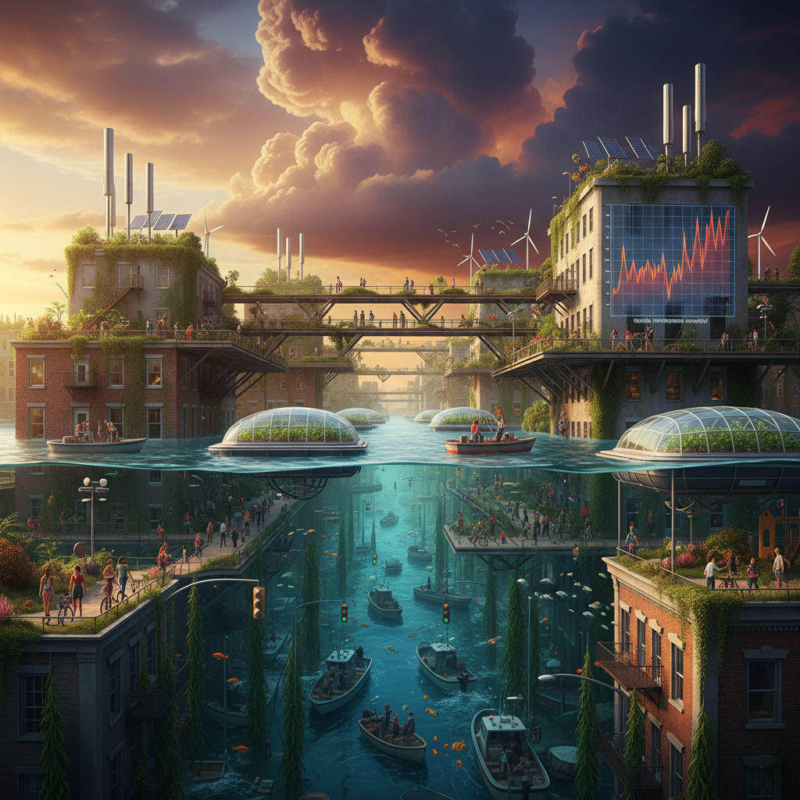

# Climate Fiction Art 气候小说艺术

> "Climate fiction art visualizes what the data cannot convey — the emotional reality of a warming world, the landscapes we are losing and the landscapes we are creating, the human stories embedded in every fraction of a degree, the beauty that persists even in catastrophe, and the futures we might still choose if we can first imagine them clearly enough to want them, turning abstract statistics into felt experience, turning graphs into grief and hope and determination." — Unknown

## 概述

气候小说艺术（Climate Fiction Art / Cli-Fi Art）是围绕气候变化主题的视觉艺术实践，与"气候小说"（Climate Fiction / Cli-Fi）文学运动平行发展。气候小说艺术试图将气候变化的抽象数据和科学预测转化为可感知的视觉体验——让人们不仅理解气候变化，而且感受它。

气候小说艺术的实践范围包括：1）未来景观——描绘气候变化后的地球景观；2）数据可视化艺术——将气候数据转化为美学体验；3）生态哀悼——记录和哀悼正在消失的生态系统；4）适应性想象——想象人类如何适应变化后的世界；5）希望的图像——描绘可持续未来的可能性。气候小说艺术既包括悲观的"末日"想象，也包括乐观的"转型"想象——后者与太阳朋克有密切关联。

## 核心特征

| 特征 | 描述 |
|------|------|
| 气候 | 气候变化为核心主题 |
| 情感 | 数据的情感化 |
| 未来 | 未来景观的想象 |
| 哀悼 | 生态哀悼 |
| 希望 | 可持续未来的想象 |
| 叙事 | 视觉叙事 |

## 视觉特征

- **水位**：上升的海平面
- **天空**：变化的天空色彩
- **废墟**：被淹没的城市
- **适应**：适应性的建筑和生活
- **数据**：数据的视觉化
- **对比**：过去与未来的对比

## 代表作品

| 作品 | 艺术家 | 年代 | 意义 |
|------|--------|------|------|
| *Postcards from the Future* | Various | 2010年代 | 未来明信片 |
| *Drowned cities* | Various | 2010年代 | 被淹没的城市 |
| *Climate data art* | Various | 2010年代 | 气候数据艺术 |
| *Warming Stripes* | Ed Hawkins | 2018 | 变暖条纹 |
| *Solarpunk visions* | Various | 2020年代 | 乐观的气候未来 |

## 历史时间线

| 时期 | 事件 |
|------|------|
| 2000年代 | 气候艺术的早期实践 |
| 2010 | "Cli-Fi"术语的流行 |
| 2015 | 巴黎协定后的艺术回应 |
| 2018 | 气候罢课运动的视觉文化 |
| 当代 | 气候艺术的主流化 |

## 中国语境

气候小说艺术在中国有越来越多的实践。中国作为全球最大的碳排放国之一，同时也是气候变化的重要受影响者——从北方的沙漠化到南方的洪涝，从冰川消退到海平面上升——这些现实为气候小说艺术提供了丰富的素材。中国的一些艺术家在创作气候主题的作品：描绘被淹没的中国城市、记录正在消失的冰川和湿地、想象适应气候变化后的中国生活方式。中国的科幻文学中也有越来越多的气候主题——如陈楸帆的一些作品。中国的气候小说艺术面临的独特挑战是如何在特定的文化和政治语境中有效地传达气候信息。

## AI生成概念图

## 与其他风格的关系

- **Solarpunk** → 太阳朋克
- **Eco-Art** → 生态艺术
- **Science Fiction Art** → 科幻艺术
- **Data Art** → 数据艺术
- **Solastalgia Art** → 生态乡愁艺术
- **Speculative Design** → 推测设计

---

*浮光艺志 | Chronicle of Artistry*
