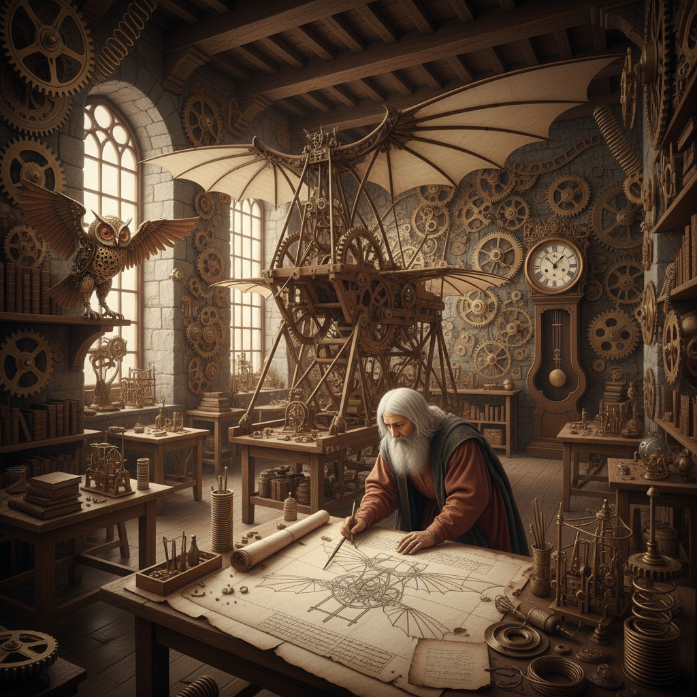

# Clockpunk 钟表朋克



> **"如果达芬奇的发明全部成真——齿轮、发条、黄铜的文艺复兴帝国。"**

## 概述

| 维度 | 描述 |
|------|------|
| 时期 | 2000s–至今（作为美学标签）/ 灵感源文艺复兴 |
| 别名 | Clockpunk, 钟表朋克, Da Vinci Punk |
| 核心色彩 | 黄铜金、羊皮纸色、深棕木、铁灰 |
| 关键元素 | 齿轮、发条机构、达芬奇手稿、文艺复兴机械 |
| 代表人物 | 视觉参考：Assassin's Creed II, The Inventor |
| 关联风格 | Steampunk, Dieselpunk, Renaissance, Baroque |

---

## 历史脉络

| 年份 | 事件 |
|------|------|
| 1490s | 达芬奇设计飞行器、坦克、机器人——Clockpunk的原始灵感 |
| 1500s | 欧洲钟表制造业兴起——精密机械的黄金时代 |
| 2000s | "Clockpunk"作为Steampunk子类被命名 |
| 2009 | Assassin's Creed II——文艺复兴意大利+达芬奇机械 |
| 2010s | Clockpunk在桌游、TTRPG中流行 |

### 核心哲学

Clockpunk的精神是**"如果文艺复兴的天才们拥有了工业能力——但没有蒸汽"**：
- "齿轮和发条 = 唯一的动力源"
- "达芬奇的手稿 = Clockpunk的圣经"
- "Steampunk用蒸汽——Clockpunk用发条"
- "美学是文艺复兴的——不是维多利亚的"
- "精密 > 力量——巧妙 > 粗暴"

---

## 视觉语法

### 色彩系统

```
主色：
  黄铜金 (#B5A642) — 齿轮、机械
  羊皮纸 (#F5DEB3) — 手稿、古典
  深棕木 (#5C4033) — 框架、温暖
  铁灰 (#696969) — 金属、结构

辅色：
  翡翠绿 (#046307) — 宝石、文艺复兴
  深红 (#8B0000) — 天鹅绒、权力
  靛蓝 (#191970) — 墨水、夜空

材质：
  黄铜 — 齿轮、装饰
  木材 — 框架、外壳
  皮革 — 绑带、覆盖
  玻璃 — 透视、展示
  羊皮纸 — 图纸、记录

规则：
  - 动力源 = 发条/弹簧/重力（无蒸汽）
  - 美学 = 文艺复兴（非维多利亚）
  - 材料 = 黄铜+木+皮革
  - 精密 > 粗犷
  - 达芬奇手稿风格的技术图纸
```

### 标志性元素

| 类别 | 元素 |
|------|------|
| 机械 | 齿轮、发条、弹簧、摆锤 |
| 发明 | 飞行器、自动人偶、机械臂 |
| 建筑 | 文艺复兴+机械装置 |
| 图纸 | 达芬奇式手稿、镜像文字 |
| 服装 | 文艺复兴服饰+机械配件 |
| 态度 | 天才、发明、精密、古典 |

---

## 与Steampunk的区别

| 维度 | Clockpunk | Steampunk |
|------|-----------|-----------|
| 时代 | 文艺复兴(1400-1600) | 维多利亚(1837-1901) |
| 动力 | 发条/弹簧/重力 | 蒸汽 |
| 材料 | 黄铜+木 | 铜+铁+皮革 |
| 美学 | 达芬奇/意大利 | 英国/工业革命 |
| 规模 | 精密小型 | 可以巨大 |

---

## 设计应用

| 场景 | 应用方式 |
|------|----------|
| 游戏 | 文艺复兴+机械发明+冒险 |
| 钟表 | 复杂机芯+展示+工艺 |
| 品牌 | 精密+古典+工匠精神 |
| 装置 | 动态雕塑+齿轮艺术 |

---

## 相关风格

← [Steampunk 蒸汽朋克](steampunk.md) | [Dieselpunk 柴油朋克](dieselpunk.md) →

↑ [返回千禧怀旧目录](README.md) | [返回总目录](../README.md)
