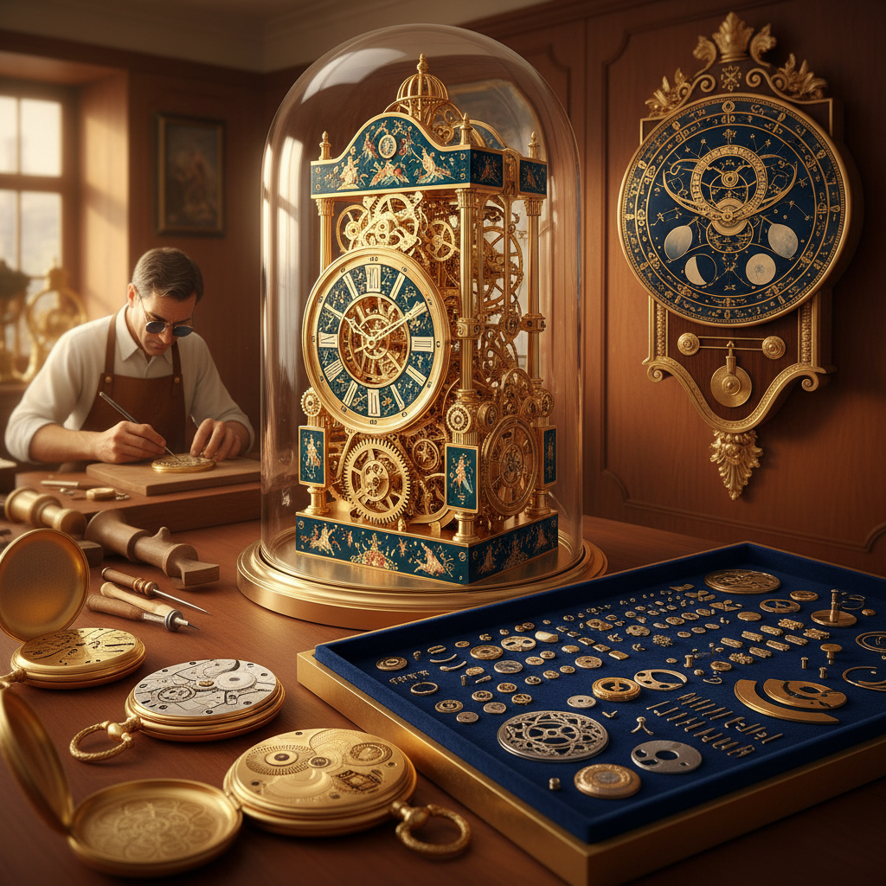

# Clockwork Art 钟表艺术

> "A clock is time made visible — gears turning at precisely calculated ratios, escapements ticking with mathematical regularity, hands sweeping across a dial in an endless circle. But beyond timekeeping, the clockmaker's art transforms these mechanisms into objects of extraordinary beauty: cases of gold and enamel, dials of precious stone, movements decorated with engravings so fine they can only be seen under magnification." — Unknown

## 概述

钟表艺术（Clockwork Art）是以钟表机械为核心的艺术创作——包括精密钟表的设计与制造、钟表机芯的装饰艺术、以钟表机械为灵感的当代艺术创作，以及将钟表元素融入雕塑和装置的实践。钟表艺术是精密工程与极致美学的结合。

钟表艺术的实践包括：1）高级制表——顶级手表的设计和制造；2）钟表雕刻——机芯和表壳的装饰雕刻；3）珐琅表盘——微缩珐琅绑画的表盘艺术；4）天文钟——展示天文信息的复杂钟表；5）音乐钟——能演奏音乐的钟表装置；6）骨架钟——展示内部机械的透明钟表；7）当代钟表艺术——以钟表为主题的当代艺术创作。

## 核心特征

| 特征 | 描述 |
|------|------|
| 精密 | 极致的精密度 |
| 时间 | 与时间的关系 |
| 微缩 | 微缩的工艺 |
| 循环 | 循环往复的运动 |
| 奢华 | 奢华的材料和工艺 |
| 永恒 | 追求永恒的运转 |

## 视觉特征

- **金属**：黄金、钢铁、黄铜的光泽
- **齿轮**：精密的齿轮系统
- **圆形**：圆形的表盘和机芯
- **微缩**：极其微小的零件
- **装饰**：精美的雕刻和珐琅
- **透明**：展示内部机械的设计

## 代表作品

| 作品 | 艺术家 | 年代 | 意义 |
|------|--------|------|------|
| *布拉格天文钟* | Various | 1410 | 中世纪天文钟 |
| *Strasbourg Cathedral Clock* | Various | 1843 | 大教堂天文钟 |
| *Patek Philippe watches* | Various | 1839至今 | 顶级制表艺术 |
| *Corpus Clock* | John Taylor | 2008 | 当代钟表艺术 |
| *Skeleton clocks* | Various | 18世纪至今 | 骨架钟 |

## 历史时间线

| 时期 | 事件 |
|------|------|
| 13世纪 | 机械钟的发明 |
| 15-16世纪 | 便携式钟表的出现 |
| 17-18世纪 | 制表艺术的黄金时代 |
| 19世纪 | 工业化制表 |
| 当代 | 高级制表的复兴和当代钟表艺术 |

## 中国语境

钟表艺术在中国有独特的历史。明末清初，欧洲传教士将机械钟表带入中国——康熙、雍正、乾隆三朝对钟表极为热爱，清宫造办处设有专门的"做钟处"，制造了大量精美的宫廷钟表。故宫博物院收藏有超过1500件珍贵的古董钟表——包括中国制造和欧洲进口的精品。中国广州在18-19世纪是重要的钟表制造中心——"广钟"以其精美的珐琅和镶嵌工艺闻名。中国当代的制表业在快速发展——从海鸥、北京等品牌的机械表到新兴的独立制表师。中国的一些当代艺术家也以钟表机械为创作灵感——探索时间、精密和机械美学的主题。

## AI生成概念图

## 与其他风格的关系

- **Automaton Art** → 自动机艺术
- **Mechanical Art** → 机械艺术
- **Miniature Art** → 微缩艺术
- **Jewelry Art** → 珠宝艺术
- **Enamel Art** → 珐琅艺术
- **Steampunk** → 蒸汽朋克

---

*浮光艺志 | Chronicle of Artistry*
