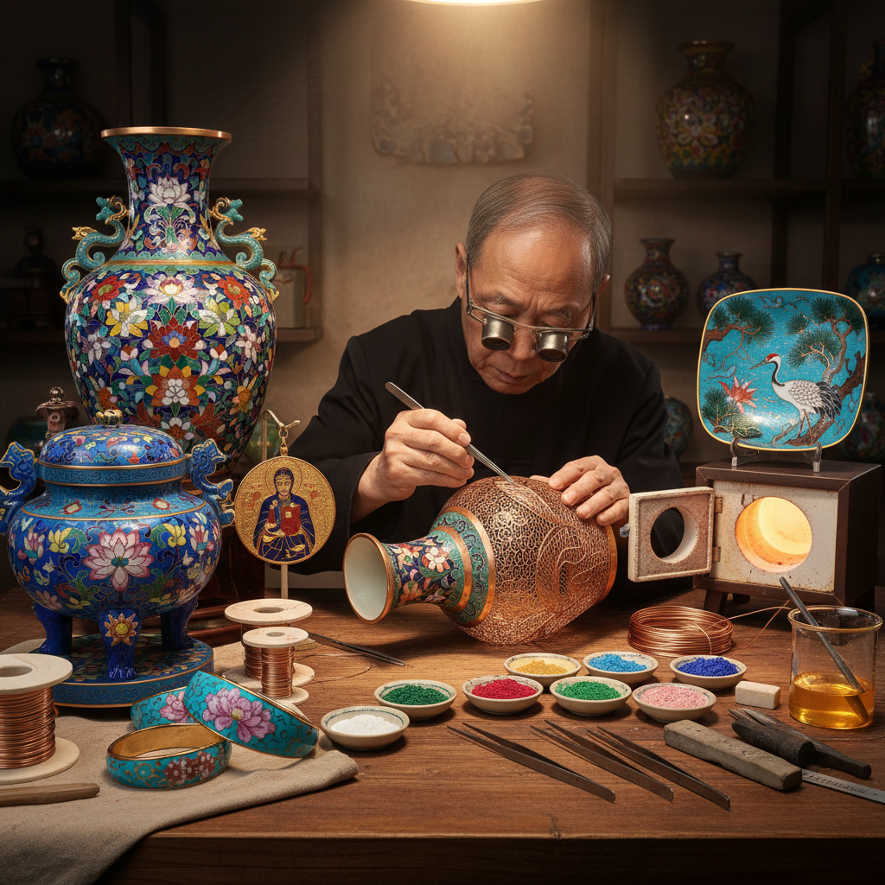

# Cloisonné Art 景泰蓝艺术

> "Cloisonné is architecture in miniature — tiny walls of metal wire creating rooms for color, each cell filled with ground glass that will melt in the kiln into jewel-bright enamel. The cloisonné master builds a city of color on the surface of copper, wire by wire, cell by cell, firing and filling and polishing until the surface blazes with the intensity of stained glass held in a framework of gold." — Unknown

## 概述

景泰蓝艺术（Cloisonné Art）是一种在金属胎体（通常为铜）上用金属丝（掐丝）围出图案轮廓，然后在轮廓内填充彩色珐琅釉料，经过烧制和打磨而成的金属珐琅工艺——因明代景泰年间（1450-1456）的作品以蓝色为主而得名"景泰蓝"。

景泰蓝艺术的实践包括：1）制胎——制作铜胎体；2）掐丝——用铜丝弯曲成图案粘贴在胎体上；3）点蓝——在丝格内填充珐琅釉料；4）烧蓝——入窑烧制使釉料熔化；5）磨光——打磨表面使之平整光滑；6）镀金——在金属丝和口沿处镀金；7）当代景泰蓝——将传统技法与现代设计结合的创作。

## 核心特征

| 特征 | 描述 |
|------|------|
| 华丽 | 极其华丽的色彩 |
| 精密 | 极其精密的掐丝工艺 |
| 耐久 | 珐琅釉极其耐久 |
| 多彩 | 丰富的色彩表现 |
| 金属 | 金属丝的线条美 |
| 皇家 | 历史上的皇家工艺 |

## 视觉特征

- **蓝色**：经典的景泰蓝色
- **金线**：金色的掐丝线条
- **多彩**：鲜艳的珐琅色彩
- **图案**：精美的装饰图案
- **光泽**：珐琅的玻璃光泽
- **对比**：金属线与色块的对比

## 代表作品

| 作品 | 艺术家/文化 | 年代 | 意义 |
|------|-------------|------|------|
| *明景泰蓝香炉* | 中国明代 | 15世纪 | 景泰蓝的命名来源 |
| *清乾隆景泰蓝* | 中国清代 | 18世纪 | 清代景泰蓝巅峰 |
| *Byzantine cloisonné* | 拜占庭 | 6-12世纪 | 拜占庭珐琅 |
| *Japanese shippo* | 日本 | 明治时代 | 日本七宝烧 |
| *Russian enamel* | 俄罗斯 | 16-19世纪 | 俄罗斯珐琅 |

## 历史时间线

| 时期 | 事件 |
|------|------|
| 古代 | 珐琅工艺的起源（埃及/拜占庭） |
| 元代 | 珐琅工艺传入中国 |
| 明景泰 | "景泰蓝"得名 |
| 清代 | 景泰蓝工艺的全面繁荣 |
| 当代 | 景泰蓝的现代传承与创新 |

## 中国语境

景泰蓝是中国最具代表性的传统工艺之一——被誉为"国宝"级工艺。景泰蓝的制作工艺极其复杂——需要经过制胎、掐丝、点蓝、烧蓝、磨光、镀金等一百多道工序。北京是中国景泰蓝的主要产地——北京景泰蓝制作技艺被列入国家级非物质文化遗产名录。历史上景泰蓝是皇家御用工艺——明清两代的宫廷设有专门的珐琅作坊。中国当代的景泰蓝大师（如张同禄、钟连盛等）将传统技法与现代审美相结合——创造出既有传统韵味又具时代感的作品。景泰蓝也是中国重要的外交礼品——经常作为国礼赠送给外国元首。中国的景泰蓝收藏市场非常活跃——古代和当代大师的景泰蓝作品都有很高的收藏价值。

## AI生成概念图

## 与其他风格的关系

- **Enamel Art** → 珐琅艺术
- **Coppersmithing** → 铜器艺术
- **Goldsmithing** → 金器艺术
- **Stained Glass** → 彩色玻璃
- **Decorative Art** → 装饰艺术
- **Chinese Art** → 中国艺术

---

*浮光艺志 | Chronicle of Artistry*
