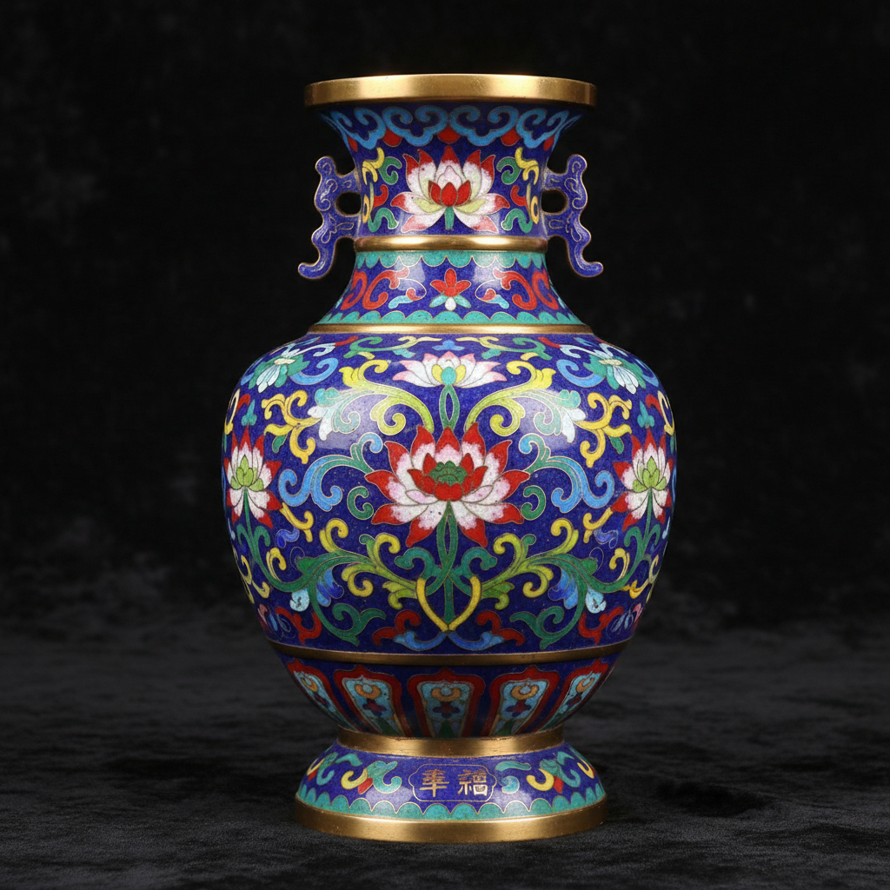

# Cloisonné Enamel Art 景泰蓝艺术

> "Cloisonné is painting with fire and wire — thin ribbons of metal are bent into outlines and soldered to a surface, creating tiny cells that are then filled with powdered glass paste and fired until the enamel fuses into jewel-like pools of color, each compartment holding its hue as precisely as a stained-glass window holds light." — Unknown

## 概述

景泰蓝艺术（Cloisonné Enamel Art）是一种古老的金属珐琅工艺——将细金属丝（通常为铜丝或金丝）弯曲成图案轮廓，焊接在金属胎体上形成小格（cloisons），然后在格内填入彩色珐琅釉料，经过反复烧制、打磨和镀金，最终形成色彩鲜艳、光泽如宝石的装饰品。

景泰蓝艺术的实践包括：1）制胎——制作铜胎体；2）掐丝——将铜丝弯曲成图案焊接在胎体上；3）点蓝——在丝格内填入珐琅釉料；4）烧蓝——入窑烧制使釉料熔化；5）磨光——打磨表面使之平整光滑；6）镀金——在金属丝和口沿镀金；7）当代景泰蓝——将传统技法与现代设计结合的创作。

## 核心特征

| 特征 | 描述 |
|------|------|
| 掐丝 | 金属丝形成图案轮廓 |
| 珐琅 | 彩色玻璃质釉料 |
| 烧制 | 高温烧制使釉料熔化 |
| 鲜艳 | 色彩极其鲜艳 |
| 镀金 | 金属丝和边缘镀金 |
| 精密 | 极其精密的手工 |

## 视觉特征

- **鲜艳**：宝石般鲜艳的色彩
- **金线**：金色的金属丝轮廓
- **平滑**：打磨后的平滑表面
- **图案**：精美的装饰图案
- **光泽**：珐琅的玻璃光泽
- **华丽**：整体华丽的效果

## 代表作品

| 作品 | 艺术家/文化 | 年代 | 意义 |
|------|-------------|------|------|
| *Byzantine cloisonné* | 拜占庭 | 6-12世纪 | 拜占庭景泰蓝 |
| *Ming Dynasty jingtailan* | 中国 | 15世纪 | 明代景泰蓝 |
| *Japanese shippo* | 日本 | 17-19世纪 | 日本七宝烧 |
| *Fabergé cloisonné* | 俄罗斯 | 19世纪 | 法贝热景泰蓝 |
| *Contemporary cloisonné* | 国际 | 当代 | 当代景泰蓝 |

## 历史时间线

| 时期 | 事件 |
|------|------|
| 公元前13世纪 | 最早的景泰蓝出现在塞浦路斯 |
| 6-12世纪 | 拜占庭景泰蓝的黄金时代 |
| 14-15世纪 | 景泰蓝传入中国并发展 |
| 明景泰年间 | 中国景泰蓝达到高峰 |
| 当代 | 景泰蓝作为非遗的保护传承 |

## 中国语境

景泰蓝是中国最具代表性的传统工艺之一。中国的景泰蓝（铜胎掐丝珐琅）是国家级非物质文化遗产——以明代景泰年间的蓝色珐琅最为著名而得名。北京是中国景泰蓝的主要产地——有数百年的制作传统。中国的景泰蓝在清代达到了技术和艺术的巅峰——乾隆时期的作品尤为精美。中国当代的景泰蓝艺术家——在传统基础上进行创新，将景泰蓝与现代设计结合。中国的景泰蓝作为国礼——经常被赠送给外国元首和贵宾。中国的工艺美术大师——在景泰蓝领域有多位国家级传承人。

## AI生成概念图

## 与其他风格的关系

- **Champlevé** → 内填珐琅
- **Plique-à-jour** → 透光珐琅
- **Basse-taille** → 浅浮雕珐琅
- **Metalwork** → 金属工艺
- **Byzantine Art** → 拜占庭艺术
- **Chinese Decorative Arts** → 中国装饰艺术

---

*浮光艺志 | Chronicle of Artistry*
