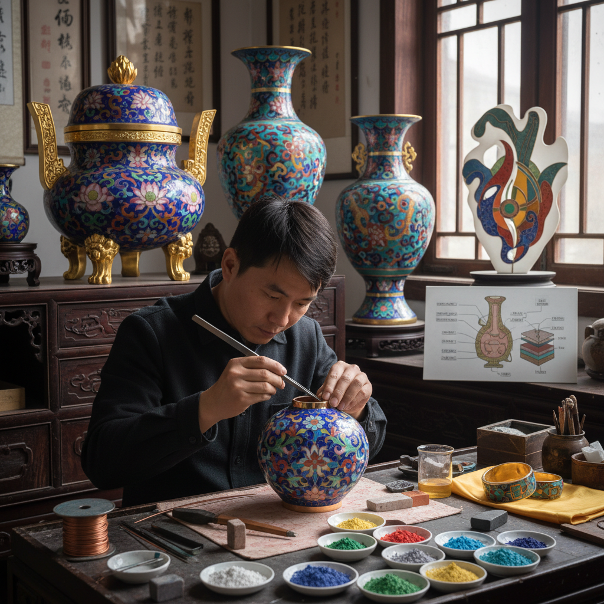

# Cloisonné Enamel 景泰蓝

> "Cloisonné is drawing with wire and painting with fire — thin metal ribbons bent into shapes and soldered to a surface to create cells that are filled with colored glass paste, then fired until the glass melts and fills each tiny compartment with jewel-like color, the wire walls remaining as golden outlines that define every form like the leading in a stained glass window." — Unknown

## 概述

景泰蓝（Cloisonné），又称铜胎掐丝珐琅，是珐琅艺术中最著名的技法之一。"Cloisonné"来自法语"cloison"（隔间），指的是用细金属丝（通常是铜丝或金丝）在金属基底上弯曲焊接成图案轮廓，形成一个个小隔间（cells），然后在隔间中填入不同颜色的珐琅釉料粉末，经高温烧制使釉料熔化填满隔间，最后打磨抛光。

景泰蓝的历史可以追溯到古埃及和拜占庭帝国。在中国，景泰蓝在元代从阿拉伯地区传入，在明代景泰年间（1450-1456）达到鼎盛——因为这一时期的作品多用蓝色釉料，故得名"景泰蓝"。景泰蓝的制作工艺极其复杂，需要经过制胎、掐丝、点蓝、烧蓝、磨光、镀金等多道工序。

## 核心特征

| 特征 | 描述 |
|------|------|
| 掐丝 | 金属丝弯曲成图案 |
| 隔间 | 金属丝形成隔间 |
| 填釉 | 隔间中填入珐琅釉 |
| 烧制 | 高温烧制熔融 |
| 打磨 | 打磨至平滑 |
| 镀金 | 最后镀金处理 |

## 视觉特征

- **金线**：金色的金属丝轮廓
- **鲜艳**：鲜艳的珐琅色彩
- **平滑**：打磨后的平滑表面
- **几何**：金属丝的几何图案
- **对称**：对称的装饰图案
- **华丽**：华丽的整体效果

## 代表作品

| 作品 | 艺术家 | 年代 | 意义 |
|------|--------|------|------|
| *明景泰蓝香炉* | 明代工匠 | 15世纪 | 景泰年间代表作 |
| *清乾隆景泰蓝* | 清宫造办处 | 18世纪 | 清代鼎盛期作品 |
| *Byzantine cloisonné icons* | 拜占庭工匠 | 6-12世纪 | 拜占庭景泰蓝 |
| *Japanese cloisonné vases* | 日本工匠 | 19世纪 | 日本七宝烧 |
| *Contemporary cloisonné* | Various | 当代 | 当代景泰蓝创新 |

## 历史时间线

| 时期 | 事件 |
|------|------|
| 古埃及 | 景泰蓝技法的早期形式 |
| 拜占庭 | 拜占庭景泰蓝的鼎盛 |
| 元代 | 景泰蓝传入中国 |
| 明景泰 | 中国景泰蓝的命名时期 |
| 清代 | 景泰蓝的工艺巅峰 |
| 当代 | 景泰蓝的传承与创新 |

## 中国语境

景泰蓝是中国最具代表性的传统工艺美术之一。北京是景泰蓝的主要产地——北京景泰蓝是国家级非物质文化遗产。景泰蓝的制作需要多个工种的协作：制胎工、掐丝工、点蓝工、烧蓝工、磨光工、镀金工。中国的景泰蓝在国际市场上享有极高声誉。故宫博物院收藏有大量明清景泰蓝精品。当代中国的景泰蓝大师（如张同禄、钟连盛）在传统基础上不断创新。景泰蓝也是中国国礼的常见选择。

## AI生成概念图

## 与其他风格的关系

- **Enameling** → 珐琅艺术
- **Champlevé** → 凹雕珐琅
- **Metalwork** → 金属工艺
- **Stained Glass** → 彩色玻璃
- **Jewelry** → 珠宝
- **Chinese Decorative Arts** → 中国装饰艺术

---

*浮光艺志 | Chronicle of Artistry*
