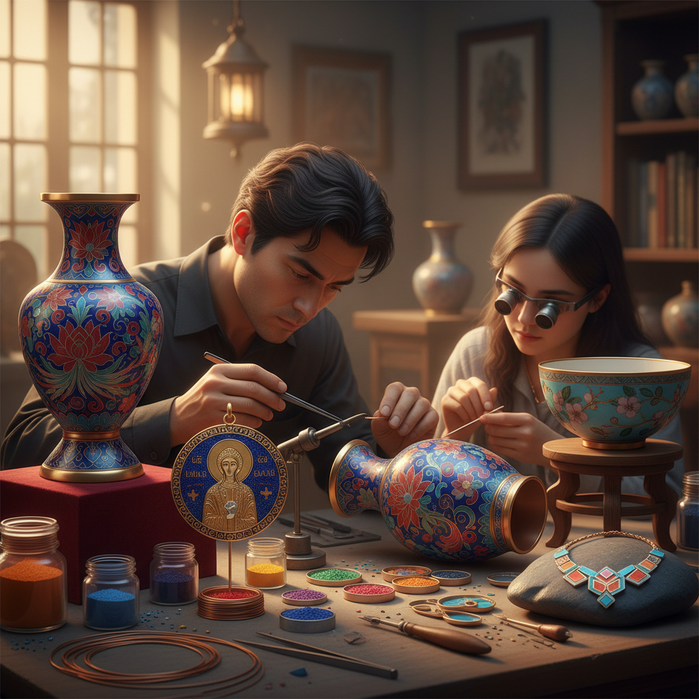

# Cloisonné 掐丝珐琅

> "Cloisonné is drawing with wire and painting with fire — thin metal ribbons define the boundaries, and molten glass fills the spaces with eternal color." — Unknown

## 概述

掐丝珐琅（Cloisonné）是珐琅工艺中最精细的一种——在金属胎体（铜、银或金）表面，用细金属丝（通常是铜丝或金丝）弯曲成图案的轮廓，焊接固定后，在金属丝围成的小格（cloisons，法语"隔间"）中填入不同颜色的珐琅釉料粉末，然后入窑高温烧制使釉料熔化。烧制后打磨平整，使金属丝线和珐琅面齐平，最后镀金抛光。掐丝珐琅的独特之处在于：金属丝线既是结构（防止不同颜色的珐琅混合），又是装饰（形成精美的线条轮廓）。中国的景泰蓝是掐丝珐琅最著名的代表。

掐丝珐琅的哲学在于：线与色的共舞——金属线条界定了色彩的疆域，而色彩赋予了线条生命。

## 核心特征

| 特征 | 描述 |
|------|------|
| 掐丝 | 细金属丝弯曲成图案 |
| 填釉 | 格内填入珐琅釉料 |
| 烧制 | 高温烧制熔融 |
| 打磨 | 烧后打磨平整 |
| 镀金 | 最后镀金抛光 |
| 精细 | 极其精细的工艺 |

## 视觉特征

- **线条**：金属丝的精美线条
- **色彩**：鲜艳的珐琅色彩
- **光泽**：珐琅的玻璃光泽
- **金属**：金属丝的金色轮廓
- **平滑**：打磨后的平滑表面
- **精细**：极其精细的图案

## 代表作品

| 作品 | 艺术家 | 年代 | 意义 |
|------|--------|------|------|
| *Byzantine cloisonné* | 匿名 | 6-12世纪 | 拜占庭掐丝珐琅 |
| *景泰蓝* | 匿名 | 明代+ | 中国掐丝珐琅 |
| *Japanese cloisonné* | Various | 明治时代 | 日本七宝烧 |
| *Namikawa Yasuyuki works* | 并河靖之 | 1880s+ | 日本掐丝珐琅巅峰 |
| *Contemporary cloisonné* | Various | 当代 | 当代掐丝珐琅 |

## 历史时间线

| 时期 | 事件 |
|------|------|
| 公元前13世纪 | 最早的掐丝珐琅（塞浦路斯） |
| 6世纪+ | 拜占庭掐丝珐琅的辉煌 |
| 元代 | 掐丝珐琅传入中国 |
| 明景泰 | 景泰蓝的命名和发展 |
| 明治时代 | 日本七宝烧的巅峰 |
| 当代 | 当代掐丝珐琅的传承 |

## 中国语境

掐丝珐琅在中国就是"景泰蓝"——中国最著名的传统工艺之一。景泰蓝因明代景泰年间（1450-1456）大量使用蓝色珐琅而得名，是国家级非物质文化遗产。北京是景泰蓝的主要产地，至今仍有多家景泰蓝工厂和大师工作室。景泰蓝的制作需要经过制胎、掐丝、点蓝、烧蓝、磨光、镀金等数十道工序。故宫博物院收藏有大量精美的景泰蓝器物。当代中国的景泰蓝大师如张同禄、钟连盛等在传承和创新方面做出了重要贡献。

## AI生成概念图

## 与其他风格的关系

- **Enameling** → 珐琅（总称）
- **Champlevé** → 内填珐琅
- **Metalwork** → 金属工艺
- **Jewelry Making** → 珠宝制作
- **Glass Art** → 玻璃艺术
- **Jingdezhen** → 景德镇（陶瓷对比）

---

*浮光艺志 | Chronicle of Artistry*
