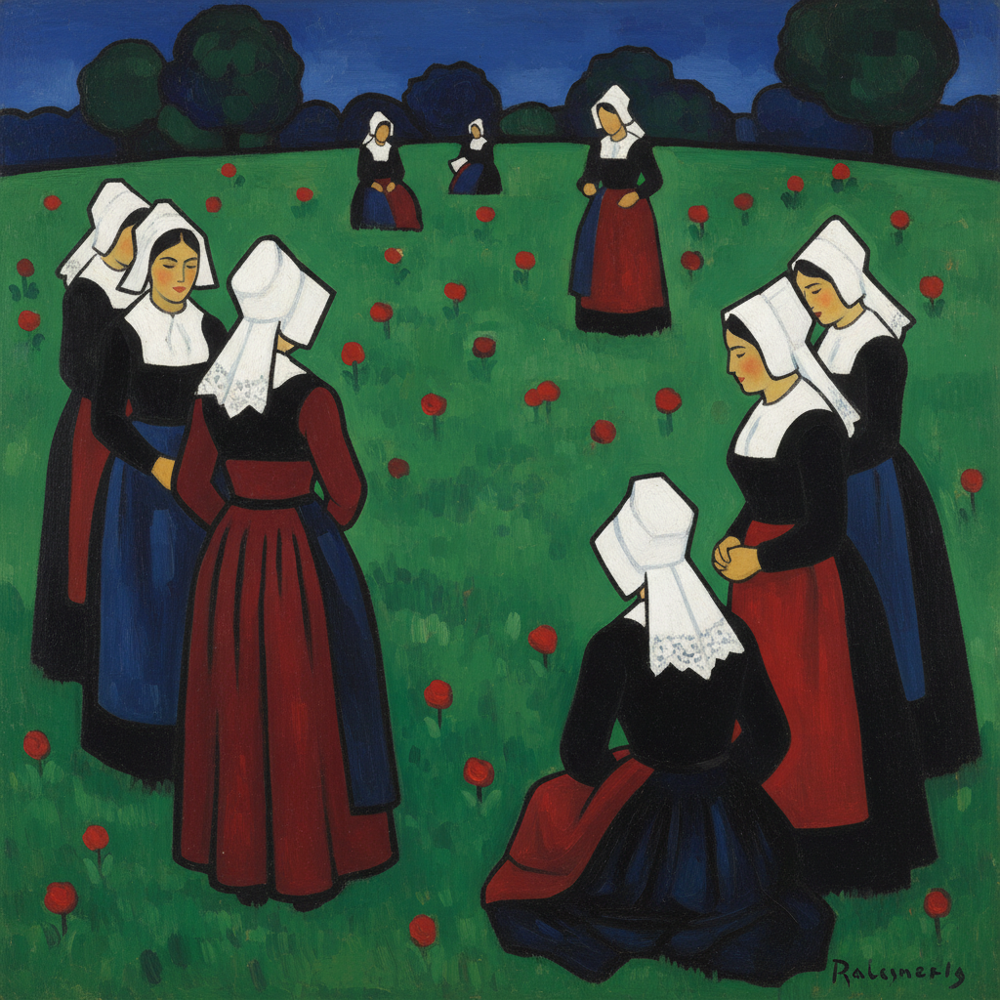

# Cloisonnism 景泰蓝主义

> "Do not copy nature too closely. Art is an abstraction." — Paul Gauguin

## 概述

景泰蓝主义（Cloisonnism）是1880年代末由埃米尔·贝尔纳和保罗·高更在法国布列塔尼发展出的后印象派绘画风格。其名称来源于景泰蓝（Cloisonné）工艺——用金属丝分隔彩色珐琅的技法。在绘画中，这表现为用粗黑轮廓线分隔大面积平涂色块，创造出强烈的装饰效果。

这一风格是对印象派光影溶解的反动，重新强调线条和色面的力量。

## 核心特征

| 特征 | 描述 |
|------|------|
| 粗黑轮廓 | 明确的深色轮廓线勾勒所有形体 |
| 平涂色块 | 大面积纯色填充，极少明暗渐变 |
| 简化形体 | 将自然形态简化为基本形状 |
| 装饰性 | 画面具有强烈的装饰图案感 |
| 反自然主义 | 色彩和形态服务于表达而非写实 |
| 中世纪灵感 | 借鉴彩色玻璃窗和景泰蓝工艺 |

## 视觉特征

- **线条**：粗重的深蓝或黑色轮廓线
- **色彩**：饱和的纯色平涂，无渐变
- **形体**：简化的、近乎几何的形状
- **空间**：极度平面化，无透视深度
- **构图**：装饰性排列，类似彩色玻璃
- **题材**：布列塔尼农民、宗教场景、风景

## 代表人物

| 画家 | 代表作 | 特点 |
|------|--------|------|
| Émile Bernard | *Breton Women in the Meadow* (1888) | 景泰蓝主义的共同创始人 |
| Paul Gauguin | *Vision After the Sermon* (1888) | 将风格推向象征主义 |
| Louis Anquetin | *Avenue de Clichy* (1887) | 最早的景泰蓝主义实验 |

## 历史背景

1. **1886年**：Anquetin 开始实验粗轮廓线和平涂色块
2. **1888年**：Bernard 和 Gauguin 在蓬塔旺合作，风格成熟
3. **1889年**：在巴黎万国博览会咖啡馆展出引发关注
4. **1890年代**：影响那比派和新艺术运动

## 与其他风格的关系

- **Japonisme** → 借鉴浮世绘的轮廓线和平涂
- **Synthetism** → 景泰蓝主义是综合主义的视觉基础
- **Nabis** → 那比派直接继承了这一风格
- **Art Nouveau** → 共享装饰性轮廓线美学
- **Stained Glass** → 中世纪彩色玻璃是直接灵感

## 概念图

---

*浮光艺志 | Chronicle of Artistry*
