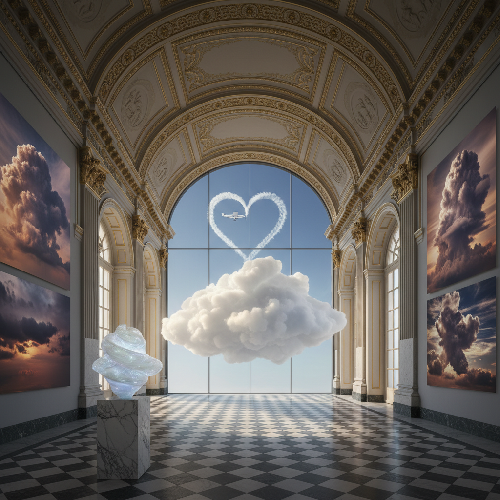

# Cloud Art 云艺术

> "Clouds are the sky's canvas — endlessly changing, never repeating, painted by wind and water vapor into forms that suggest everything and depict nothing. When an artist works with clouds, they work with the most ephemeral material imaginable: water suspended in air, shaped by forces beyond human control, existing for minutes before dissolving back into the blue." — Unknown

## 概述

云艺术（Cloud Art）是以云或云的意象为核心的艺术实践——包括用人工方法创造云（如烟雾、蒸汽）、在云中书写（skywriting）、以云为主题的绘画和摄影，以及用云状材料创作的装置艺术。云艺术探索了短暂性、不可控性和自然之美。

云艺术的实践包括：1）天空书写（skywriting）——用飞机在天空中用烟雾写字或画图；2）人工云装置——用雾化器、干冰或蒸汽在室内创造云；3）云摄影——以云为主题的艺术摄影；4）云绘画——以云为主题的绘画传统；5）云雕塑——用棉花、树脂等材料模拟云的形态；6）气象艺术——与天气和大气现象互动的艺术；7）烟雾艺术——用烟雾创造的短暂造型。

## 核心特征

| 特征 | 描述 |
|------|------|
| 短暂 | 极其短暂的存在 |
| 不可控 | 受自然力影响 |
| 轻盈 | 极致的轻盈感 |
| 变化 | 不断变化的形态 |
| 壮观 | 天空尺度的壮观 |
| 诗意 | 诗意和想象力 |

## 视觉特征

- **白色**：云的白色和灰色
- **柔软**：柔软的边缘和形态
- **光影**：阳光穿透云层的效果
- **体量**：巨大的体量感
- **变化**：不断变化的形态
- **天空**：以天空为背景

## 代表作品

| 作品 | 艺术家 | 年代 | 意义 |
|------|--------|------|------|
| *Nimbus* | Berndnaut Smilde | 2012至今 | 室内人工云 |
| *Cloud Gate* | Anish Kapoor | 2006 | 云门雕塑（芝加哥） |
| *Skywriting* | Various | 1920年代至今 | 天空书写 |
| *Cloud studies* | John Constable | 19世纪 | 云的绘画研究 |
| *Cloudscapes* | Fujiko Nakaya | 1970年代至今 | 雾雕塑 |

## 历史时间线

| 时期 | 事件 |
|------|------|
| 古代 | 云在艺术中的象征意义 |
| 19世纪 | 康斯太勃尔的云研究 |
| 1920年代 | 天空书写的发明 |
| 1970年代 | 中谷芙二子的雾雕塑 |
| 当代 | 室内人工云艺术 |

## 中国语境

云艺术在中国有极其深厚的文化传统。中国传统艺术中的"云"是最重要的视觉元素之一——从商周青铜器上的云雷纹到唐代壁画中的祥云，从宋代山水画中的云烟到清代建筑上的云纹装饰，云贯穿了中国艺术的全部历史。中国传统美学中的"云烟供养"——用云烟营造山水画的意境——是中国绘画的核心技法之一。中国的"祥云"图案是中国文化中最具代表性的吉祥符号之一。中国当代的一些艺术家在探索云艺术：用人工雾创造沉浸式装置、将中国传统云纹与当代设计结合、以及用新媒体技术模拟和互动云的形态。

## AI生成概念图

## 与其他风格的关系

- **Ephemeral Art** → 短暂艺术
- **Land Art** → 大地艺术
- **Light Art** → 光艺术
- **Installation Art** → 装置艺术
- **Weather Art** → 气象艺术
- **Smoke Art** → 烟雾艺术

---

*浮光艺志 | Chronicle of Artistry*
