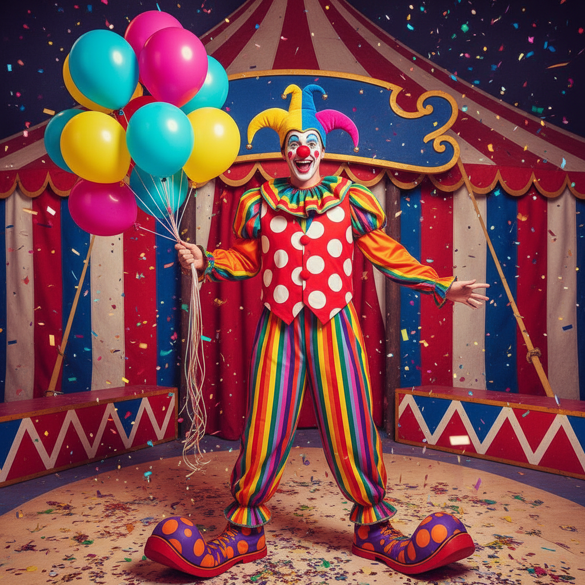

# Clowncore 小丑核



> **"彩虹条纹、红鼻子、过大的鞋——当荒诞成为一种自由。"**

## 概述

| 维度 | 描述 |
|------|------|
| 时期 | 2019–至今 |
| 别名 | Clowncore, Circus Aesthetic, Jester |
| 核心色彩 | 彩虹全色、红色、黄色、蓝色、白色 |
| 关键元素 | 红鼻子、条纹、波点、过大服装、气球 |
| 代表人物 | TikTok 社区、独立音乐人 |
| 关联风格 | Kidcore, Maximalism, Weirdcore, Dopamine Dressing |

---

## 历史脉络

### 从马戏团到互联网美学

| 年份 | 事件 |
|------|------|
| 古罗马 | 宫廷小丑——"说真话的疯子" |
| 1800s | 现代马戏团小丑形象成型 |
| 1990s | "恐怖小丑"文化（IT、Joker） |
| 2019 | Clowncore 作为正面美学在 TikTok 兴起 |
| 2020 | 疫情期间——"世界已经够荒诞了，不如拥抱它" |
| 2022 | 与 Maximalism 和 Dopamine Dressing 交叉 |

### 核心哲学

Clowncore 的精神是**"荒诞是自由——不需要'正常'"**：
- "正常"是一种压迫
- 荒诞 = 解放（"我可以是任何东西"）
- 快乐不需要理由
- 小丑 = 说真话的人（宫廷弄臣传统）
- "如果你觉得我奇怪——那就是重点"

---

## 视觉语法

### 色彩系统

```
主色：
  红色 (#FF0000) — 鼻子、嘴唇
  黄色 (#FFFF00) — 快乐、注意
  蓝色 (#0000FF) — 对比
  白色 (#FFFFFF) — 面部底妆
  绿色 (#00FF00) — 怪异

规则：
  - 所有颜色都可以
  - 越多越好
  - 越不搭配越好
  - 高饱和度
  - 没有"太过分"

质感：
  光滑 — 气球、塑料
  蓬松 — 假发、绒球
  条纹 — 经典马戏团
  波点 — 小丑服装
```

### 标志性元素

| 类别 | 元素 |
|------|------|
| 妆容 | 白脸、红鼻子、夸张嘴唇、彩色眼影 |
| 服装 | 过大的鞋、条纹裤、波点衬衫、彩色假发 |
| 物件 | 气球、喇叭、花朵喷水、魔术道具 |
| 图案 | 条纹、波点、棋盘格、彩虹 |
| 符号 | 红鼻子、笑脸、眼泪、星星 |
| 态度 | 荒诞、快乐、自由、反规范 |

---

## 与千禧怀旧的关系

### 疫情时代的荒诞主义
- 2020 疫情 = "世界已经是马戏团了"
- Clowncore = 对荒诞现实的拥抱
- "既然一切都没有意义——那就开心吧"
- 与 Weirdcore 共享"拒绝正常"的精神

### 与 Dopamine Dressing 的交叉
- 两者都拒绝"低调"
- 色彩 = 快乐 = 反抗
- "穿得开心"比"穿得好看"重要
- 从"品味"到"表达"的转变

---

## 中国语境

- 与中国"搞怪"/"沙雕"文化的交叉
- 马戏团/小丑在中国文化中的形象
- 抖音上的 Clowncore 内容
- 与中国"丑萌"审美的关系

---

## 设计应用

| 场景 | 应用方式 |
|------|----------|
| 品牌 | 彩虹+波点+条纹+幽默+荒诞 |
| 活动 | 马戏团主题+互动+惊喜+快乐 |
| 时尚 | 过大+不搭配+彩色+有趣 |
| 数字 | 动态+彩色+荒诞+互动+惊喜 |

---

## 相关风格

← [Kidcore 童核](kidcore.md) | [Weirdcore 怪核](dreamcore-weirdcore.md) →

↑ [返回千禧怀旧目录](README.md) | [返回总目录](../README.md)
