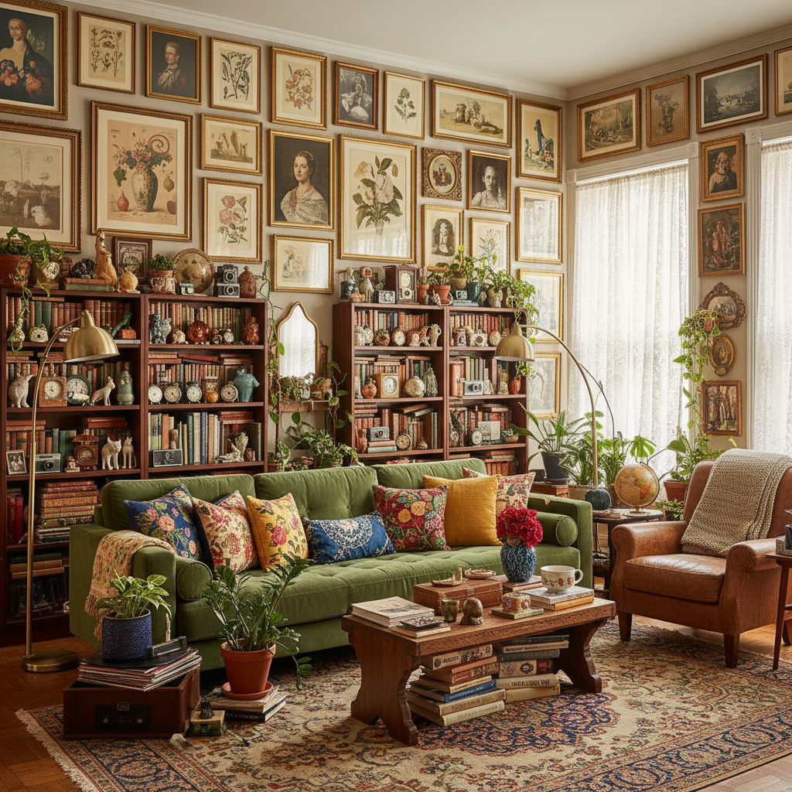
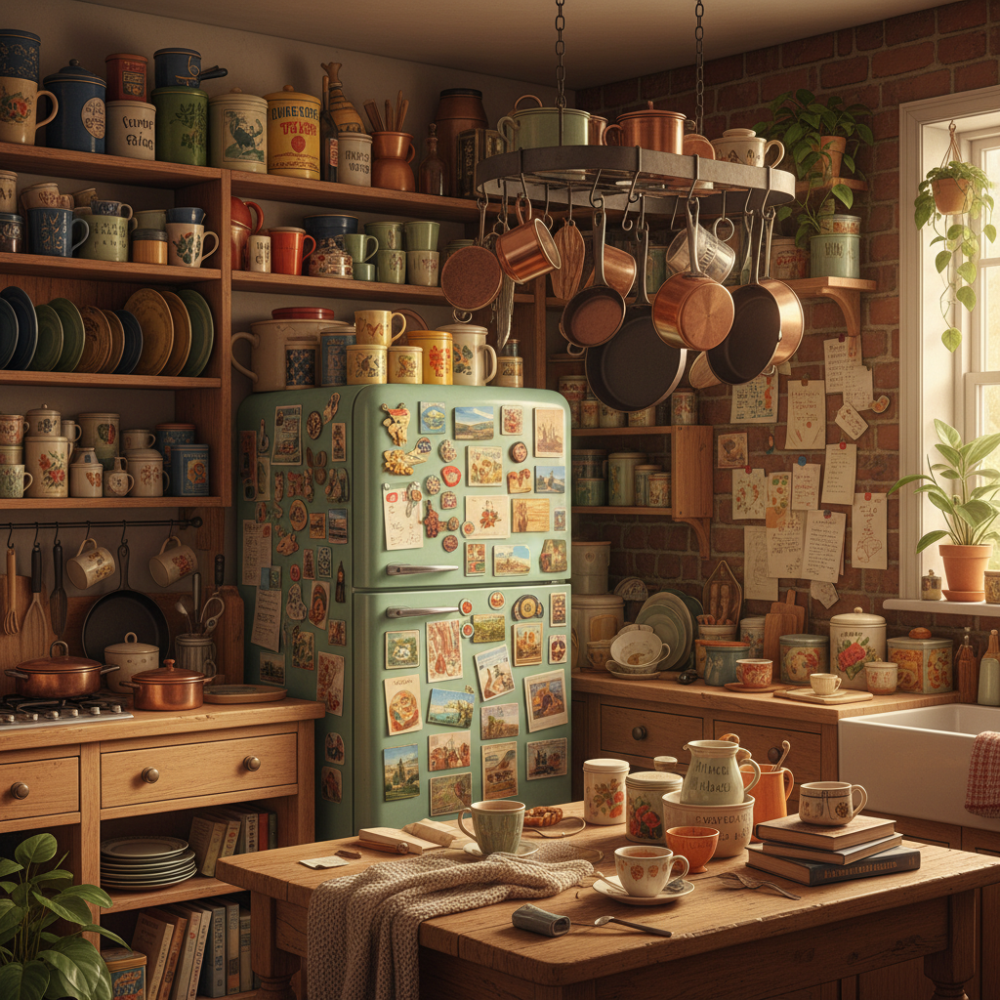

# Cluttercore 杂物核





> **"极简主义的反义词——当你的房间像一家古董店，而你觉得这样刚刚好。"**

## 概述

| 维度 | 描述 |
|------|------|
| 时期 | 2020–至今 |
| 别名 | Cluttercore, Maximalism, Anti-Minimalism, Organized Chaos |
| 核心色彩 | 无固定色板——越多越好 |
| 关键元素 | 满墙装饰、收藏品堆叠、混搭图案、vintage物件 |
| 代表人物 | Iris Apfel、Wes Anderson 布景、跳蚤市场文化 |
| 关联风格 | Kidcore, Goblincore, Cottagecore, Maximalism |

---

## 历史脉络

### 2020：对极简主义的反叛

Cluttercore 在 2020 年作为一种 TikTok/Instagram 美学标签出现，是对过去十年极简主义统治的**直接反叛**：

**极简主义的十年统治（2010–2020）**：
- Marie Kondo《怦然心动的人生整理魔法》(2011/2014英文版)
- "Does it spark joy?" 成为全球口号
- 断舍离文化
- 白墙+极少物品 = "有品味"
- 拥有太多东西 = "不够成熟"

**Cluttercore 的反击**：
- "我的东西都让我快乐，为什么要扔掉？"
- 收藏品、纪念品、旧物件都有情感价值
- 视觉丰富 ≠ 脏乱
- 个性化 > 标准化

### 文化背景

Cluttercore 的兴起有多重文化原因：

1. **极简疲劳**：十年的"扔东西"让人厌倦
2. **疫情居家**：长时间待在家里，想让空间更有趣
3. **可持续性**：不扔东西 = 减少浪费
4. **反消费主义悖论**：极简主义实际上鼓励"买更好的少量物品"（仍然是消费）
5. **神经多样性**：ADHD 等群体发现"整洁"标准对他们不公平

### 与 Maximalism 的关系

Cluttercore 是 Maximalism（极繁主义）的一个子集：
- **Maximalism**：设计哲学，"more is more"
- **Cluttercore**：生活方式美学，强调个人收藏和情感连接
- 区别：Maximalism 可以是精心策划的视觉过载；Cluttercore 更强调"自然积累"

---

## 视觉语法

### 色彩系统

```
规则：没有规则

Cluttercore 的色彩逻辑：
  - 不限制色彩数量
  - 不追求"和谐"配色
  - 让物品本身的颜色说话
  - 越多样越好
  - 图案可以混搭（碎花+格子+条纹）

常见色彩来源：
  - 旧书封面的各种颜色
  - 陶瓷/瓷器的釉色
  - 织物/地毯的图案色
  - 植物的绿色
  - 木材的棕色
  - 金属的铜/金/银
```

### 标志性元素

| 类别 | 元素 |
|------|------|
| 墙面 | Gallery wall（满墙画框）、挂毯、架子上的小物件 |
| 收藏 | 旧书堆、唱片、明信片、票根、贝壳、石头 |
| 植物 | 大量绿植（越多越好）、悬挂植物 |
| 织物 | 多层地毯、混搭靠垫、毯子堆叠 |
| 照明 | 多个不同风格的灯具、蜡烛群 |
| 家具 | 不成套的vintage家具、跳蚤市场淘来的 |
| 厨房 | 开放式架子、挂满的锅碗瓢盆、冰箱贴 |

---

## 与千禧怀旧的关系

Cluttercore 与千禧怀旧的关系在于**物品即记忆**：

### 物质化的怀旧
- 保留旧物件 = 保留记忆
- 2000年代的CD、磁带、游戏卡带 = 怀旧收藏品
- 童年的玩具、贴纸、文具 = Kidcore 交叉
- 不扔东西 = 不放弃过去

### 对"成长"的拒绝
极简主义暗示"成熟的人不需要这么多东西"
Cluttercore 回应："我的东西就是我的人生"

---

## 中国语境

- "收纳"文化的反面
- 小红书上的"我的杂货铺房间"
- 旧物市场/古着店文化
- 手账/贴纸收藏社群
- "断舍离"的反对者

---

## 设计应用

| 场景 | 应用方式 |
|------|----------|
| 品牌设计 | 多层叠加+混搭字体+拼贴风格 |
| 空间 | 开放式收纳+gallery wall+混搭家具 |
| 摄影 | 满画面构图+丰富道具+多色彩 |
| UI | 信息密度高+多元素+拼贴布局 |

---

## 延伸阅读

- Aesthetics Wiki: [Cluttercore](https://aesthetics.fandom.com/wiki/Cluttercore)
- "The Rise of Cluttercore" (Apartment Therapy, 2021)
- Iris Apfel 的极繁主义生活哲学

---

## 相关风格

← [Kidcore 童年核](kidcore.md) | [Goblincore 哥布林核](goblincore.md) →

↑ [返回千禧怀旧目录](README.md) | [返回总目录](../README.md)
