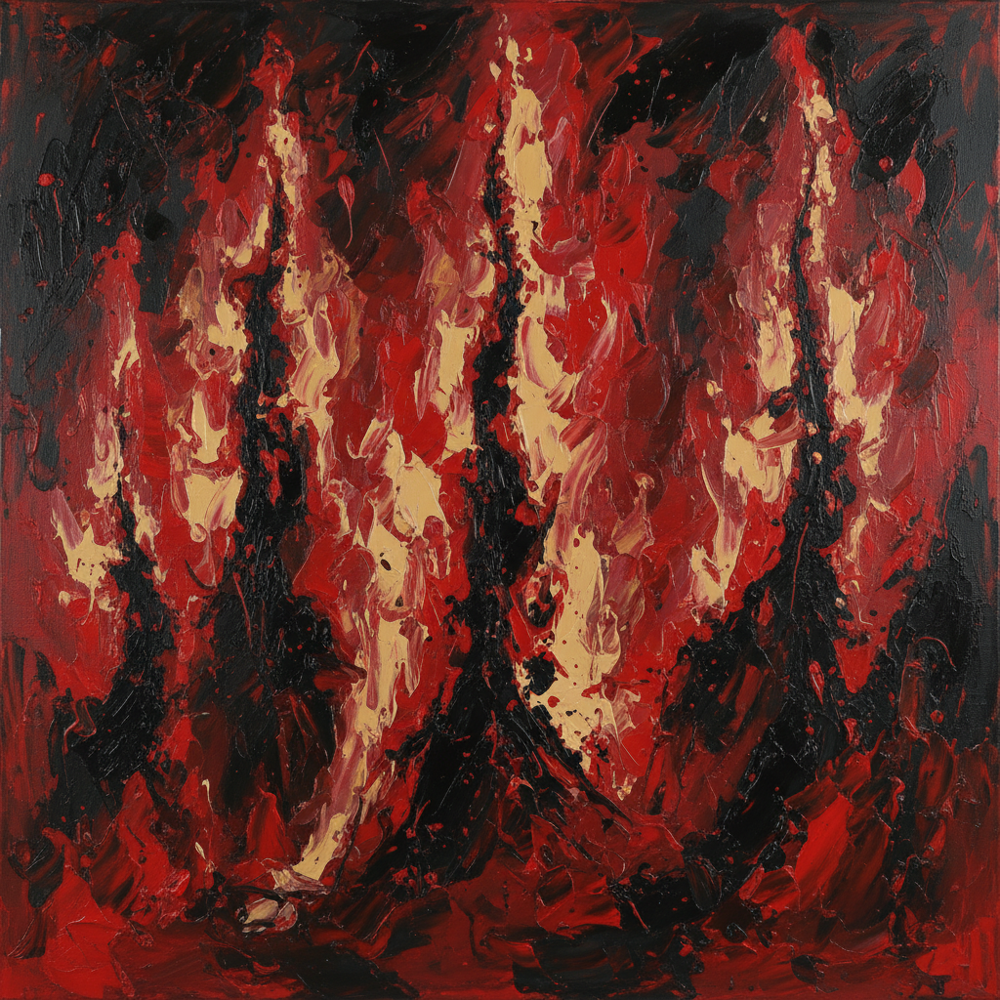

# Clyfford Still 克利福德·斯蒂尔

> "I never wanted color to be color. I never wanted texture to be texture, or images to become shapes. I wanted them all to fuse into a living spirit." — Clyfford Still

## 概述

克利福德·斯蒂尔（Clyfford Still，1904–1980）是美国抽象表现主义的先驱之一，以巨大的、撕裂般的色域画作闻名。他的画面如同地质断层——粗糙的色彩板块相互挤压、撕裂，露出下方的颜色层，创造出一种原始的、大地般的崇高感。他是最早实现大尺幅抽象的画家之一。

## 核心特征

| 特征 | 描述 |
|------|------|
| 撕裂色域 | 如地质断层般的色彩板块 |
| 垂直构图 | 火焰般向上升腾的形式 |
| 厚重肌理 | 调色刀堆积的粗糙表面 |
| 大地色调 | 黑色、赭石、深红的原始力量 |
| 巨大尺幅 | 压倒性的视觉体验 |
| 独立精神 | 拒绝画廊体系的孤傲 |

## 代表作品

| 作品 | 年代 | 意义 |
|------|------|------|
| *1957-D No. 1* | 1957 | 撕裂色域的经典 |
| *PH-950* | 1950 | 黑色与黄色的对峙 |
| *1944-N No. 2* | 1944 | 早期抽象的突破 |
| *PH-971* | 1959 | 红色火焰的崇高 |

## AI生成概念图

## 与其他风格的关系

- **Abstract Expressionism** → 最早的抽象表现主义者之一
- **Color Field** → 色域绘画的先驱
- **Rothko** → 同代色域画家，但风格截然不同
- **Newman** → 共享崇高美学的追求
