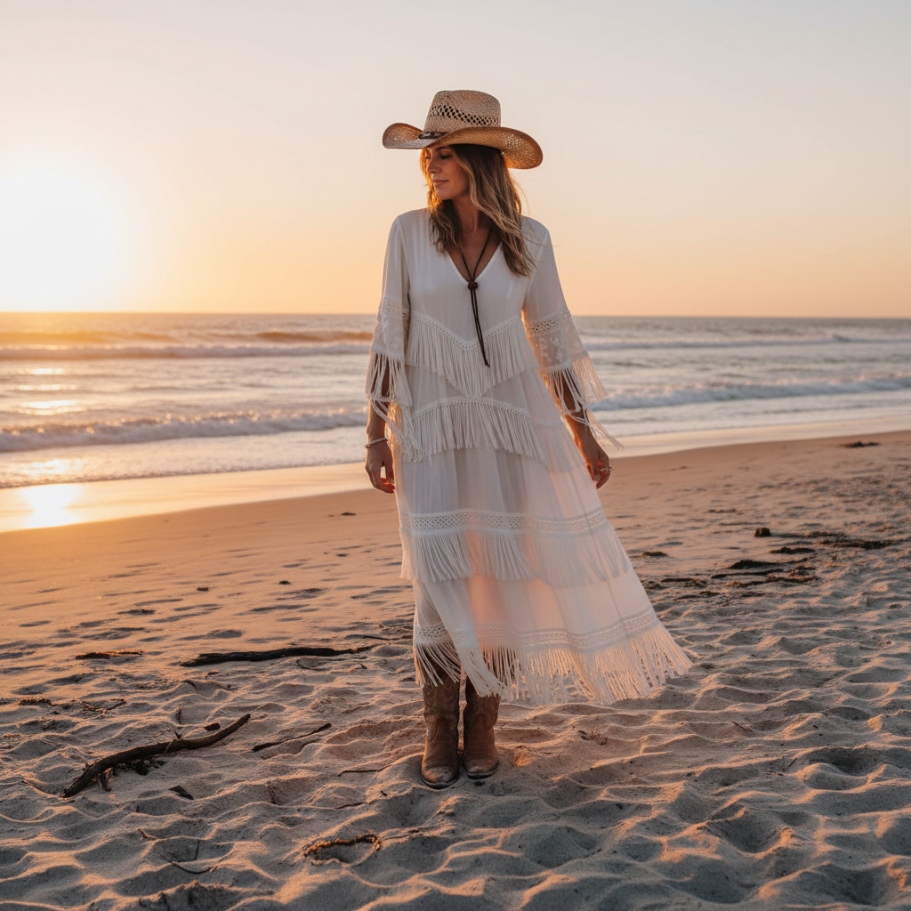

# Coastal Cowgirl 海岸牛仔女孩



> **"牛仔帽+比基尼+日落——当西部遇见海滩。"**

## 概述

| 维度 | 描述 |
|------|------|
| 时期 | 2022–至今 |
| 别名 | Coastal Cowgirl, Beach Western, Cowgirl Aesthetic |
| 核心色彩 | 米白、棕褐、天蓝、日落橙、牛仔蓝 |
| 关键元素 | 牛仔帽、流苏、牛仔靴、贝壳、日落 |
| 代表人物 | Beyoncé (Cowboy Carter)、Kacey Musgraves |
| 关联风格 | Western, Boho, Coastal Grandmother, Y2K |

---

## 历史脉络

### 从牧场到海滩

| 年份 | 事件 |
|------|------|
| 传统 | 美国西部牛仔文化 |
| 2019 | Lil Nas X "Old Town Road" 打破界限 |
| 2022 | TikTok #CoastalCowgirl 爆发 |
| 2023 | Beyoncé Renaissance 巡演牛仔造型 |
| 2024 | Beyoncé "Cowboy Carter" 专辑 |
| 2024 | 西部元素全面进入主流时尚 |

### 核心哲学

Coastal Cowgirl 的精神是**"自由、阳光、不受约束"**：
- 西部的独立精神 + 海滩的松弛感
- 不是真的要去骑马——是要那种"自由"
- 日落是永恒的背景
- 女性化的西部——不是粗犷，是浪漫
- "我可以同时是牛仔和美人鱼"

---

## 视觉语法

### 色彩系统

```
主色：
  米白 (#F5F5DC) — 沙滩、帽子
  棕褐 (#D2B48C) — 皮革、靴子
  天蓝 (#87CEEB) — 海洋、天空
  日落橙 (#FF8C00) — 黄昏、温暖
  牛仔蓝 (#6F8FAF) — 牛仔布

辅色：
  金色 (#FFD700) — 阳光、配饰
  珊瑚 (#FF7F50) — 日落
  白色 (#FFFFFF) — 沙滩、纯净

质感：
  皮革 — 靴子、皮带
  牛仔 — 短裤、夹克
  流苏 — 包、裙子
  草编 — 帽子、包
  贝壳 — 项链、装饰
```

### 标志性元素

| 类别 | 元素 |
|------|------|
| 帽子 | 草编牛仔帽、米色毡帽 |
| 鞋 | 白色牛仔靴、棕色短靴 |
| 服装 | 牛仔短裤、流苏裙、比基尼+牛仔帽 |
| 配饰 | 贝壳项链、皮革腰带、流苏包 |
| 场景 | 海滩日落、沙漠公路、敞篷车 |
| 音乐 | 乡村流行、Beyoncé、Kacey Musgraves |

---

## 与千禧怀旧的关系

### Beyoncé 效应
- 2024 "Cowboy Carter" = 黑人女性重新定义西部
- 打破"牛仔=白人男性"的刻板印象
- 西部美学的民主化和多元化

### 与 Y2K 的交叉
- 2000s 的 Jessica Simpson = 原版 Coastal Cowgirl
- 牛仔帽+低腰牛仔裤 = Y2K 经典
- 2024 版更"高级"、更多元

---

## 中国语境

- "牛仔风"/"西部风"在小红书的流行
- 与"美式复古"/"波西米亚"的交叉
- 中国版：草帽+牛仔+海边拍照
- 三亚/大理 = 中国的 Coastal Cowgirl 场景

---

## 设计应用

| 场景 | 应用方式 |
|------|----------|
| 品牌 | 暖色调+西部字体+日落+自由感 |
| 时尚 | 牛仔+流苏+皮革+海滩元素 |
| 空间 | 木质+皮革+暖光+植物 |
| 活动 | 海滩派对+乡村音乐+日落主题 |

---

## 相关风格

← [Boho 波西米亚](boho-chic.md) | [Coastal Grandmother 海岸祖母](coastal-grandmother.md) →

↑ [返回千禧怀旧目录](README.md) | [返回总目录](../README.md)
