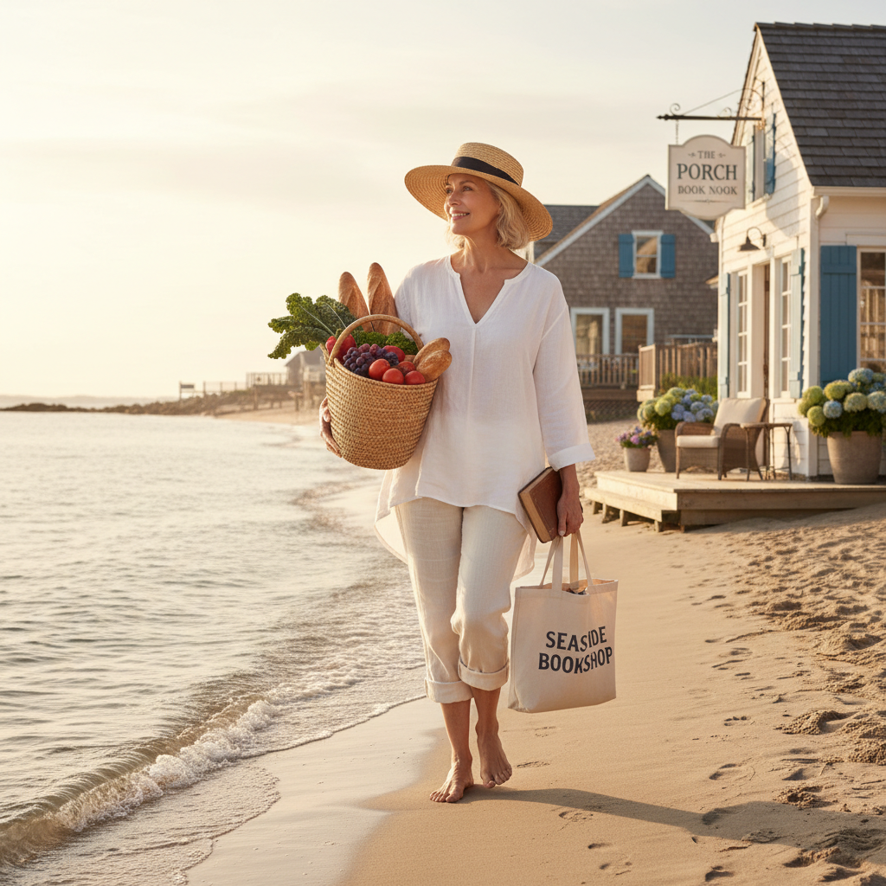

# Coastal Grandmother 海岸祖母




> **"Nancy Meyers 电影里那个住在汉普顿海边别墅的女人——亚麻衬衫、白色厨房和一杯白葡萄酒。"**

## 概述

| 维度 | 描述 |
|------|------|
| 时期 | 2022 命名 / 怀念 1990s–2000s 电影美学 |
| 别名 | Coastal Grandmother, Nancy Meyers Core, Hamptons Chic |
| 核心色彩 | 白色、米色、天蓝、沙色、海军蓝 |
| 关键元素 | 亚麻衬衫、草帽、白色厨房、海边别墅、书店 |
| 代表人物 | Diane Keaton、Meryl Streep、Nancy Meyers 电影 |
| 关联风格 | Normcore, Cottagecore, Quiet Luxury, Frasurbane |

---

## 历史脉络

### 2022：TikTok 的命名时刻

"Coastal Grandmother" 由 TikTok 用户 @lexnicoleta 在 2022 年 3 月创造，迅速病毒式传播。她的定义：

> "如果你喜欢 Nancy Meyers 电影、海滩散步、有组织的厨房、亚麻布料和 Ina Garten 的烹饪节目——你可能是一个 Coastal Grandmother。"

关键点：**你不需要是祖母，也不需要住在海边**。这是一种生活方式的想象。

### 文化原型

Coastal Grandmother 的视觉模板来自几部特定的电影：

| 电影 | 年份 | 贡献 |
|------|------|------|
| 《Something's Gotta Give》 | 2003 | Diane Keaton 的汉普顿海边别墅——白色厨房、高领毛衣 |
| 《It's Complicated》 | 2009 | Meryl Streep 的加州面包店——亚麻围裙、花园 |
| 《The Holiday》 | 2006 | 英国乡村小屋 + LA 豪宅的双重幻想 |
| 《Under the Tuscan Sun》 | 2003 | 意大利乡村的慢生活 |

### 为什么是 2022？

Coastal Grandmother 在 2022 年爆发的原因：
- **后疫情的"慢生活"渴望**：经历了两年混乱后，想要平静和秩序
- **对 Y2K 回潮的反动**：2021–2022 年 Y2K 风格太吵了，需要安静的替代品
- **"老钱"美学的兴起**：Quiet Luxury、Old Money 同期流行
- **代际想象**：Z世代想象"如果我60岁了，我想成为什么样的人"

---

## 视觉语法

### 色彩系统

```
主色（全部取自海岸自然）：
  白色 (#FFFFFF) — 亚麻、墙壁、厨房
  沙色 (#F4E4C1) — 沙滩、草帽、柳条
  天蓝 (#87CEEB) — 天空、海洋
  海军蓝 (#000080) — 条纹衫、航海元素
  米色 (#F5F5DC) — 针织衫、地毯

辅色：
  橄榄绿 (#808000) — 花园植物
  淡粉 (#FFF0F5) — 花朵
  铜色 (#B87333) — 厨具

质感：
  亚麻 — 最核心的 Coastal Grandmother 材质
  棉 — 白色T恤、床单
  柳条/藤编 — 篮子、家具
  陶瓷 — 白色餐具
  木材 — 浅色、风化的
```

### 标志性元素

| 类别 | 元素 |
|------|------|
| 服装 | 亚麻衬衫、白色裤子、条纹衫、开衫、草帽 |
| 空间 | 白色厨房、开放式书架、海景窗户、花园 |
| 活动 | 海边散步、烹饪、读书、园艺、逛农夫市场 |
| 食物 | 白葡萄酒、新鲜沙拉、烤鱼、柠檬水 |
| 物品 | 柳条篮、白色陶瓷、亚麻餐巾、鲜花 |
| 品牌 | Eileen Fisher、J.Crew、L.L.Bean、Le Creuset |

### 与 Quiet Luxury 的关系

| 维度 | Coastal Grandmother | Quiet Luxury |
|------|---------------------|--------------|
| 场景 | 海边/乡村 | 城市 |
| 品牌 | J.Crew, Eileen Fisher | The Row, Loro Piana |
| 价位 | 中产可及 | 超高端 |
| 情绪 | 温暖、放松 | 冷静、克制 |
| 共同点 | 无logo、自然色、品质面料、低调 |

---

## 与千禧怀旧的关系

Coastal Grandmother 怀念的是**2000年代 Nancy Meyers 电影中的生活幻想**：

### 一种从未拥有的生活
- 海边别墅（房价数百万美元）
- 巨大的白色厨房（需要豪宅才有）
- 不需要工作的悠闲下午（经济自由）
- 这是一种**阶级幻想**，包装成"生活方式"

### 与 Frasurbane 的平行
- Frasurbane 怀念 90s 情景喜剧的客厅
- Coastal Grandmother 怀念 2000s 浪漫喜剧的厨房
- 两者都是对**虚构空间**的怀旧

---

## 中国语境

- "松弛感"穿搭（2022–2023 小红书热词）
- 三亚/大理的"海边生活"想象
- "退休后的理想生活"讨论
- 亚麻材质在中国时尚中的流行
- 日式"生活感"美学的影响

---

## 设计应用

| 场景 | 应用方式 |
|------|----------|
| 品牌设计 | 白色+沙色+衬线字体+大量留白 |
| 包装 | 亚麻质感+极简标签+自然色 |
| 空间 | 白色为主+自然材质+鲜花+海洋元素 |
| 摄影 | 自然光+白色背景+食物/花朵道具 |

---

## 延伸阅读

- Aesthetics Wiki: [Coastal Grandmother](https://aesthetics.fandom.com/wiki/Coastal_Grandmother)
- Nancy Meyers 电影美术设计分析
- @lexnicoleta 原始 TikTok 视频

---

## 相关风格

← [Cottagecore 田园核](cottagecore.md) | [Normcore 正常核](normcore.md) →

↑ [返回千禧怀旧目录](README.md) | [返回总目录](../README.md)
