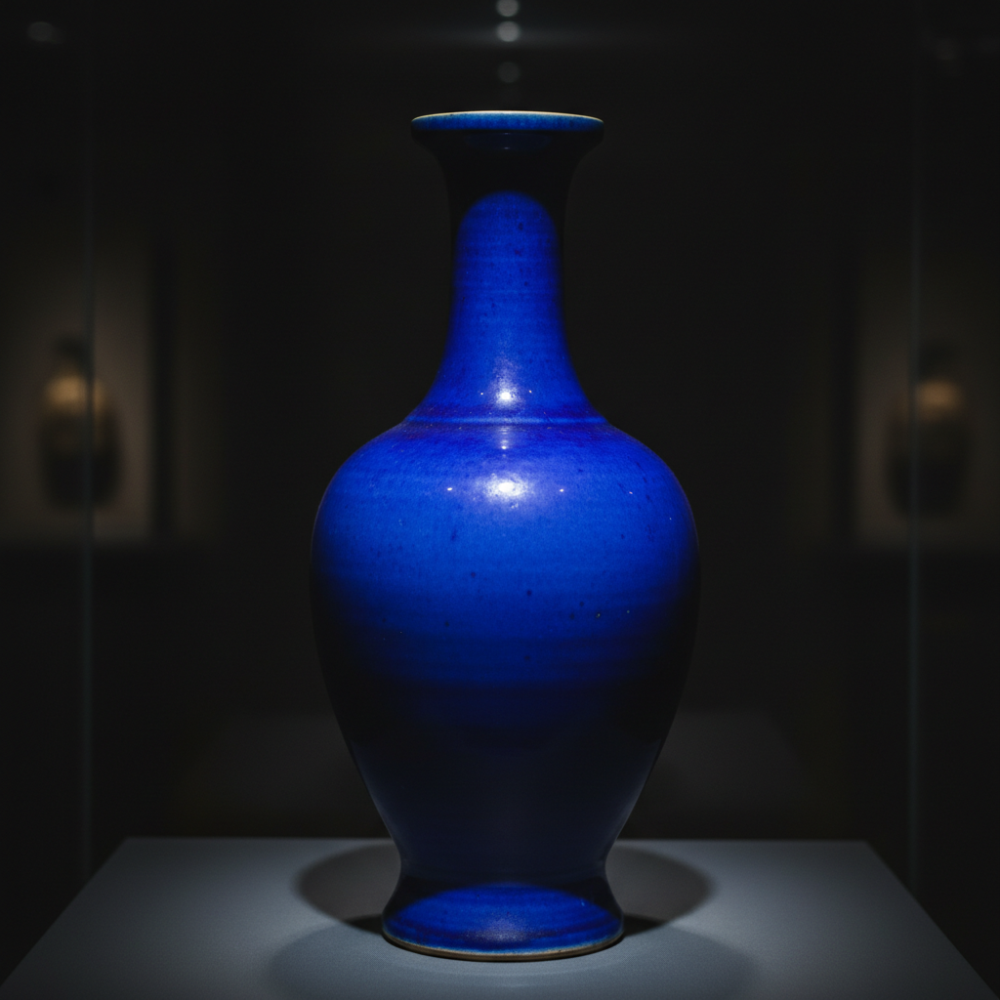

# Cobalt Glaze Art 钴蓝釉艺术

> "Cobalt is the truest blue in the potter's world — a pigment so stable and so vivid that it survives any fire without fading, painting the same electric blue whether brushed under a clear glaze at 1300 degrees or dusted over a tin glaze at 1000, the mineral that gave us blue-and-white porcelain, Islamic tiles, Delft pottery, and every ceramic blue that has ever made the eye believe it was looking at a piece of captured sky." — Unknown

## 概述

钴蓝釉艺术（Cobalt Glaze Art）是一种以氧化钴为着色剂的蓝色陶瓷釉料和装饰艺术。钴是陶瓷中最稳定、最鲜艳的蓝色着色剂——它在任何温度和气氛下都能呈现纯净的蓝色，不受氧化还原的影响。钴蓝是人类最早使用的陶瓷颜料之一，从中国的青花瓷到伊斯兰的蓝色瓷砖，从代尔夫特蓝陶到日本的染付，钴蓝贯穿了世界陶瓷史。

钴蓝釉艺术的核心要素包括：1）氧化钴——极其稳定的蓝色着色剂；2）釉下彩——钴料在釉下绘制（青花）；3）满釉——钴蓝色的整体釉面；4）稳定性——在任何气氛下都呈蓝色；5）浓度变化——从淡蓝到深蓝的色调控制；6）全球性——世界各地都使用的颜料；7）文化象征——蓝色在各文化中的象征意义。

## 核心特征

| 特征 | 描述 |
|------|------|
| 钴着色 | 氧化钴的纯净蓝色 |
| 极稳定 | 不受气氛和温度影响 |
| 色彩鲜艳 | 最鲜艳的陶瓷蓝色 |
| 全球应用 | 世界各地的广泛使用 |
| 釉下釉上 | 可用于釉下和釉上装饰 |
| 历史悠久 | 数千年的使用历史 |

## 视觉特征

- **纯净蓝色**：鲜艳纯净的蓝色
- **深蓝**：浓郁的深蓝色调
- **淡蓝**：柔和的淡蓝色
- **蓝白对比**：蓝色与白色的经典搭配
- **渐变效果**：浓淡变化的蓝色层次
- **宝石光泽**：如蓝宝石般的光泽

## 代表作品

| 作品 | 艺术家/窑口 | 年代 | 意义 |
|------|-------------|------|------|
| *元青花大罐* | 景德镇 | 元代 | 青花瓷的巅峰 |
| *伊兹尼克蓝色瓷砖* | 土耳其 | 15-16世纪 | 伊斯兰钴蓝 |
| *代尔夫特蓝陶* | 荷兰 | 17世纪 | 欧洲钴蓝传统 |
| *宣德青花* | 景德镇御窑 | 明宣德 | 苏麻离青的浓艳 |
| *霁蓝釉* | 景德镇 | 明清 | 钴蓝满釉的典范 |

## 历史时间线

| 时期 | 事件 |
|------|------|
| 公元前2000年 | 埃及和美索不达米亚使用钴蓝 |
| 唐代 | 中国开始使用钴蓝装饰陶瓷 |
| 元代 | 青花瓷的成熟和大规模生产 |
| 15世纪 | 伊斯兰世界钴蓝瓷砖的巅峰 |
| 17世纪 | 代尔夫特蓝陶的兴起 |
| 当代 | 钴蓝在全球陶瓷中的持续应用 |

## 中国语境

钴蓝在中国陶瓷史上有举足轻重的地位。中国的青花瓷——以钴料在白瓷上绘制图案——是世界上最具影响力的陶瓷品种，从元代开始大规模生产，影响了从中东到欧洲到东南亚的整个世界。中国的霁蓝釉（祭蓝）是钴蓝满釉的典范。中国历史上使用的钴料——从进口的苏麻离青到国产的珠明料——各有特色。青花瓷是中国对世界文明最重要的贡献之一，钴蓝色已成为中国陶瓷的标志性色彩。

## AI生成概念图

## 与其他风格的关系

- **Blue and White** → 青花瓷
- **Delftware** → 代尔夫特蓝陶
- **Iznik** → 伊兹尼克瓷砖
- **Iron Glaze** → 铁釉
- **Copper Red** → 铜红釉
- **Underglaze** → 釉下彩

---

*浮光艺志 | Chronicle of Artistry*
