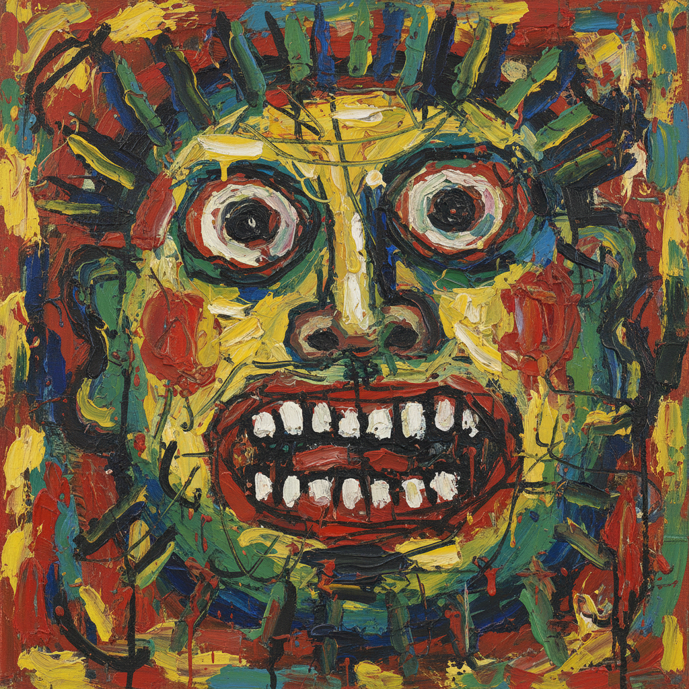

# CoBrA 眼镜蛇画派

> **"一幅画不是椅子上的结构，而是一头公牛、一个夜晚、一声呐喊。"** —— Karel Appel

## 概述

CoBrA（1948–1951）是二战后欧洲最具爆发力的前卫艺术运动之一，名称取自三座城市首字母的组合：**Co**penhagen（哥本哈根）、**Br**ussels（布鲁塞尔）、**A**msterdam（阿姆斯特丹）。该运动由丹麦、比利时和荷兰的艺术家于1948年11月8日在巴黎一家咖啡馆联合创立，主张回归原始表现力，反对几何抽象和超现实主义的教条。

## 时间线

| 年份 | 事件 |
|------|------|
| 1948 | 11月8日，六位艺术家在巴黎签署宣言，CoBrA 正式成立 |
| 1949 | 阿姆斯特丹市立博物馆举办首次大型 CoBrA 展览 |
| 1949–1951 | 出版《CoBrA》杂志（共10期） |
| 1951 | 列日展览后运动正式解散，但影响持续数十年 |

## 创始成员

| 艺术家 | 国籍 | 特征 |
|--------|------|------|
| Asger Jorn | 丹麦 | 狂野笔触与北欧神话意象 |
| Karel Appel | 荷兰 | 儿童般的色彩爆发与厚涂肌理 |
| Christian Dotremont | 比利时 | "Logograms"——文字与绘画的融合 |
| Constant Nieuwenhuys | 荷兰 | 乌托邦建筑幻想"New Babylon" |
| Corneille | 荷兰 | 鸟、太阳与非洲色彩 |
| Pierre Alechinsky | 比利时 | 东方书法与西方表现的交汇 |

## 核心理念

- **自发性**：拒绝理性计算，追求本能的、未经审查的创作冲动
- **原始主义**：从儿童画、民间艺术、北欧神话和非洲艺术中汲取灵感
- **集体创作**：多位艺术家在同一画布上共同作画
- **反学院**：反对巴黎画派的精英主义和几何抽象的冷漠
- **诗画一体**：文字、诗歌与视觉艺术不可分割

## 视觉特征

- 粗犷、厚重的笔触和颜料堆积
- 鲜艳、对比强烈的原色
- 类似儿童画的人物和动物形象
- 面具般的面孔、怪兽、神话生物
- 文字与图像的混合（Dotremont 的 Logograms）
- 大尺幅、充满能量的画面

## 与其他运动的关系

| 运动 | 关系 |
|------|------|
| 抽象表现主义 | 同时代，共享自发性但 CoBrA 保留具象元素 |
| Art Informel | 重叠时期，共享反几何立场 |
| 情境主义国际 | Jorn 和 Constant 后来参与创立 |
| 新表现主义 | 1980年代的精神后裔 |
| Art Brut | 共享对"局外人"创作的尊重 |

## 遗产

虽然 CoBrA 仅存在三年，但其影响深远：
- 为1960年代的激浪派和情境主义铺路
- 影响了1980年代新表现主义（Neue Wilde、Transavanguardia）
- Jorn 的思想直接催生了情境主义国际
- 哥本哈根的 CoBrA 博物馆（阿姆斯特丹）至今展示其遗产

## 概念图

---

*浮光艺志 | Chronicle of Artistry*
