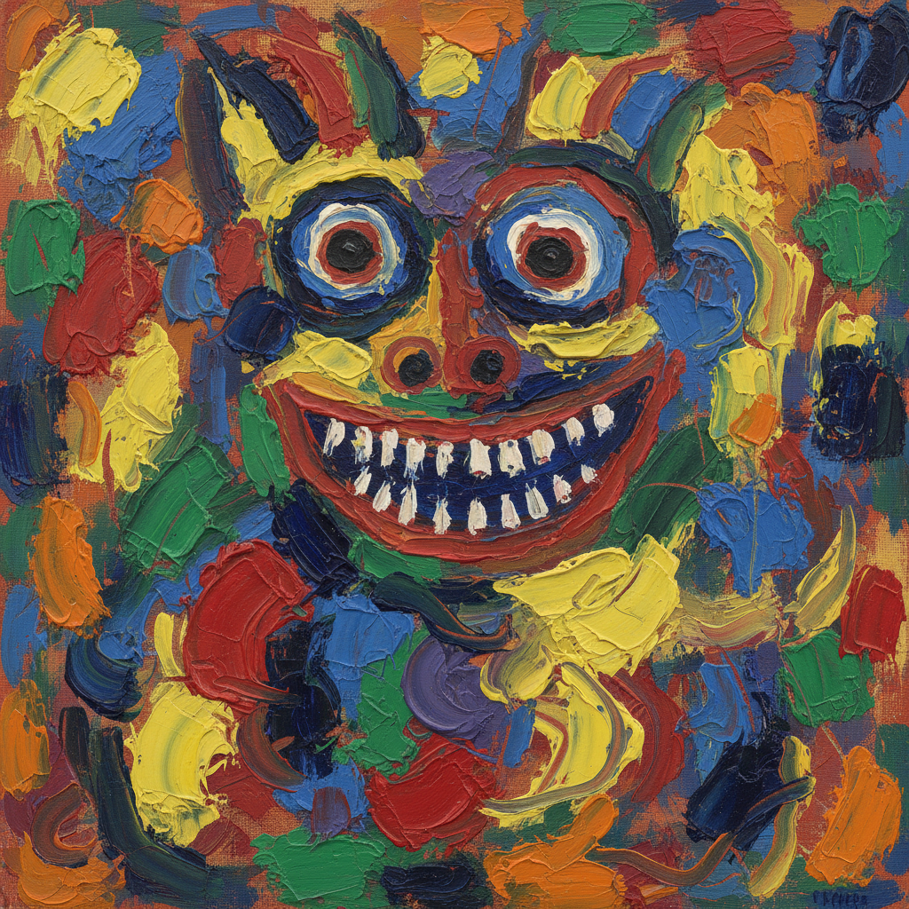

# CoBrA 眼镜蛇画派

> "A painting is not a construction of colors and lines, but an animal, a night, a cry, a human being." — Karel Appel

## 概述

CoBrA（1948–1951）是战后欧洲最激进的艺术运动之一，名称取自三座城市的首字母：哥本哈根（Copenhagen）、布鲁塞尔（Brussels）、阿姆斯特丹（Amsterdam）。他们拒绝一切理性主义和几何抽象，追求儿童画般的自发性、原始的生命力和集体创作的狂欢。

## 核心特征

| 特征 | 描述 |
|------|------|
| 自发性 | 拒绝预先构思，即兴创作 |
| 儿童画风 | 模仿儿童的自由与天真 |
| 厚涂颜料 | 大量堆积的物质性色彩 |
| 怪兽形象 | 半人半兽的幻想生物 |
| 集体创作 | 多人合作的大型作品 |
| 反理性 | 拒绝几何抽象和超现实主义的文学性 |

## 核心成员

| 画家 | 国籍 | 特色 |
|------|------|------|
| Karel Appel | 荷兰 | 色彩爆炸的怪兽面孔 |
| Asger Jorn | 丹麦 | 北欧神话的野性能量 |
| Constant | 荷兰 | 乌托邦建筑幻想 |
| Pierre Alechinsky | 比利时 | 东方书法与西方表现的融合 |
| Corneille | 荷兰 | 鸟与热带风景 |

## 代表作品

| 作品 | 画家 | 意义 |
|------|------|------|
| *Questioning Children* | Appel, 1949 | 引发丑闻的市政厅壁画 |
| *Letter to My Son* | Jorn, 1956–57 | 北欧神话的现代重生 |
| *Central Park* | Alechinsky, 1965 | 书法与绘画的融合 |

## AI生成概念图

## 与其他风格的关系

- **Abstract Expressionism** → 欧洲的平行运动
- **Art Brut** → 共享对"局外人"艺术的兴趣
- **Die Brücke** → 继承德国表现主义的野性
- **Situationist International** → 部分成员后来加入情境主义
