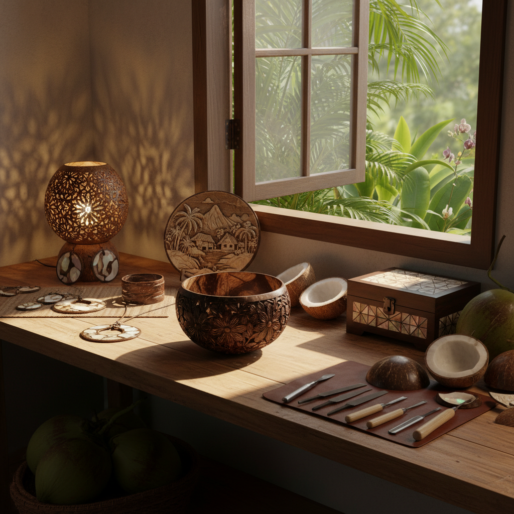

# Coconut Art 椰壳艺术

> "A coconut shell is nature's perfect bowl — hard as wood, smooth as stone, dark as ebony. When an artist takes this humble tropical waste and transforms it through carving, polishing, inlay, and imagination, the result is objects of surprising elegance: bowls that glow with inner warmth, jewelry that rivals lacquerware, and sculptures that celebrate the beauty hidden in the discarded." — Unknown

## 概述

椰壳艺术（Coconut Art）是以椰子壳为主要材料进行艺术创作的实践——利用椰壳天然的硬度、深棕色泽和优美的曲面，通过雕刻、打磨、镶嵌、拼接等技法创造器物、装饰品和艺术品。椰壳艺术是热带地区重要的传统工艺，也是废物利用的典范。

椰壳艺术的实践包括：1）椰壳雕刻——在椰壳表面雕刻图案和浮雕；2）椰壳器皿——用椰壳制作的碗、杯、勺等器具；3）椰壳珠宝——用椰壳制作的首饰和配饰；4）椰壳镶嵌——将椰壳片镶嵌在家具或器物表面；5）椰壳拼贴——用椰壳碎片拼贴成图案；6）椰壳灯具——用椰壳制作的灯罩；7）椰壳乐器——用椰壳制作的传统乐器。

## 核心特征

| 特征 | 描述 |
|------|------|
| 天然 | 天然的有机材料 |
| 硬度 | 坚硬耐用 |
| 色泽 | 深棕色的天然色泽 |
| 曲面 | 天然的曲面形态 |
| 环保 | 废物利用 |
| 热带 | 热带文化特色 |

## 视觉特征

- **深棕**：椰壳的深棕色
- **光泽**：打磨后的光泽
- **纹理**：天然的纤维纹理
- **曲面**：半球形的曲面
- **对比**：内外颜色的对比
- **质朴**：质朴的自然美

## 代表作品

| 作品 | 艺术家 | 年代 | 意义 |
|------|--------|------|------|
| *Coconut shell carvings* | 传统 | 古代至今 | 热带地区传统工艺 |
| *Coconut shell jewelry* | Various | 当代 | 椰壳首饰 |
| *Coconut shell lamps* | Various | 当代 | 椰壳灯具 |
| *Coconut shell inlay* | 传统 | 古代至今 | 椰壳镶嵌 |
| *Contemporary coconut art* | Various | 当代 | 当代椰壳艺术 |

## 历史时间线

| 时期 | 事件 |
|------|------|
| 古代 | 热带地区的椰壳利用 |
| 中世纪 | 椰壳作为珍贵材料传入欧洲 |
| 近代 | 椰壳工艺的产业化 |
| 20世纪 | 椰壳工艺品的国际贸易 |
| 当代 | 椰壳的环保设计复兴 |

## 中国语境

椰壳艺术在中国主要集中在海南省——海南是中国最大的椰子产区，椰壳工艺是海南的特色传统工艺。海南的椰雕有数百年历史——明清时期海南椰雕就是进贡朝廷的贡品。海南椰雕以精细的浮雕和镂空雕刻著称——将椰壳雕刻成花鸟、人物、山水等精美图案。海南椰雕是国家级非物质文化遗产。中国当代的一些设计师将椰壳材料融入现代产品设计——椰壳碗、椰壳首饰、椰壳家居装饰品在环保消费趋势下越来越受欢迎。中国的椰壳活性炭产业也是椰壳利用的重要方向。

## AI生成概念图

## 与其他风格的关系

- **Wood Carving** → 木雕艺术
- **Shell Art** → 贝壳艺术
- **Tropical Art** → 热带艺术
- **Eco Art** → 生态艺术
- **Folk Art** → 民间艺术
- **Jewelry Art** → 珠宝艺术

---

*浮光艺志 | Chronicle of Artistry*
