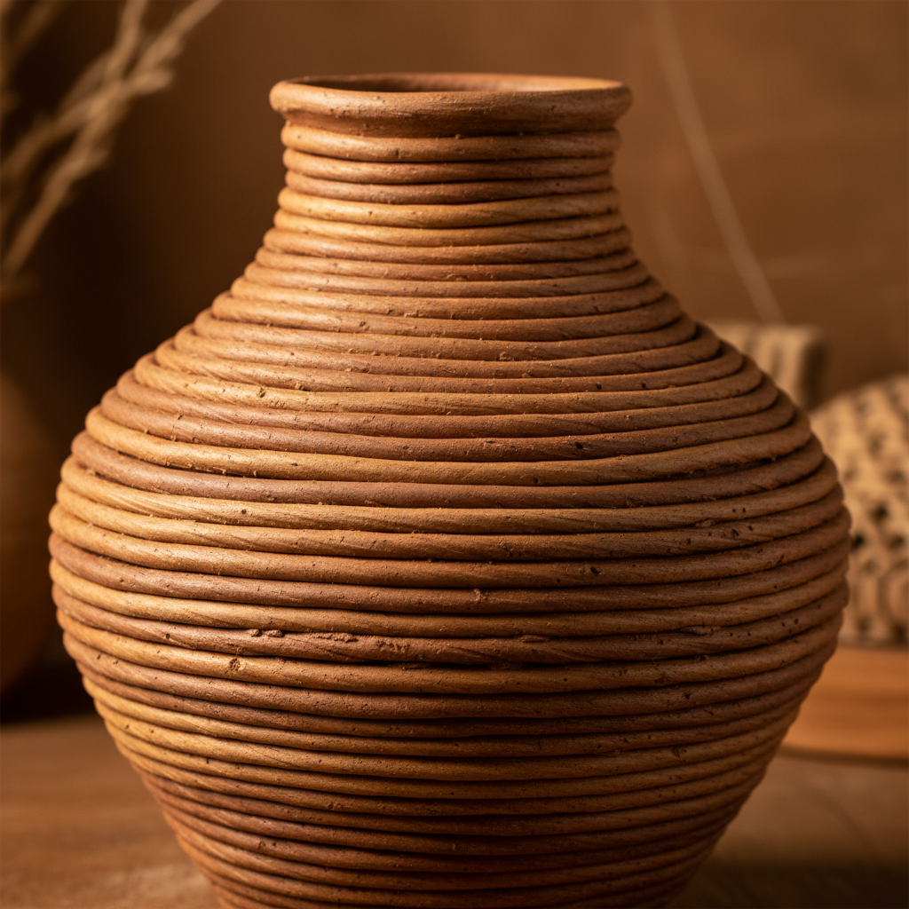

# Coil Building Art 盘筑艺术

> "Coil building is time made visible in clay — each rope of earth laid upon the last in a rising spiral, the potter's hands smoothing or leaving the coils exposed as the vessel grows upward ring by ring like the growth rings of a tree, the oldest method of making a pot and still the freest, limited only by gravity and the patience to let each layer firm before adding the next." — Unknown

## 概述

盘筑艺术（Coil Building Art）是一种将粘土搓成长条（泥条），然后一圈圈叠加堆筑成器物的古老陶瓷成型技法。盘筑是人类最早的陶器成型方法之一——在轮制技术发明之前，几乎所有陶器都是用盘筑法制作的。盘筑法不受圆形的限制，可以制作任何形状和尺寸的器物，从小型茶碗到巨大的储物罐，是最自由也最基础的陶瓷成型方式。

盘筑艺术的核心要素包括：1）泥条制作——将粘土搓成均匀的长条；2）叠加堆筑——一圈圈叠加泥条；3）连接——将泥条之间牢固连接；4）造型自由——不受圆形限制的自由造型；5）表面处理——可保留泥条纹理或抹平；6）大型制作——可制作超大型器物；7）时间性——需要等待每层干燥后继续。

## 核心特征

| 特征 | 描述 |
|------|------|
| 泥条叠加 | 一圈圈叠加泥条成型 |
| 造型自由 | 不受圆形限制 |
| 古老技法 | 最古老的成型方法之一 |
| 大型可能 | 可制作超大型器物 |
| 纹理选择 | 可保留或抹平泥条痕迹 |
| 时间过程 | 需要耐心等待干燥 |

## 视觉特征

- **泥条纹理**：保留的泥条叠加痕迹
- **有机形态**：自由的非对称造型
- **生长感**：如年轮般的层次感
- **厚重体量**：厚实有力的器壁
- **手工痕迹**：明显的手工制作痕迹
- **大型尺度**：可达到的巨大尺寸

## 代表作品

| 作品 | 艺术家/文化 | 年代 | 意义 |
|------|-------------|------|------|
| *绳纹陶器* | 日本绳文 | 公元前14000年 | 最早的盘筑陶器 |
| *非洲大型储物罐* | 非洲各族 | 传统 | 传统盘筑大器 |
| *Maria Martinez黑陶* | Maria Martinez | 20世纪 | 美国原住民盘筑 |
| *Jennifer Lee作品* | Jennifer Lee | 当代 | 当代盘筑艺术 |
| *当代大型盘筑* | 各地陶艺家 | 当代 | 盘筑的现代探索 |

## 历史时间线

| 时期 | 事件 |
|------|------|
| 公元前14000年 | 最早的盘筑陶器（绳文） |
| 新石器时代 | 世界各地的盘筑陶器 |
| 古代 | 盘筑作为主要成型方法 |
| 轮制发明后 | 盘筑与轮制并存 |
| 当代 | 盘筑作为艺术表达手段复兴 |

## 中国语境

盘筑在中国有极其悠久的历史。中国新石器时代的陶器——从仰韶文化的彩陶到龙山文化的黑陶——大多使用盘筑法制作。中国的大型陶器——如储酒缸、水缸——至今仍使用盘筑法制作，因为它们的尺寸超出了轮制的能力。宜兴紫砂壶的"打身筒"技法也包含盘筑的元素。中国当代陶艺教育中，盘筑是最基础的成型课程之一。中国少数民族地区——如云南、贵州——至今保留着传统的盘筑制陶技艺，被列为非物质文化遗产。

## AI生成概念图

## 与其他风格的关系

- **Pinch Pot** → 捏塑
- **Slab Building** → 泥板成型
- **Wheel Throwing** → 拉坯
- **Primitive Pottery** → 原始陶器
- **Large Scale Ceramics** → 大型陶瓷
- **Process Art** → 过程艺术

---

*浮光艺志 | Chronicle of Artistry*
