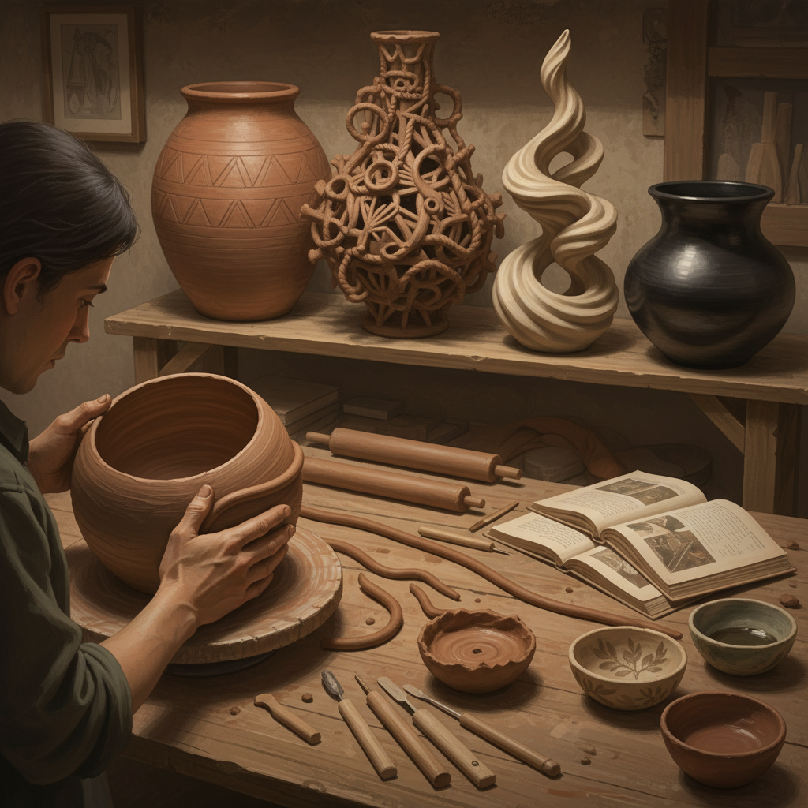

# Coiling Pottery 盘筑陶艺

> "Coiling is the oldest architecture of clay — rope upon rope of earth spiraling upward, each coil supporting the next, building vessels that carry the memory of hands in every ridge and the patience of millennia in every curve." — Unknown

## 概述

盘筑陶艺（Coiling Pottery）是人类最古老的陶器成型技法之一——将粘土搓成长条（泥条/coils），然后一圈一圈地叠加盘绕，逐渐建立起器物的形状。盘筑法不需要陶轮——完全依靠手工将泥条叠加、连接和塑形。盘筑法可以制作从小型杯碗到大型储物罐的各种器物，形状不受陶轮对称性的限制。

盘筑法的历史可追溯到新石器时代——在陶轮发明之前，几乎所有的陶器都是用盘筑法制作的。世界各地的原住民文化（如美洲原住民、非洲部落、日本绳文文化）都有悠久的盘筑陶艺传统。当代陶艺家重新发现了盘筑法的表现力——它能创造出陶轮无法实现的不规则形态和大型作品。

## 核心特征

| 特征 | 描述 |
|------|------|
| 泥条 | 使用泥条盘绕 |
| 手工 | 完全手工成型 |
| 古老 | 最古老的陶艺技法 |
| 自由 | 形状自由不受限 |
| 大型 | 可制作大型器物 |
| 纹理 | 泥条留下的纹理 |

## 视觉特征

- **螺旋**：螺旋上升的结构
- **手工**：手工的质感
- **有机**：有机的形态
- **纹理**：泥条的纹理
- **不规则**：自然的不规则
- **原始**：原始的美感

## 代表作品

| 作品 | 艺术家 | 年代 | 意义 |
|------|--------|------|------|
| *Jomon pottery* | 日本绳文工匠 | 公元前 | 绳文盘筑陶器 |
| *Pueblo pottery* | 美洲原住民 | 传统 | 普韦布洛盘筑陶 |
| *African coiled vessels* | 非洲工匠 | 传统 | 非洲盘筑陶器 |
| *Contemporary coiled art* | Various | 当代 | 当代盘筑陶艺 |
| *Large-scale coiled works* | Various | 当代 | 大型盘筑作品 |

## 历史时间线

| 时期 | 事件 |
|------|------|
| 新石器时代 | 盘筑法的起源 |
| 公元前10000年 | 日本绳文陶器 |
| 古代 | 全球各文化的盘筑传统 |
| 陶轮发明后 | 盘筑法在部分地区的延续 |
| 20世纪 | 工作室陶艺运动中的复兴 |
| 当代 | 盘筑法在当代陶艺中的创新 |

## 中国语境

盘筑法在中国有极其悠久的历史——中国新石器时代的陶器大多使用盘筑法制作。中国的仰韶文化、龙山文化等早期文明都有精美的盘筑陶器。中国的一些少数民族（如傣族、彝族）至今仍保留传统的盘筑制陶技艺。中国的当代陶艺教育中，盘筑法是基础课程之一。中国的陶艺工作室和体验课程中，盘筑法因其"不需要陶轮、适合初学者"的特点而受欢迎。

## AI生成概念图

## 与其他风格的关系

- **Pinch Pottery** → 捏塑陶艺
- **Slab Building** → 板筑陶艺
- **Wheel Throwing** → 拉坯
- **Ceramic Sculpture** → 陶瓷雕塑
- **Primitive Pottery** → 原始陶器
- **Hand Building** → 手工成型

---

*浮光艺志 | Chronicle of Artistry*
