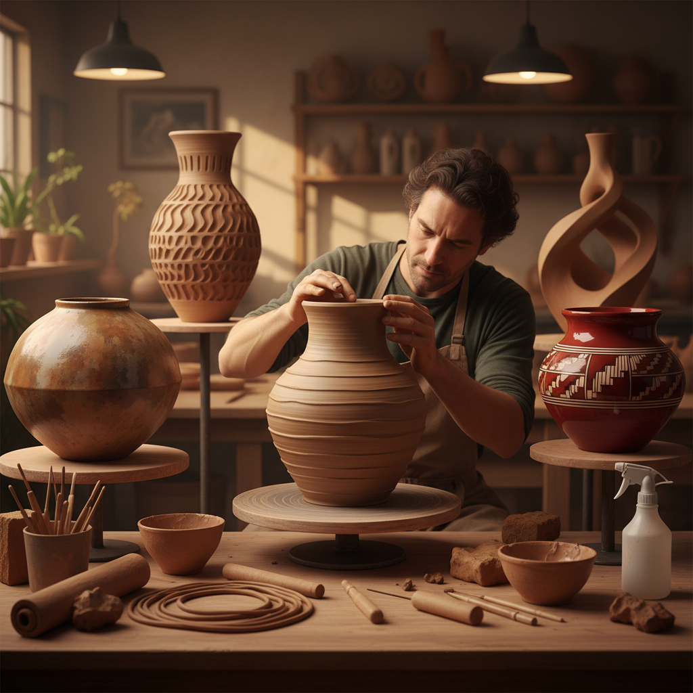

# Coiling 盘筑法

> "Coiling is the oldest architecture of clay — rope upon rope, smoothed or left raw, building vessels that carry the memory of every hand that shaped them upward from the earth." — Unknown

## 概述

盘筑法（Coiling）是人类最古老的陶器成型技法之一——将黏土搓成长条（泥条），然后一圈一圈地盘叠起来，逐渐构建出器物的形状。每一圈泥条与下一圈之间通过压合和抹平来连接。盘筑法不需要任何机械设备（如拉坯用的转轮），完全依靠双手的控制。

盘筑法的优势在于：可以制作任何大小和形状的器物——从小巧的杯子到巨大的储水缸，从规则的圆形到自由的有机形态。艺术家可以选择将泥条完全抹平（隐藏盘筑痕迹），也可以保留泥条的纹理作为装饰元素。当代陶艺中，盘筑法因其自由度和表现力而被广泛使用。

## 核心特征

| 特征 | 描述 |
|------|------|
| 泥条 | 搓制泥条为基本元素 |
| 盘叠 | 一圈圈盘叠成型 |
| 手工 | 完全手工操作 |
| 自由 | 形状极其自由 |
| 大型 | 可制作大型器物 |
| 古老 | 最古老的成型法之一 |

## 视觉特征

- **纹理**：泥条的盘旋纹理
- **有机**：有机的形态
- **厚实**：相对厚实的壁
- **手感**：强烈的手工感
- **不规则**：自然的不规则性
- **层次**：可见的层叠痕迹

## 代表作品

| 作品 | 艺术家 | 年代 | 意义 |
|------|--------|------|------|
| *Jomon pottery* | 匿名 | 公元前10000年 | 最早的盘筑陶器 |
| *African coiled pottery* | 匿名 | 传统 | 非洲盘筑传统 |
| *Pueblo pottery* | 匿名 | 传统 | 美洲原住民盘筑 |
| *Large coiled vessels* | Jennifer Lee | 当代 | 当代盘筑艺术 |
| *Coiled sculptures* | Various | 当代 | 盘筑雕塑 |

## 历史时间线

| 时期 | 事件 |
|------|------|
| 公元前10000年+ | 最早的盘筑陶器（绳文） |
| 新石器时代 | 全球范围的盘筑陶器 |
| 古代 | 拉坯发明前的主要成型法 |
| 传统 | 非洲、美洲的盘筑传统延续 |
| 20世纪 | 当代陶艺中的盘筑复兴 |
| 当代 | 盘筑作为艺术表达 |

## 中国语境

盘筑法在中国有着极其悠久的历史——中国新石器时代的陶器（如仰韶文化的彩陶）大多是用盘筑法制作的。在拉坯技术发明之前，盘筑法是中国陶器的主要成型方式。即使在拉坯普及之后，大型器物（如缸、瓮）仍然使用盘筑法。中国的一些少数民族地区（如云南、贵州）至今仍保留着传统的盘筑制陶技艺，被列为非物质文化遗产。当代中国的陶艺教育中，盘筑法是基础课程之一。

## AI生成概念图

## 与其他风格的关系

- **Ceramics** → 陶瓷
- **Wheel Throwing** → 拉坯
- **Slab Building** → 板筑法
- **Pinching** → 捏塑法
- **Slip Casting** → 注浆成型
- **Pit Firing** → 坑烧

---

*浮光艺志 | Chronicle of Artistry*
