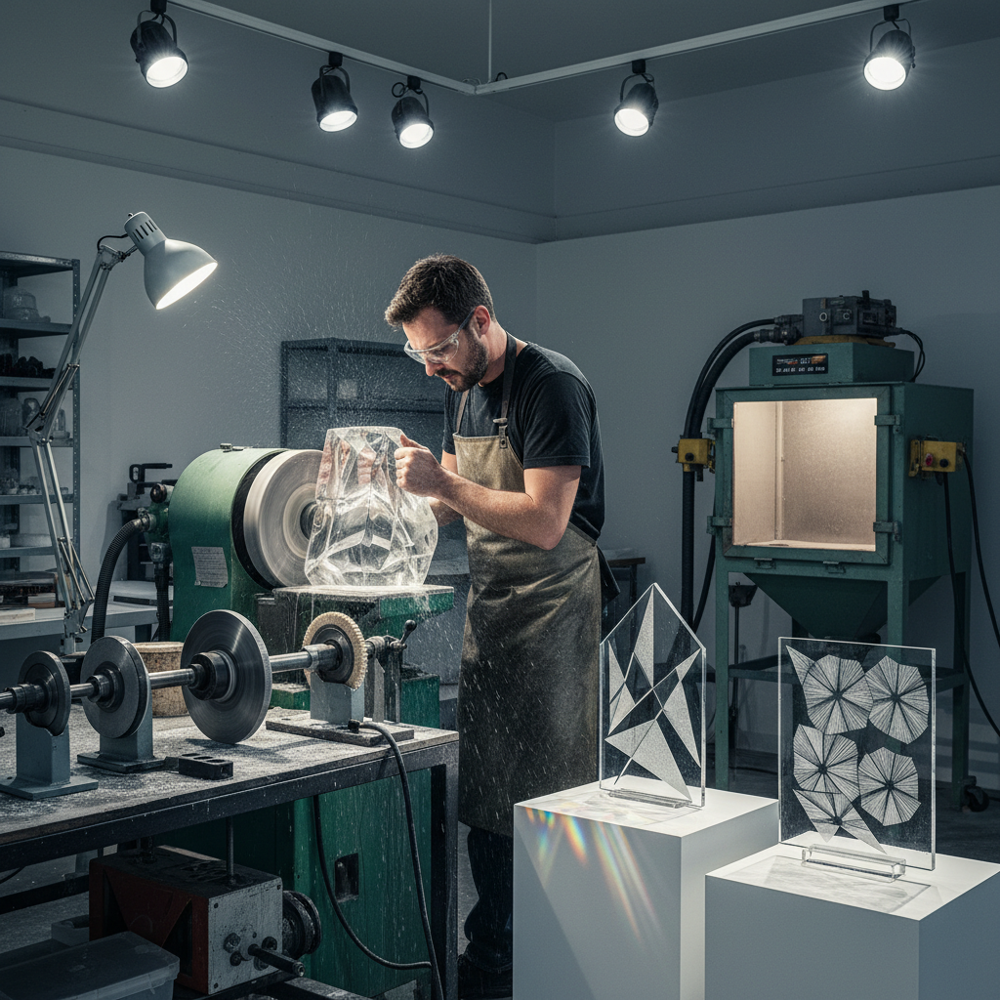

# Cold Working 玻璃冷加工

> "Cold working is glass after the fire — where patience and precision reveal the light hidden within." — Unknown

## 概述

玻璃冷加工（Cold Working）是在室温下对已成型的玻璃进行切割、研磨、抛光、雕刻和表面处理的技术总称。与热加工（吹制、熔融、铸造）不同，冷加工是"减法"过程——通过去除材料来精炼形态和表面。冷加工包括：切割（cutting）、研磨（grinding）、抛光（polishing）、喷砂（sandblasting）、酸蚀（acid etching）、雕刻（engraving）等多种技法。许多玻璃艺术品需要热加工和冷加工的结合才能完成。

冷加工的哲学在于：揭示而非创造——玻璃的光学潜力已经存在于材料中，冷加工只是通过精确的表面处理将其释放出来。

## 核心特征

| 特征 | 描述 |
|------|------|
| 室温 | 在室温下进行 |
| 减法 | 去除材料的过程 |
| 精密 | 高精度的加工 |
| 光学 | 优化光学效果 |
| 表面 | 表面处理为主 |
| 多样 | 多种技法的总称 |

## 视觉特征

- **光学**：精确的光学折射
- **棱面**：切割的棱面效果
- **磨砂**：磨砂的柔和表面
- **透明**：高度抛光的透明
- **对比**：磨砂与抛光的对比
- **精密**：精密的几何切割

## 代表作品

| 作品 | 艺术家 | 年代 | 意义 |
|------|--------|------|------|
| *Bohemian cut glass* | 匿名 | 17世纪+ | 波西米亚切割玻璃 |
| *Waterford Crystal* | Various | 1783+ | 沃特福德水晶 |
| *Václav Cigler sculptures* | Václav Cigler | 1960s+ | 光学玻璃雕塑 |
| *Colin Reid cast & cold-worked* | Colin Reid | 1990s+ | 铸造+冷加工 |
| *Jon Kuhn geometric forms* | Jon Kuhn | 当代 | 几何冷加工玻璃 |

## 历史时间线

| 时期 | 事件 |
|------|------|
| 古代 | 宝石切割技术应用于玻璃 |
| 17世纪 | 波西米亚切割玻璃的兴起 |
| 18-19世纪 | 水晶切割的黄金时代 |
| 20世纪 | 光学玻璃的精密加工 |
| 1960s+ | 艺术冷加工的发展 |
| 当代 | CNC和传统手工的结合 |

## 中国语境

中国有悠久的玉石冷加工传统——琢玉的技法（切、磋、琢、磨）与玻璃冷加工高度相似。中国当代的水晶和玻璃加工产业主要集中在浙江浦江等地。在艺术领域，中国玻璃艺术家越来越多地将冷加工作为创作的重要环节——通过切割和抛光来揭示窑铸玻璃内部的光学效果。中国传统的"套料"（overlay glass）雕刻也是冷加工的经典应用。

## AI生成概念图

## 与其他风格的关系

- **Glass Engraving** → 玻璃雕刻
- **Sandblasting** → 喷砂
- **Lapidary** → 宝石切割（共享技法）
- **Kiln Casting** → 窑铸后的冷加工
- **Crystal** → 水晶切割
- **Optical Art** → 光学艺术

---

*浮光艺志 | Chronicle of Artistry*
