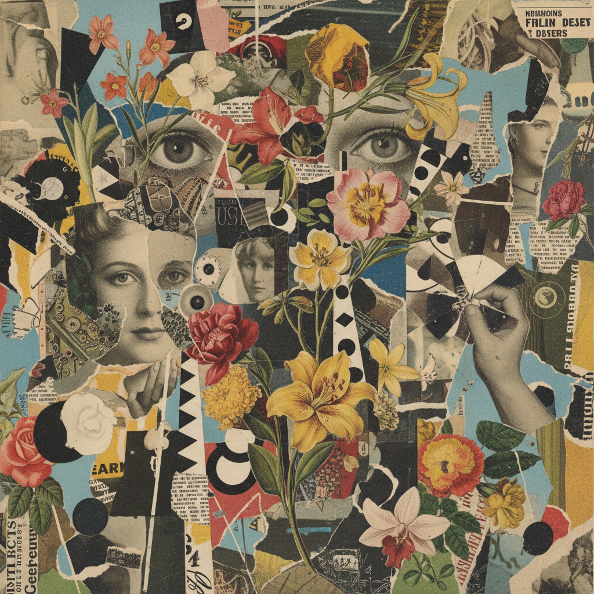

# Collage Art 拼贴艺术



> **"剪刀、胶水、旧杂志——把现实撕碎再重新组合成新的真实。"**

## 概述

| 维度 | 描述 |
|------|------|
| 时期 | 1912（立体派）–至今 |
| 别名 | Collage, Mixed Media, Cut-and-Paste, 拼贴 |
| 核心色彩 | 无固定——取决于素材来源 |
| 关键元素 | 剪切粘贴、异质材料并置、层叠、解构重组 |
| 代表人物 | Kurt Schwitters, Hannah Höch, Robert Rauschenberg, David Hockney |
| 关联风格 | Dada, Surrealism, Pop Art, Zine Culture, Digital Collage |

---

## 历史脉络

| 年份 | 事件 |
|------|------|
| 1912 | 毕加索、布拉克——立体派拼贴 |
| 1919 | Hannah Höch——达达主义照片蒙太奇 |
| 1920s | Kurt Schwitters "Merz"——垃圾变艺术 |
| 1950s | Robert Rauschenberg "Combines"——混合媒介 |
| 1960s | Pop Art 拼贴——Richard Hamilton |
| 2010s | 数字拼贴(Digital Collage)——Instagram美学 |
| 2020s | AI拼贴——新的可能性 |

### 核心哲学

拼贴艺术的精神是**"万物皆可成为素材——重要的是你如何重新组合它们"**：
- 解构 = 自由（"撕碎原有的意义——创造新的意义"）
- 并置 = 力量（"把不相关的东西放在一起——产生新的真实"）
- 民主 = 材料（"旧杂志和油画颜料一样有价值"）
- 层叠 = 深度（"每一层都是一个故事"）
- "拼贴是最民主的艺术形式——你不需要会画画"

---

## 视觉语法

### 色彩系统

```
无固定色彩规则——取决于素材

常见特征：
  - 异质色彩并置
  - 复古素材的褪色调
  - 高对比的意外组合
  - 纸张边缘可见

质感：
  纸张 — 撕裂边缘、折痕
  印刷 — 杂志、报纸、照片
  手工 — 胶水痕迹、层叠
  数字 — 像素、分辨率差异
```

### 标志性元素

| 类别 | 元素 |
|------|------|
| 技法 | 剪切、撕裂、粘贴、层叠、并置 |
| 材料 | 杂志、报纸、照片、布料、票据、任何纸质物 |
| 构图 | 非线性、碎片化、层叠、意外并置 |
| 题材 | 政治、身份、梦境、记忆、消费文化 |
| 工具 | 剪刀、胶水、刀片（或Photoshop） |
| 态度 | 解构、重组、民主、实验、反叛 |

---

## 与千禧怀旧的关系

### 数字拼贴的爆发
- 2010s Instagram "Digital Collage" 美学
- Photoshop/Procreate 让拼贴更容易
- "数字拼贴 = 21世纪的达达主义"
- 超现实数字拼贴成为社交媒体视觉语言

### 与 Zine/Punk 的传承
- 朋克拼贴 → Zine 拼贴 → 数字拼贴
- "剪刀+胶水" 的精神从未改变
- 拼贴作为"反设计"的设计策略

---

## 中国语境

- 中国当代艺术中的拼贴实践
- 中国设计师的数字拼贴作品
- 与中国"混搭"文化的交叉
- 中国独立出版中的拼贴美学

---

## 设计应用

| 场景 | 应用方式 |
|------|----------|
| 品牌 | 解构+重组+实验+年轻+反叛 |
| 时尚 | 混搭+层叠+异质+实验 |
| 数字 | 数字拼贴+超现实+社交媒体 |
| 出版 | Zine+海报+封面+独立出版 |

---

## 相关风格

← [Zine Culture 独立出版文化](zine-culture.md) | [Dada 达达主义](dada.md) →

↑ [返回千禧怀旧目录](README.md) | [返回总目录](../README.md)
