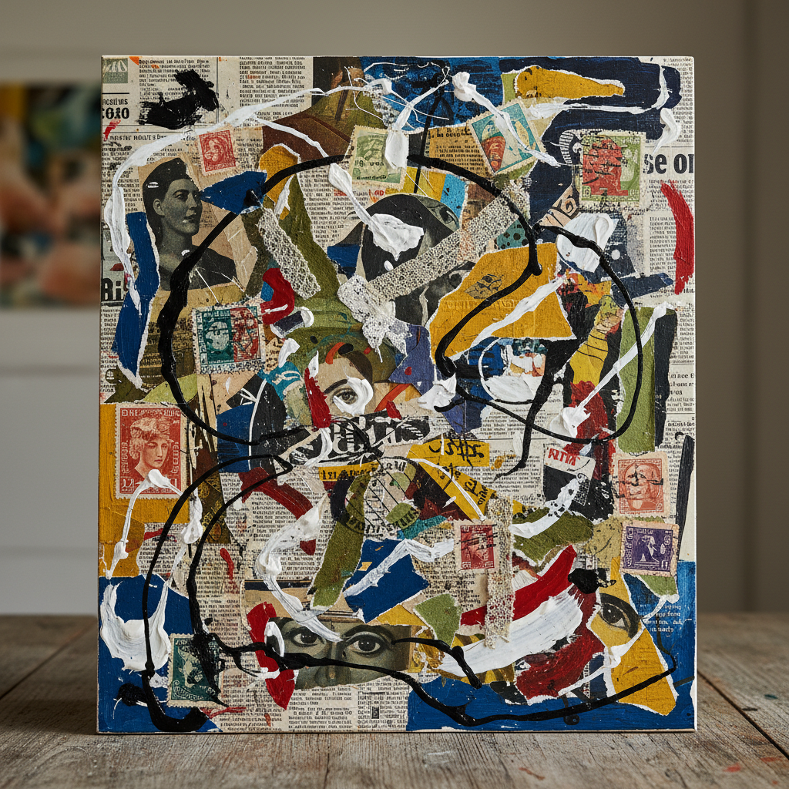

# Collage 拼贴艺术

> "Collage is the noble conquest of the irrational." — Max Ernst

## 概述

拼贴艺术（Collage）是将不同来源的材料——纸片、照片、布料、报纸、票据——粘贴组合在一起创作的艺术形式。1912年毕加索和布拉克将报纸和壁纸粘贴到画布上，正式开创了拼贴作为现代艺术技法的历史。

拼贴的革命性在于它打破了绘画的统一表面——将"真实世界"的碎片直接引入艺术，模糊了再现与现实、艺术与生活的边界。

## 核心特征

| 特征 | 描述 |
|------|------|
| 粘贴组合 | 将不同材料粘贴在一起 |
| 异质性 | 来自不同来源的材料并置 |
| 碎片性 | 碎片的组合而非统一的创造 |
| 挪用 | 使用已有的图像和材料 |
| 并置 | 意想不到的并置产生新意义 |
| 民主性 | 任何材料都可以成为艺术 |

## 视觉特征

- **层次**：多层材料的叠加和遮挡
- **边缘**：撕裂的、剪切的、不规则的边缘
- **材料**：报纸、杂志、照片、布料、票据
- **对比**：不同质感、色彩、图像的对比
- **文字**：印刷文字作为视觉元素
- **偶然**：偶然的并置产生意外的诗意

## 代表作品

| 作品 | 艺术家 | 年代 | 意义 |
|------|--------|------|------|
| *Still Life with Chair Caning* | Pablo Picasso | 1912 | 第一件拼贴作品——艺术史转折 |
| *The Snail* | Henri Matisse | 1953 | 剪纸拼贴的色彩交响 |
| *Just what is it...* | Richard Hamilton | 1956 | 波普拼贴的先驱 |
| *Romare Bearden collages* | Romare Bearden | 1960s+ | 非裔美国人生活的拼贴叙事 |
| *Une Semaine de Bonté* | Max Ernst | 1934 | 超现实主义的拼贴小说 |
| *The Bride Stripped Bare* | Hannah Höch | 1919 | 达达的政治拼贴 |

## 历史时间线

| 时期 | 事件 |
|------|------|
| 1912 | Picasso和Braque发明papier collé |
| 1919 | 达达的政治拼贴——Höch、Heartfield |
| 1920s-30s | 超现实主义拼贴——Ernst |
| 1950s | Matisse的剪纸——晚年的第二春 |
| 1956 | Hamilton——波普拼贴的诞生 |
| 1960s | Bearden——拼贴的社会叙事 |
| 1980s | 数字拼贴的出现 |
| 2000s-至今 | 数字拼贴、meme文化、混搭美学 |

## 中国语境

拼贴在中国当代艺术中有广泛应用。中国传统的"百宝嵌"和"贴落"可视为拼贴的古老形式。当代中国艺术家大量使用拼贴——从政治波普的图像挪用到当代摄影的数字拼贴。中国的"表情包"文化和短视频混剪在某种意义上是数字时代的大众拼贴。

## AI生成概念图

## 与其他风格的关系

- **Cubism** → 立体主义发明了拼贴技法
- **Dadaism** → 达达将拼贴政治化
- **Surrealism** → 超现实主义用拼贴创造梦境
- **Pop Art** → 波普艺术用拼贴引用大众文化
- **Assemblage** → 集合艺术是拼贴的三维延伸
- **Digital Art** → 数字拼贴是传统拼贴的当代形式

---

*浮光艺志 | Chronicle of Artistry*
