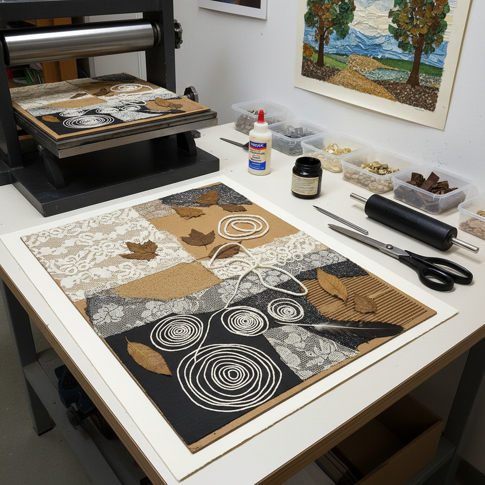

# Collagraph Art 拼贴版画艺术

> "A collagraph is a landscape built from scraps — cardboard, fabric, leaves, string, sandpaper, anything with texture glued to a plate and run through a press. The print that emerges is a map of surfaces, a catalog of textures translated into ink on paper. It is the most democratic of printmaking methods: no expensive copper plates, no dangerous acids, no heavy stones — just glue, found materials, and imagination." — Unknown

## 概述

拼贴版画艺术（Collagraph Art）是将各种材料粘贴在底板上制作印版，然后通过凹版或凸版方式印刷的版画艺术形式——艺术家将纸板、织物、树叶、砂纸、线绳等各种有纹理的材料粘贴在硬纸板或木板上，涂上封固剂后作为印版使用。拼贴版画以其丰富的纹理效果和材料的多样性著称。

拼贴版画的实践包括：1）凹印拼贴版画——将油墨填入纹理凹处后擦净表面印刷；2）凸印拼贴版画——在凸起表面涂墨后印刷；3）混合印刷——同时使用凹印和凸印技法；4）多色拼贴版画——使用多种颜色的拼贴版画；5）大型拼贴版画——大尺幅的拼贴版画创作；6）自然材料拼贴版画——使用树叶、花瓣等自然材料；7）实验性拼贴版画——探索非传统材料和技法的创作。

## 核心特征

| 特征 | 描述 |
|------|------|
| 纹理 | 极其丰富的纹理 |
| 材料 | 多种材料的组合 |
| 廉价 | 材料成本极低 |
| 实验 | 高度实验性 |
| 独特 | 每版效果独特 |
| 环保 | 可使用回收材料 |

## 视觉特征

- **纹理**：丰富多样的纹理效果
- **层次**：材料厚度产生的层次
- **压痕**：版边和材料边缘的压痕
- **有机**：有机的不规则形态
- **对比**：粗糙与光滑的对比
- **深度**：凹凸产生的视觉深度

## 代表作品

| 作品 | 艺术家 | 年代 | 意义 |
|------|--------|------|------|
| *Collagraph prints* | Glen Alps | 1950s | 拼贴版画的命名者 |
| *Nature collagraphs* | Various | 当代 | 自然材料拼贴版画 |
| *Large collagraphs* | Various | 当代 | 大型拼贴版画 |
| *Mixed media collagraphs* | Various | 当代 | 混合媒介拼贴版画 |
| *Educational collagraphs* | Various | 当代 | 教育用拼贴版画 |

## 历史时间线

| 时期 | 事件 |
|------|------|
| 1950年代 | Glen Alps命名并推广拼贴版画 |
| 1960-70年代 | 拼贴版画在艺术教育中的普及 |
| 1980年代 | 拼贴版画技法的多样化发展 |
| 2000年代 | 环保意识推动拼贴版画复兴 |
| 当代 | 拼贴版画的当代艺术实践 |

## 中国语境

拼贴版画艺术在中国的版画教育中作为一种重要的实验性技法被教授——因其材料易得、设备简单而适合教学。中国的一些美术院校将拼贴版画作为版画入门课程——帮助学生理解版画的基本原理。中国的一些当代版画家将拼贴版画发展为独立的创作形式——利用中国特有的材料（如宣纸、丝绸、竹片）创造具有东方特色的拼贴版画。中国的儿童美术教育中，拼贴版画因其安全性和趣味性而受到欢迎——孩子们可以用树叶、布料等日常材料进行创作。中国的一些环保艺术项目使用拼贴版画技法——将废弃材料转化为艺术作品，传达环保理念。

## AI生成概念图

## 与其他风格的关系

- **Printmaking** → 版画艺术
- **Collage** → 拼贴艺术
- **Mixed Media** → 混合媒介
- **Texture Art** → 纹理艺术
- **Found Object Art** → 现成物艺术
- **Eco Art** → 生态艺术

---

*浮光艺志 | Chronicle of Artistry*
