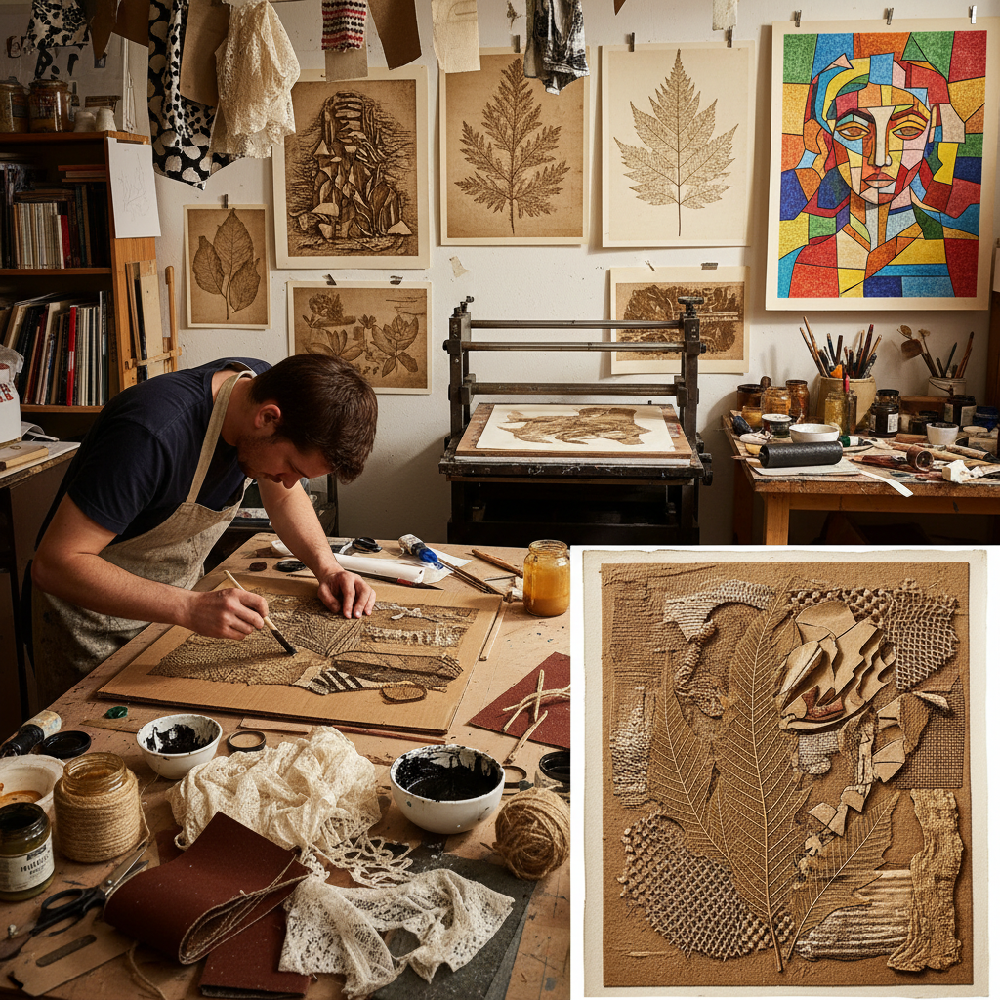

# Collagraph Printing 拼贴版画

> "Collagraph is printmaking liberated from tradition — building a plate from anything that has texture, gluing cardboard, fabric, leaves, sand, and string onto a base to create a surface that prints its own portrait, each material contributing its unique mark, democratizing printmaking by proving that a printing plate can be made from the contents of a junk drawer rather than expensive copper." — Unknown

## 概述

拼贴版画（Collagraph）是一种通过在基板（通常是硬纸板或薄木板）上粘贴各种材料来创造印刷版面的版画技法。"Collagraph"来自"collage"（拼贴）和"graph"（印刷）。艺术家将各种有纹理的材料——纸板、织物、砂纸、树叶、线绳、网纱、石膏等——粘贴在基板上，然后密封表面（通常用虫胶或丙烯酸介质），使其能够承受印刷过程中的油墨和压力。

Collagraph可以作为凹版（将油墨擦入纹理凹处）或凸版（在凸起表面滚墨）印刷，也可以两者结合。Collagraph的最大优势是其无限的纹理可能性和低成本——不需要昂贵的金属板和有毒的酸液。Collagraph在1950-60年代由Glen Alps等艺术家发展和推广，是最具实验性和民主性的版画技法之一。

## 核心特征

| 特征 | 描述 |
|------|------|
| 拼贴 | 粘贴材料构建版面 |
| 纹理 | 丰富的纹理效果 |
| 低成本 | 材料成本低 |
| 实验性 | 高度实验性 |
| 混合 | 可凹版可凸版 |
| 民主 | 人人可做的版画 |

## 视觉特征

- **纹理**：丰富多样的纹理
- **层次**：多层次的深度
- **有机**：有机的形态
- **实验**：实验性的效果
- **混合**：混合媒介的质感
- **独特**：每张印刷独特

## 代表作品

| 作品 | 艺术家 | 年代 | 意义 |
|------|--------|------|------|
| *Glen Alps collagraphs* | Glen Alps | 1950-60年代 | 拼贴版画的开创 |
| *Collagraph landscapes* | Various | 当代 | 拼贴版画风景 |
| *Mixed media collagraphs* | Various | 当代 | 混合媒介拼贴版画 |
| *Large-scale collagraphs* | Various | 当代 | 大型拼贴版画 |
| *Educational collagraphs* | Various | 当代 | 教育用拼贴版画 |

## 历史时间线

| 时期 | 事件 |
|------|------|
| 1950年代 | Glen Alps发展拼贴版画 |
| 1960-70年代 | 拼贴版画的推广 |
| 1980年代 | 拼贴版画在教育中的普及 |
| 1990年代至今 | 拼贴版画的艺术化发展 |
| 当代 | 拼贴版画的全球实践 |

## 中国语境

拼贴版画在中国的版画教育中有一定的应用——作为版画入门和实验性创作的教学手段。中国的一些美术院校在版画基础课程中教授collagraph技法。中国的一些当代版画家在创作中使用拼贴版画——特别是在探索纹理和材料表现力时。中国的儿童美术教育中也使用简化的collagraph技法。中国的一些版画工作坊开设collagraph体验课程。

## AI生成概念图

## 与其他风格的关系

- **Collage** → 拼贴
- **Printmaking** → 版画
- **Mixed Media** → 混合媒介
- **Relief Printing** → 凸版印刷
- **Intaglio** → 凹版
- **Texture Art** → 纹理艺术

---

*浮光艺志 | Chronicle of Artistry*
