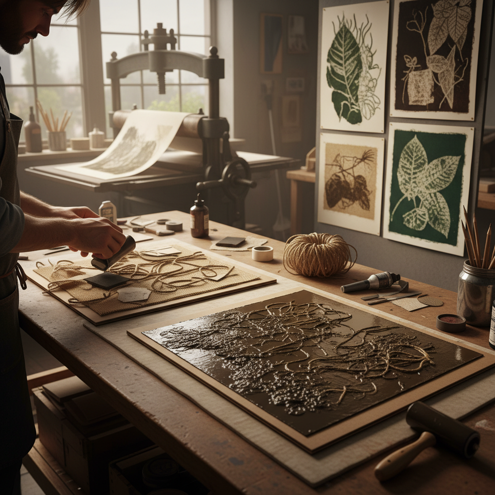

# Collagraph 拼贴版画

> "Collagraph turns texture into image — every found surface, every torn edge, every glued fragment becomes a printing plate of infinite possibility." — Unknown

## 概述

拼贴版画（Collagraph）是一种通过在板面上粘贴各种材料来制作印版的版画技法。"Collagraph"一词来自"collage"（拼贴）和"graph"（绘画/印刷）。艺术家在硬纸板、木板或金属板上粘贴各种材料——织物、砂纸、树叶、线绳、纸片、胶带等——创造出丰富的表面质感，然后涂墨印刷。拼贴版画可以作为凸版（只印凸起部分）或凹版（油墨填入凹处）印刷，甚至两者结合。它是最自由、最实验性的版画形式之一——几乎任何有质感的材料都可以成为印版的一部分。

拼贴版画的哲学在于：万物皆可印——将日常材料的质感转化为艺术图像，发现平凡事物中的视觉诗意。

## 核心特征

| 特征 | 描述 |
|------|------|
| 拼贴 | 粘贴材料制版 |
| 质感 | 丰富的表面质感 |
| 自由 | 材料选择极自由 |
| 实验 | 高度实验性 |
| 混合 | 凸凹版可结合 |
| 偶然 | 偶然的印刷效果 |

## 视觉特征

- **质感**：丰富多样的质感
- **层次**：多层次的深度
- **有机**：有机的形态
- **肌理**：材料的肌理转印
- **对比**：光滑与粗糙的对比
- **实验**：实验性的视觉效果

## 代表作品

| 作品 | 艺术家 | 年代 | 意义 |
|------|--------|------|------|
| *Glen Alps collagraphs* | Glen Alps | 1950s+ | 拼贴版画命名者 |
| *Edith Frohock works* | Edith Frohock | 1960s+ | 早期拼贴版画 |
| *Brenda Hartill prints* | Brenda Hartill | 1980s+ | 英国拼贴版画 |
| *Collagraph landscapes* | Various | 当代 | 当代风景拼贴版画 |
| *Mixed media collagraphs* | Various | 当代 | 混合媒介拼贴版画 |

## 历史时间线

| 时期 | 事件 |
|------|------|
| 1950s | Glen Alps命名并推广 |
| 1960s | 在美术院校中传播 |
| 1970s | 技法的多样化发展 |
| 1980s+ | 全球范围的实践 |
| 1990s+ | 与混合媒介的融合 |
| 当代 | 当代拼贴版画的繁荣 |

## 中国语境

拼贴版画在中国版画界是相对较新的技法，但近年来越来越受到关注。中国的版画教育体系中，拼贴版画被视为一种创新性的教学手段——它材料易得、操作灵活，特别适合培养学生的实验精神和材料意识。一些中国当代版画家将拼贴版画与中国传统材料（如宣纸、丝绸、茶叶等）结合，创造出具有中国特色的拼贴版画作品。中国的版画双年展和版画工作坊中也越来越多地出现拼贴版画作品。

## AI生成概念图

## 与其他风格的关系

- **Collage** → 拼贴艺术
- **Printmaking** → 版画总称
- **Relief Printing** → 凸版印刷
- **Intaglio** → 凹版印刷
- **Mixed Media** → 混合媒介
- **Found Object Art** → 现成物艺术

---

*浮光艺志 | Chronicle of Artistry*
