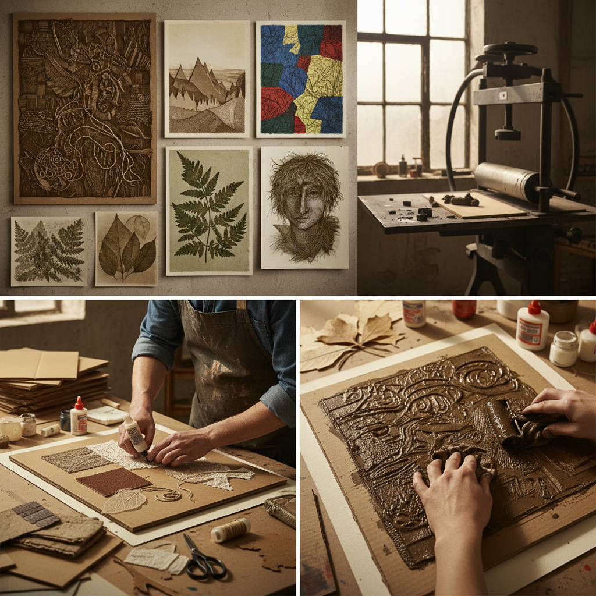

# Collagraphy Printing 拼贴版画

> "Collagraphy is printmaking from collage — materials glued to a plate become the printing surface, every texture faithfully transferred to paper under pressure, turning found objects, fabrics, and cardboard into matrices that print with the richness of intaglio and the surprise of assemblage." — Unknown

## 概述

拼贴版画（Collagraphy Printing，也拼作Collagraph）是一种将各种材料（纸板、织物、砂纸、树叶、线绳、胶水纹理等）粘贴在基板（通常是硬纸板或薄木板）上，形成有纹理的印版，然后涂墨印刷的版画技法。"Collagraphy"一词来自希腊语"kolla"（胶水）和"graph"（书写/绘画）。

拼贴版画可以同时产生凹版和凸版效果——凸起的材料表面着墨产生凸版效果，凹陷处积墨产生凹版效果。这种技法的魅力在于其"材料的民主性"——几乎任何有纹理的材料都可以成为印版的一部分。拼贴版画不需要有毒的酸液或昂贵的金属版材，是一种环保、经济且效果丰富的版画技法。

## 核心特征

| 特征 | 描述 |
|------|------|
| 拼贴 | 材料粘贴成版 |
| 纹理 | 丰富的纹理效果 |
| 混合 | 凹凸版混合效果 |
| 环保 | 无毒环保 |
| 经济 | 材料经济易得 |
| 多样 | 材料选择多样 |

## 视觉特征

- **纹理**：丰富的纹理层次
- **深度**：凹凸产生的深度
- **有机**：有机的材料质感
- **对比**：明暗的强烈对比
- **肌理**：独特的肌理效果
- **版画感**：传统版画的质感

## 代表作品

| 作品 | 艺术家 | 年代 | 意义 |
|------|--------|------|------|
| *Collagraph prints* | Glen Alps | 1950s | 技法的命名和推广 |
| *Textured collagraphs* | Various | 当代 | 纹理拼贴版画 |
| *Nature collagraphs* | Various | 当代 | 自然材料拼贴版画 |
| *Abstract collagraphs* | Various | 当代 | 抽象拼贴版画 |
| *Mixed media collagraphs* | Various | 当代 | 混合媒介拼贴版画 |

## 历史时间线

| 时期 | 事件 |
|------|------|
| 1950年代 | Glen Alps命名并推广collagraph |
| 1960年代 | 拼贴版画在艺术教育中的普及 |
| 1970-80年代 | 技法的多样化发展 |
| 2000年代 | 环保版画运动中的重要地位 |
| 当代 | 拼贴版画的持续创新 |

## 中国语境

拼贴版画在中国的版画教育中有重要的地位——中国的美术学院版画系将拼贴版画作为综合版画课程的一部分。拼贴版画因其材料简单、无毒环保的特点，特别适合中国的中小学美术教育。中国的一些版画艺术家使用拼贴版画技法创作具有中国特色的作品——将中国传统材料（宣纸、丝绸、麻绳等）融入拼贴版画的创作中。

## AI生成概念图

## 与其他风格的关系

- **Intaglio** → 凹版印刷
- **Relief Printing** → 凸版印刷
- **Collage** → 拼贴艺术
- **Mixed Media** → 混合媒介
- **Monoprint** → 单版印刷
- **Gelatin Printing** → 明胶版印刷

---

*浮光艺志 | Chronicle of Artistry*
