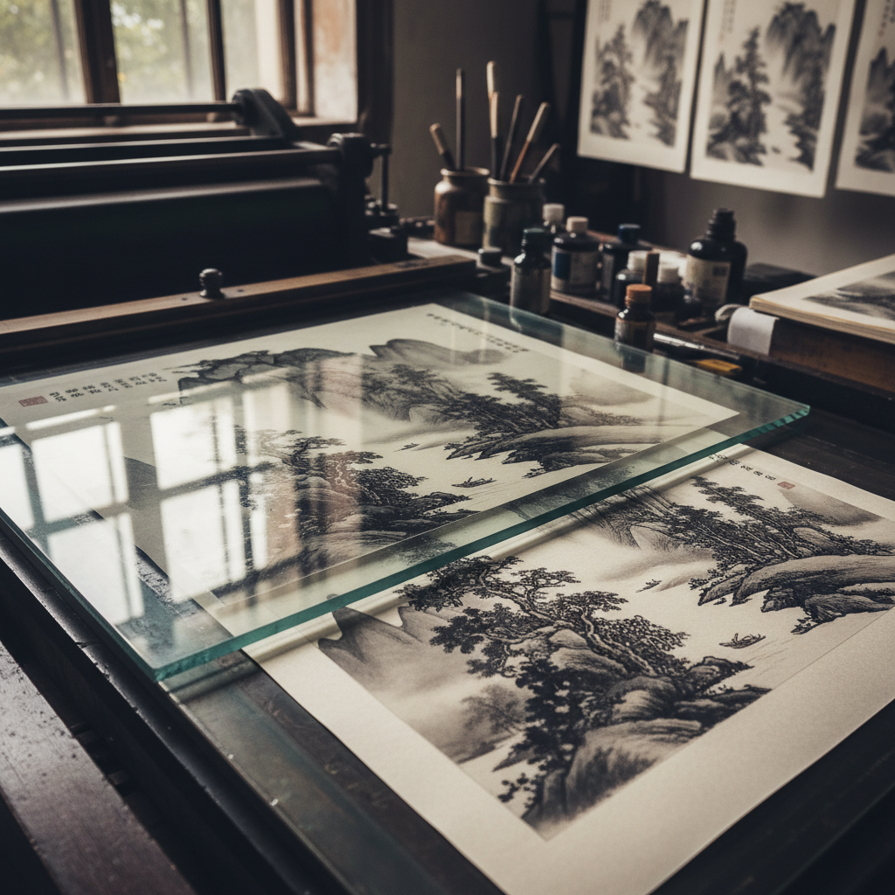

# Collotype Art 珂罗版艺术

> "Collotype is the only photomechanical process that prints continuous tone without a halftone screen — a glass plate coated with light-hardened gelatin accepts greasy ink in proportion to its exposure, reproducing every subtle gradation of a photograph with the fidelity of a contact print. The reticulated gelatin surface gives collotype its characteristic grain-free smoothness." — Unknown

## 概述

珂罗版艺术（Collotype Art）是一种无网点的照相平版印刷工艺——利用明胶在玻璃板上的感光硬化特性，使硬化程度不同的明胶表面吸附不同量的油墨，从而实现连续色调的印刷。珂罗版是唯一能够不使用网点而直接印刷连续色调的照相印刷工艺，以其极高的图像保真度著称。

珂罗版艺术的实践包括：1）玻璃板涂布——在玻璃板上涂布感光明胶；2）曝光——通过底片曝光使明胶硬化；3）润湿——用甘油水溶液润湿版面；4）上墨——用油墨辊上墨；5）印刷——在平版印刷机上印刷；6）限量——每版只能印刷有限数量；7）当代珂罗版——将传统工艺与现代创作结合。

## 核心特征

| 特征 | 描述 |
|------|------|
| 无网点 | 不使用网点 |
| 连续 | 连续色调印刷 |
| 明胶 | 明胶版面 |
| 保真 | 极高的图像保真度 |
| 限量 | 每版印量有限 |
| 精细 | 极其精细的细节 |

## 视觉特征

- **连续**：无网点的连续色调
- **精细**：极其精细的细节再现
- **柔和**：柔和自然的色调
- **保真**：高度忠实的图像
- **质感**：明胶纹理的微妙质感
- **深度**：丰富的色调深度

## 代表作品

| 作品 | 艺术家/文化 | 年代 | 意义 |
|------|-------------|------|------|
| *Benrido collotypes* | 日本 | 1887年起 | 便利堂珂罗版 |
| *Art reproduction collotypes* | 欧洲 | 19-20世纪 | 艺术品复制 |
| *Photographic portfolios* | 国际 | 19-20世纪 | 摄影作品集 |
| *Museum postcards* | 国际 | 20世纪 | 博物馆明信片 |
| *Contemporary collotype* | 日本 | 当代 | 当代珂罗版 |

## 历史时间线

| 时期 | 事件 |
|------|------|
| 1855年 | Alphonse Poitevin发明珂罗版 |
| 1868年 | Josef Albert改进工艺 |
| 19世纪末-20世纪初 | 珂罗版的商业应用高峰 |
| 20世纪中 | 胶印取代珂罗版 |
| 当代 | 日本便利堂等少数工坊的延续 |

## 中国语境

珂罗版在中国有重要的历史和当代意义。中国在20世纪初引入珂罗版技术——用于复制中国传统书画作品。中国的故宫博物院和国家图书馆——曾大量使用珂罗版复制珍贵文物和古籍。中国的珂罗版印刷在文物复制领域——至今仍有重要应用。中国的一些传统印刷工坊——保留了珂罗版的技术和设备。中国的艺术出版中，珂罗版作为最高品质的传统书画复制方式——在限量版画册中使用。中国的非物质文化遗产保护中，珂罗版印刷技术——作为传统印刷工艺受到保护。中本的荣宝斋等老字号——曾以珂罗版复制闻名。

## AI生成概念图

## 与其他风格的关系

- **Photogravure** → 照相凹版
- **Lithography** → 石版印刷
- **Platinum Print** → 铂金印相
- **Fine Art Print** → 艺术版画
- **Photography** → 摄影
- **Printmaking** → 版画

---

*浮光艺志 | Chronicle of Artistry*
