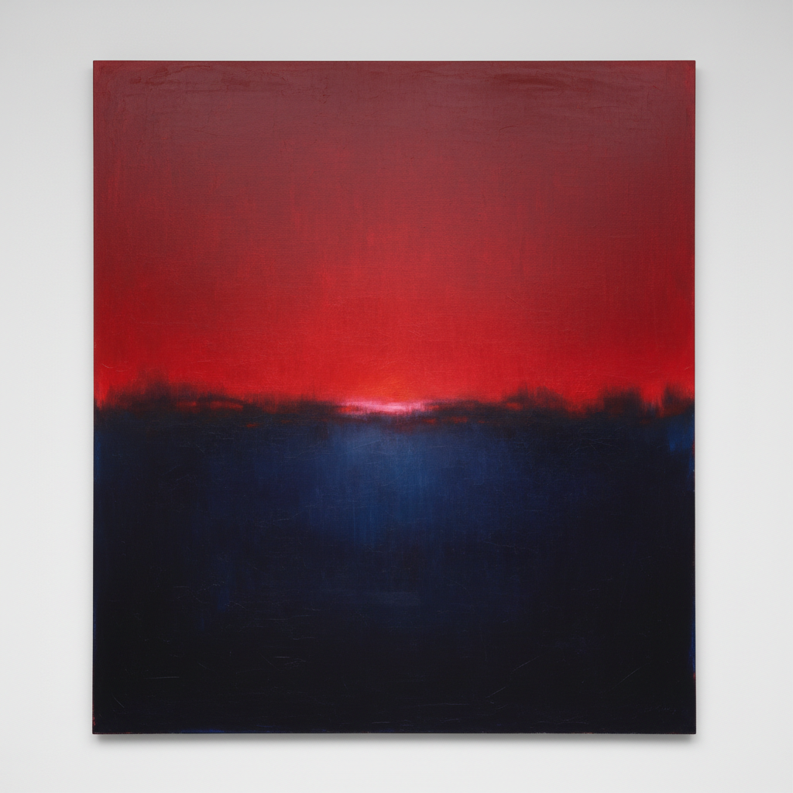

# Color Field Abstraction 色域抽象

> **时期：** 1950年代–1970年代  
> **关键词：** 大面积色彩、浸染画布、冥想体验、后绘画性抽象、视觉沉浸

## 概述

Color Field Abstraction（色域抽象）是抽象表现主义的一个分支，以大面积的纯色或渐变色覆盖巨型画布，创造沉浸式的色彩体验。马克·罗斯科的发光色块、海伦·弗兰肯塔勒的浸染色彩、巴尼特·纽曼的"拉链"——它们不描绘任何东西，只是让你站在颜色面前，感受颜色本身的情感力量。

## 风格特征

- **大面积纯色**：色彩覆盖整个视野
- **浸染技法**：颜料渗入画布纤维
- **去笔触**：消除手工痕迹
- **沉浸体验**：大尺幅创造包围感
- **冥想品质**：安静、缓慢的观看体验

## 代表人物与作品

- 马克·罗斯科 发光色块
- 海伦·弗兰肯塔勒《山与海》
- 巴尼特·纽曼《英雄的崇高》
- 朱尔斯·奥利茨基 喷涂色域

## 概念图

