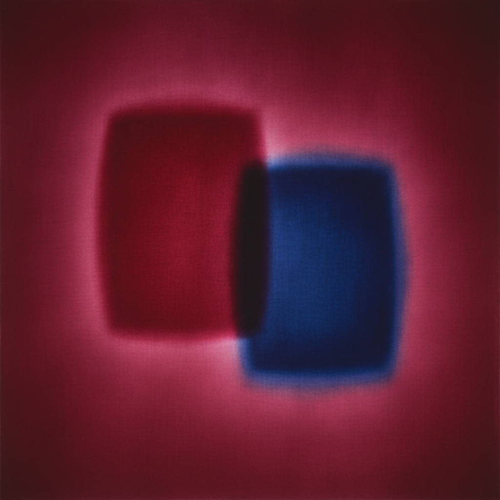

# Color Field Painting 色域绘画

> "I'm interested only in expressing basic human emotions — tragedy, ecstasy, doom." — Mark Rothko

## 概述

色域绘画（Color Field Painting）是1950-60年代在美国发展的抽象绘画流派，以大面积的纯色或渐变色覆盖画布，创造沉浸式的色彩体验。与行动绘画（Action Painting）的激烈笔触不同，色域绘画追求的是色彩本身的情感力量和精神深度。

马克·罗斯科（Mark Rothko）、巴尼特·纽曼（Barnett Newman）和克莱福德·斯蒂尔（Clyfford Still）是色域绘画的第一代代表；海伦·弗兰肯塔勒（Helen Frankenthaler）和莫里斯·路易斯（Morris Louis）发展了"浸染"技法的第二代。

## 核心特征

| 特征 | 描述 |
|------|------|
| 大面积色彩 | 色彩覆盖大部分或全部画面 |
| 去笔触 | 消除可见的笔触和手势 |
| 平面性 | 强调画布的平面性而非深度幻觉 |
| 沉浸感 | 大尺幅创造包围观众的色彩环境 |
| 情感性 | 色彩直接传达情感和精神状态 |
| 冥想性 | 邀请长时间的凝视和沉思 |

## 视觉特征

- **色彩**：大面积的纯色、渐变、色彩的微妙变化
- **边缘**：柔和的、渗透的边缘（Rothko）或硬边（Newman）
- **尺度**：巨大的——包围观众的尺幅
- **表面**：薄涂、浸染、或多层叠加的深度
- **构图**：极简的——色块、条纹、或单色
- **光**：色彩本身发出的内在光芒

## 代表作品

| 作品 | 艺术家 | 年代 | 意义 |
|------|--------|------|------|
| *No. 61 (Rust and Blue)* | Mark Rothko | 1953 | 悬浮色块的精神深度 |
| *Vir Heroicus Sublimis* | Barnett Newman | 1950-51 | 巨型红色画面中的"拉链" |
| *Mountains and Sea* | Helen Frankenthaler | 1952 | 浸染技法的发明——里程碑 |
| *Alpha-Phi* | Morris Louis | 1961 | 颜料自由流淌的"面纱" |
| *Who's Afraid of Red, Yellow and Blue* | Newman | 1966 | 纯色的崇高感 |
| *Rothko Chapel* | Mark Rothko | 1964-67 | 14幅暗色画作的冥想空间 |

## 历史时间线

| 时期 | 事件 |
|------|------|
| 1948 | Rothko开始"多形式"绘画 |
| 1950 | Newman的*Vir Heroicus Sublimis* |
| 1952 | Frankenthaler的*Mountains and Sea*——浸染技法 |
| 1953 | Clement Greenberg理论化"后绘画性抽象" |
| 1960s | Louis、Noland、Olitski——第二代色域画家 |
| 1964 | Greenberg策划"Post-Painterly Abstraction"展览 |
| 1970 | Rothko自杀——色域绘画的悲剧性终章 |
| 1971 | Rothko Chapel开放——色彩的神圣空间 |
| 2000s-至今 | 色域绘画的影响延续到当代抽象 |

## 子类型

| 子类型 | 特征 |
|--------|------|
| 悬浮色块 | Rothko——柔边色块的叠加 |
| 拉链绘画 | Newman——色域中的垂直线 |
| 浸染绘画 | Frankenthaler、Louis——颜料渗入画布 |
| 硬边绘画 | Noland、Kelly——清晰边缘的色块 |
| 单色绘画 | Klein、Ryman——单一色彩的极致 |

## 中国语境

色域绘画对中国当代抽象艺术有深远影响。中国的抽象画家如丁乙、周力、梁铨等在不同程度上受到色域绘画的启发。中国传统水墨画中的"留白"和"墨分五色"与色域绘画的色彩冥想有精神上的相通。Rothko Chapel式的沉浸式色彩空间在中国的当代艺术空间中也有回响。

## AI生成概念图

## 与其他风格的关系

- **Abstract Expressionism** → 色域绘画是抽象表现主义的分支
- **Minimalism** → 极简主义继承了色域的简约和纯粹
- **Light Art** → 光艺术与色域绘画共享色彩的沉浸体验
- **Op Art** → 光效应艺术探索色彩的视觉效果
- **Monochrome** → 单色绘画是色域的极端化
- **Hard-Edge Painting** → 硬边绘画是色域的几何化变体

---

*浮光艺志 | Chronicle of Artistry*
