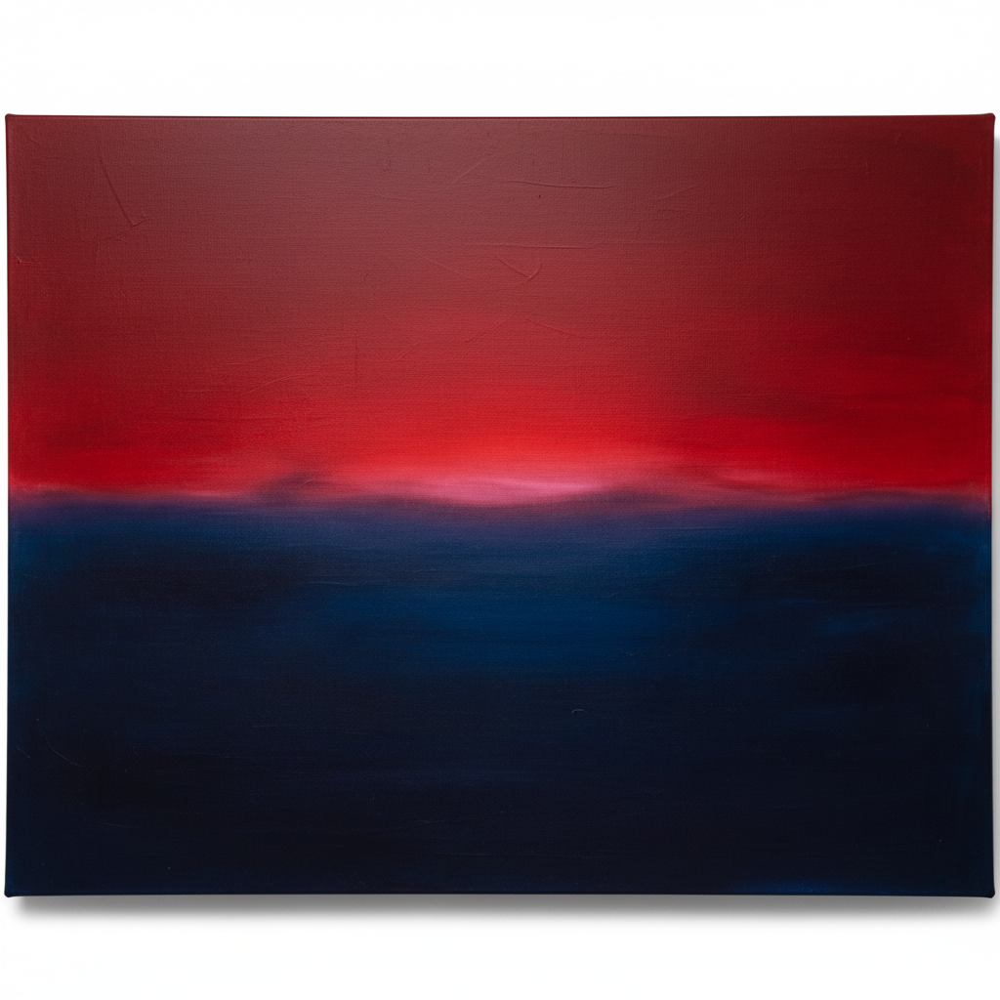

# Color Field 色域绘画



> **"一整面墙的纯色——不是空无，是无限。"**

## 概述

| 维度 | 描述 |
|------|------|
| 时期 | 1950s–1970s |
| 别名 | Color Field Painting, 色域绘画, 色面绘画 |
| 核心色彩 | 大面积纯色、渐变、柔和边缘——色彩本身即主题 |
| 关键元素 | 巨幅画布、纯色平涂、柔和边缘、沉浸式体验 |
| 代表人物 | Mark Rothko, Barnett Newman, Helen Frankenthaler, Morris Louis |
| 关联风格 | Abstract Expressionism, Minimalism, Hard-Edge, Op Art |

---

## 历史脉络

| 年份 | 事件 |
|------|------|
| 1950 | Rothko开始标志性的色块绘画 |
| 1948 | Barnett Newman《Onement I》——"拉链"绘画 |
| 1952 | Helen Frankenthaler《Mountains and Sea》——浸染技法 |
| 1953 | Morris Louis受Frankenthaler启发——倾倒技法 |
| 1960s | Color Field成为独立运动 |
| 1970 | Rothko去世——Color Field的精神终结 |

### 核心哲学

色域绘画的精神是**"色彩不需要形状来承载——色彩本身就是一切"**：
- Rothko："我画的不是色彩——是人类的基本情感"
- Newman："我的画是关于空间的感觉——不是关于空间的描述"
- "当你站在一幅Rothko面前——你不是在看画——你是在被画包围"
- "Color Field不是装饰——是冥想"
- "减少一切——直到只剩下色彩和你"

---

## 视觉语法

### 色彩系统

```
Rothko系：
  深红 (#8B0000) — 生命、激情
  橙色 (#FF4500) — 温暖、光
  深蓝 (#000080) — 深渊、冥想
  黑色 (#1A1A1A) — 死亡、终极

Frankenthaler系：
  水彩蓝 (#87CEEB) — 流动、透明
  淡粉 (#FFB6C1) — 柔和、有机
  薄荷绿 (#98FF98) — 自然、清新

Newman系：
  纯红 (#FF0000) — 崇高
  深蓝 (#00008B) — 无限
  白色 (#FFFFFF) — 光

规则：
  - 色彩占据整个画面
  - 边缘柔和或硬边——但不是形状
  - 巨幅尺寸是必须的——要包围观者
  - 没有笔触痕迹（或极少）
```

### 标志性元素

| 类别 | 元素 |
|------|------|
| 尺寸 | 巨幅——必须大到包围观者 |
| 边缘 | Rothko柔和边缘、Newman硬边"拉链" |
| 技法 | 浸染、倾倒、薄涂、多层透明 |
| 空间 | 无深度、无透视——纯平面 |
| 体验 | 沉浸、冥想、情感共鸣 |
| 态度 | 崇高、精神性、极简、纯粹 |

---

## 与千禧怀旧/当代设计的关系

### 对数字设计的影响
- iOS 7+的渐变背景 = Color Field的数字化
- 品牌设计中的大面积纯色 = Color Field精神
- "Rothko如果活在今天——他会做沉浸式数字装置"
- 冥想App的色彩设计 = Color Field的当代应用

### James Turrell——Color Field的空间化
- Turrell的光装置 = 三维的Color Field
- "当色彩充满整个空间——你就在画里面了"

---

## 设计应用

| 场景 | 应用方式 |
|------|----------|
| 品牌 | 大面积纯色+渐变+高端感 |
| 空间 | 沉浸式装置+灯光设计 |
| 数字 | 渐变背景+色彩系统+冥想App |
| 建筑 | 色彩墙面+光影空间 |

---

## 相关风格

← [Abstract Expressionism 抽象表现主义](abstract-expressionism.md) | [Minimalism 极简主义](minimalism.md) →

↑ [返回千禧怀旧目录](README.md) | [返回总目录](../README.md)
