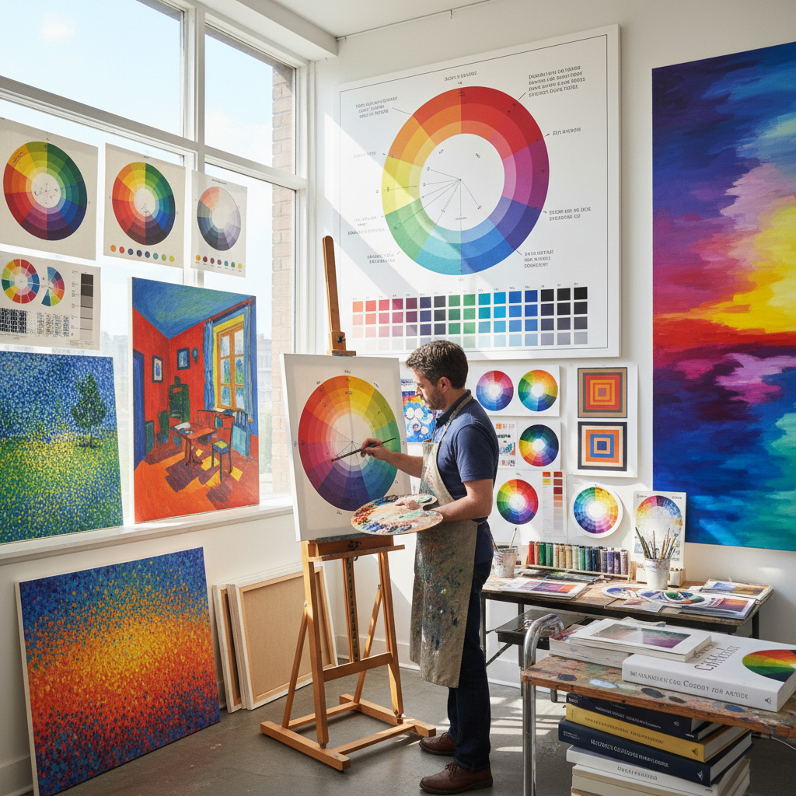

# Color Theory Painting 色彩理论绘画

> "Color theory painting is the science of seeing made visible — where complementary hues vibrate against each other, warm advances and cool recedes, and the entire emotional spectrum is orchestrated through the deliberate architecture of chromatic relationships." — Unknown

## 概述

色彩理论绘画（Color Theory Painting）是一种以色彩科学原理为核心指导的绘画方法——画家系统性地运用色轮、互补色、类似色、色温、色彩对比、色彩和谐等理论来构建画面的色彩关系。这不是一种单一的风格，而是一种贯穿多种绘画流派的方法论——从印象派的光色分析到后印象派的主观色彩，从野兽派的解放色彩到色域绘画的纯色体验。

色彩理论的系统化始于牛顿的光谱实验（1666年），经过歌德的色彩论（1810年）、谢弗勒尔的同时对比法则（1839年）、伊顿的色彩艺术（1961年）和阿尔伯斯的色彩交互作用（1963年）等里程碑式的发展。这些理论深刻影响了印象派、新印象派（点彩派）、野兽派、抽象表现主义和色域绘画等艺术运动。

## 核心特征

| 特征 | 描述 |
|------|------|
| 科学 | 基于色彩科学 |
| 系统 | 系统性的色彩运用 |
| 关系 | 强调色彩关系 |
| 对比 | 利用色彩对比 |
| 和谐 | 追求色彩和谐 |
| 情感 | 色彩的情感表达 |

## 视觉特征

- **对比**：互补色的对比
- **和谐**：类似色的和谐
- **温度**：冷暖色的运用
- **振动**：色彩的视觉振动
- **层次**：色彩的空间层次
- **纯度**：色彩纯度的变化

## 代表作品

| 作品 | 艺术家 | 年代 | 意义 |
|------|--------|------|------|
| *A Sunday on La Grande Jatte* | Seurat | 1886 | 点彩派色彩理论 |
| *The Joy of Life* | Matisse | 1906 | 野兽派色彩解放 |
| *Homage to the Square* | Albers | 1950s-70s | 色彩交互作用 |
| *Who's Afraid of Red, Yellow and Blue* | Newman | 1966 | 色域绘画 |
| *Interaction of Color studies* | Various | 当代 | 当代色彩研究 |

## 历史时间线

| 时期 | 事件 |
|------|------|
| 1666 | 牛顿的光谱实验 |
| 1810 | 歌德的色彩论 |
| 1839 | 谢弗勒尔的同时对比法则 |
| 1880s | 印象派和新印象派的色彩实践 |
| 1961 | 伊顿的色彩艺术 |
| 1963 | 阿尔伯斯的色彩交互作用 |

## 中国语境

色彩理论在中国的美术教育中占有核心地位。中国的美术学院普遍开设色彩构成课程，系统教授色彩理论。中国的设计教育中，色彩理论是基础课程之一。中国传统绘画有自己的色彩体系（如五色观），与西方色彩理论形成有趣的对话。中国的当代艺术家在创作中融合东西方色彩理论。中国的高考美术色彩科目要求学生掌握基本的色彩理论知识。

## AI生成概念图

## 与其他风格的关系

- **Impressionism** → 印象派
- **Pointillism** → 点彩派
- **Fauvism** → 野兽派
- **Color Field Painting** → 色域绘画
- **Op Art** → 光效应艺术
- **Abstract Expressionism** → 抽象表现主义

---

*浮光艺志 | Chronicle of Artistry*
